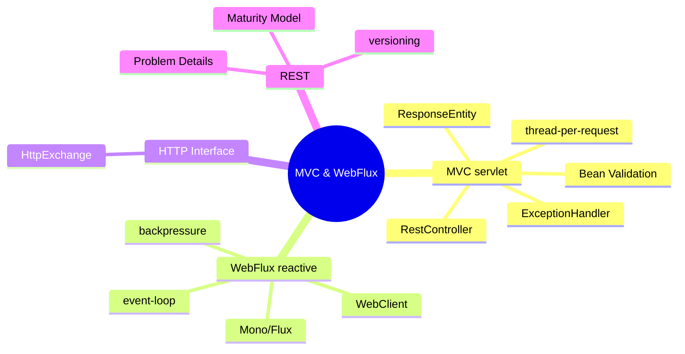
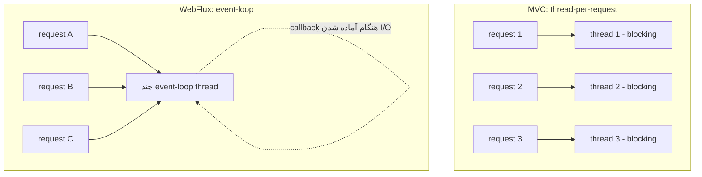
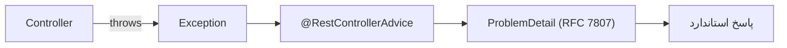

# Spring MVC & WebFlux — REST، Reactive، HTTP Clients

> دو مدل برنامه‌نویسی وب در Spring: servlet-based (MVC) و reactive (WebFlux). انتخاب درست تصمیم معماری است. این فایل با دیاگرام و مثال‌های متعدد گسترش یافته.

## فهرست
- [نقشه‌ی ذهنی](#نقشه‌ی-ذهنی)
- [📖 مفاهیم](#-مفاهیم)
- [🎯 سوالات مصاحبه](#-سوالات-مصاحبه)
- [⚠️ اشتباهات رایج](#️-اشتباهات-رایج)
- [🔗 ارتباط با سایر مفاهیم](#-ارتباط-با-سایر-مفاهیم)

---

## نقشه‌ی ذهنی



---

## مدل اجرای MVC در برابر WebFlux



---

## 📖 مفاهیم

### Spring MVC (Servlet-based)

**توضیح:**

مدل کلاسیک: هر request توسط یک thread از pool پردازش می‌شود (thread-per-request) و کد blocking است. `@RestController` = `@Controller` + `@ResponseBody`. binding با `@PathVariable`, `@RequestParam`, `@RequestBody`. `ResponseEntity<T>` کنترل کامل status/header/body. مدیریت خطای متمرکز با `@RestControllerAdvice`. validation با `@Valid`.

با Java 21 virtual threads، MVC برای throughput بالا هم رقابتی شده.

**مثال کد:**

```java
@RestController
@RequestMapping("/api/v1/users")
public class UserController {
    private final UserService service;
    public UserController(UserService service) { this.service = service; }

    @GetMapping("/{id}")
    public ResponseEntity<UserDto> getUser(@PathVariable Long id) {
        return service.findById(id)
            .map(ResponseEntity::ok)
            .orElseGet(() -> ResponseEntity.notFound().build());
    }

    @PostMapping
    public ResponseEntity<UserDto> create(@Valid @RequestBody CreateUserRequest req) {
        UserDto created = service.create(req);
        return ResponseEntity.created(URI.create("/api/v1/users/" + created.id())).body(created);
    }

    @GetMapping
    public Page<UserDto> list(@RequestParam(defaultValue = "0") int page,
                              @RequestParam(required = false) String status) {
        return service.find(status, PageRequest.of(page, 20));
    }
}
```

**نکات کلیدی:**

- `ResponseEntity` برای کنترل دقیق؛ برای ساده می‌توان DTO برگرداند.
- `@Valid` validation را trigger می‌کند.
- با virtual threads، MVC blocking مقیاس‌پذیرتر شده.

---

### Exception Handling متمرکز

**توضیح:**

`@RestControllerAdvice` نقطه‌ی مرکزی برای تبدیل استثناها به response استاندارد. Spring 6+ از `ProblemDetail` (RFC 7807) پشتیبانی می‌کند.



**مثال کد:**

```java
@RestControllerAdvice
public class GlobalExceptionHandler {
    @ExceptionHandler(UserNotFoundException.class)
    public ProblemDetail handleNotFound(UserNotFoundException ex) {
        ProblemDetail pd = ProblemDetail.forStatusAndDetail(HttpStatus.NOT_FOUND, ex.getMessage());
        pd.setType(URI.create("https://api.example.com/errors/not-found"));
        return pd;
    }

    @ExceptionHandler(MethodArgumentNotValidException.class)
    public ProblemDetail handleValidation(MethodArgumentNotValidException ex) {
        ProblemDetail pd = ProblemDetail.forStatus(HttpStatus.BAD_REQUEST);
        pd.setProperty("violations", ex.getFieldErrors().stream()
            .map(e -> Map.of("field", e.getField(), "message", e.getDefaultMessage())).toList());
        return pd;
    }
}
```

**نکات کلیدی:**

- مدیریت خطا را متمرکز کنید.
- `ProblemDetail` فرمت استاندارد و قابل‌پیش‌بینی.

---

### Spring WebFlux (Reactive)

**توضیح:**

مدل non-blocking و event-loop مبتنی بر Project Reactor. به‌جای thread-per-request، چند event-loop thread درخواست‌ها را با callback مدیریت می‌کنند. `Mono<T>` (0 یا 1) و `Flux<T>` (0 تا N). `WebClient` کلاینت reactive (جایگزین `RestTemplate`). **backpressure**: مصرف‌کننده نرخ تولید را کنترل می‌کند.

**مثال کد:**

```java
@RestController
@RequestMapping("/api/products")
public class ProductController {
    private final ProductRepository repository; // ReactiveCrudRepository
    public ProductController(ProductRepository r) { this.repository = r; }

    @GetMapping("/{id}")
    public Mono<Product> getProduct(@PathVariable String id) {
        return repository.findById(id)
            .switchIfEmpty(Mono.error(new ProductNotFoundException(id)));
    }

    @GetMapping(produces = MediaType.TEXT_EVENT_STREAM_VALUE)
    public Flux<Product> streamProducts() {
        return repository.findAll().delayElements(Duration.ofSeconds(1)); // SSE streaming
    }
}
```

**نکات کلیدی:**

- هرگز کد blocking در reactive chain اجرا نکنید (event-loop را مسدود می‌کند).
- `subscribeOn(Schedulers.boundedElastic())` برای wrap کردن blocking ناگزیر.
- بدون subscriber هیچ اتفاقی نمی‌افتد.

---

### HTTP Interface Clients

**توضیح:**

از Spring 6، کلاینت HTTP declarative با `@HttpExchange` (مشابه Feign). Spring پیاده‌سازی را تولید می‌کند.

**مثال کد:**

```java
@HttpExchange("/users")
public interface UserClient {
    @GetExchange("/{id}") User getUser(@PathVariable Long id);
    @PostExchange User create(@RequestBody CreateUserRequest req);
}

@Bean
UserClient userClient(RestClient.Builder builder) {
    RestClient client = builder.baseUrl("https://api.example.com").build();
    return HttpServiceProxyFactory.builderFor(RestClientAdapter.create(client))
        .build().createClient(UserClient.class);
}
```

**نکات کلیدی:**

- declarative client boilerplate را حذف می‌کند.
- با resilience4j ترکیب می‌شود.

---

### REST Best Practices

**توضیح:**

- **Richardson Maturity Model:** Level 0 → 3 (HATEOAS).
- **Versioning:** URL/Header/Content-Type.
- **Error:** RFC 7807 Problem Details.
- status code صحیح (200/201/204/400/404/409/422/500).

**نکات کلیدی:**

- اکثر APIها Level 2 هستند؛ HATEOAS به‌ندرت ارزش دارد.
- versioning را از ابتدا پلن کنید.

---

## 🎯 سوالات مصاحبه

### سوال ۱: WebFlux کِی به‌جای MVC؟ (با virtual threads)

**سطح:** Lead
**تکرار:** زیاد

**جواب کامل:**

WebFlux مزیت دارد وقتی: اتصال هم‌زمان بسیار بالا با I/O-bound، streaming واقعی (SSE/WebSocket)، backpressure واقعی، یا ترکیب پیچیده‌ی جریان async. هزینه: یادگیری تند، دیباگ سخت، آلودگی کل stack (یک blocking call کل event-loop را خراب می‌کند). با virtual threads (Java 21)، MVC ساده می‌تواند به throughput مشابه برسد بدون پیچیدگی reactive. برای اکثر CRUD/microservice، MVC + virtual threads انتخاب پیش‌فرض منطقی است.

**نکته مصاحبه:**

Lead کورکورانه reactive تجویز نمی‌کند.

---

### سوال ۲: تفاوت `Mono` و `Flux`؟

**سطح:** Senior
**تکرار:** متوسط

**جواب کامل:**

هر دو publisher در Reactor. `Mono<T>` صفر یا یک عنصر؛ `Flux<T>` صفر تا N. هر دو lazy: تا قبل از `subscribe` هیچ کاری انجام نمی‌شود. operatorها مثل Stream + async/خطا (`onErrorResume`, `retryWhen`, `timeout`).

**نکته مصاحبه:**

Follow-up: «چرا بدون subscribe هیچ اتفاقی نمی‌افتد؟»

---

### سوال ۳: چرا نباید کد blocking در WebFlux؟

**سطح:** Senior / Lead
**تکرار:** متوسط

**جواب کامل:**

WebFlux چند event-loop thread دارد. blocking روی این threadها throughput را سقوط می‌دهد. باید با `subscribeOn(boundedElastic())` به thread pool جدا منتقل شود. به همین دلیل کل stack (شامل DB با R2DBC) باید reactive باشد.

**نکته مصاحبه:**

Lead به boundedElastic و R2DBC اشاره می‌کند.

---

### سوال ۴: API versioning — کدام استراتژی؟

**سطح:** Senior / Lead
**تکرار:** متوسط

**جواب کامل:**

URL (`/v1/`) ساده و رایج‌ترین؛ Header تمیز اما کمتر شفاف؛ Content-Type اصیل اما پیچیده. مهم‌تر از روش: سیاست deprecation و backward compatibility (تغییرات additive نیاز به version جدید ندارند).

**نکته مصاحبه:**

Lead به deprecation policy اشاره می‌کند.

---

### سوال ۵: `@RequestParam` در برابر `@PathVariable`؟

**سطح:** Junior / Mid
**تکرار:** متوسط

**جواب کامل:**

`@PathVariable` بخشی از مسیر برای شناسایی resource (`/users/{id}`). `@RequestParam` query parameter برای فیلتر/صفحه‌بندی (`/users?status=active`). قاعده RESTful: شناسه در path، معیار جستجو در query.

**نکته مصاحبه:**

Follow-up: «query param اختیاری با default؟» (`defaultValue`).

---

## ⚠️ اشتباهات رایج

### اشتباه ۱: blocking در reactive chain

```java
// ❌
Mono<User> get(Long id) { User u = jdbcRepo.findById(id); return Mono.just(u); }
```

```java
// ✅
Mono<User> get(Long id) {
    return Mono.fromCallable(() -> jdbcRepo.findById(id)).subscribeOn(Schedulers.boundedElastic());
}
```

**توضیح:** blocking روی event-loop throughput را نابود می‌کند.

---

### اشتباه ۲: try/catch پراکنده

```java
// ❌ تکرار در هر controller
try { ... } catch (Exception e) { return ResponseEntity.status(500).build(); }
```

```java
// ✅ @RestControllerAdvice
```

**توضیح:** مدیریت خطا را متمرکز کنید.

---

### اشتباه ۳: فراموشی `@Valid`

```java
// ❌
@PostMapping User create(@RequestBody CreateUserRequest req) {}
```

```java
// ✅
@PostMapping User create(@Valid @RequestBody CreateUserRequest req) {}
```

**توضیح:** بدون `@Valid` constraintها بررسی نمی‌شوند.

---

### اشتباه ۴: 200 برای همه‌چیز

```java
// ❌
return ResponseEntity.ok(result);
```

```java
// ✅
return ResponseEntity.created(uri).body(result); // 201 برای ساخت
```

**توضیح:** status code صحیح مهم است.

---

## 🔗 ارتباط با سایر مفاهیم

- MVC vs WebFlux با **Virtual Threads (1.5)**.
- WebFlux با **R2DBC (2.4)** و **Reactor (13.4)**.
- Exception handling با **Problem Details (19.1)**.
- HTTP Interface با **resilience4j (2.6)** و **microservices (6.1)**.
- REST با **API Gateway (2.6)** و **API design (19.1)**.
