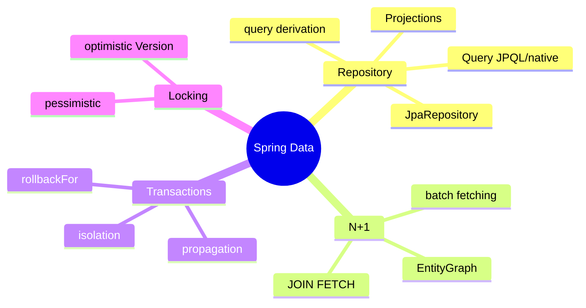
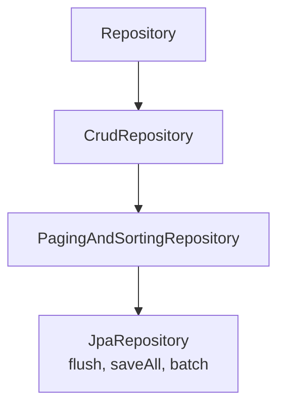
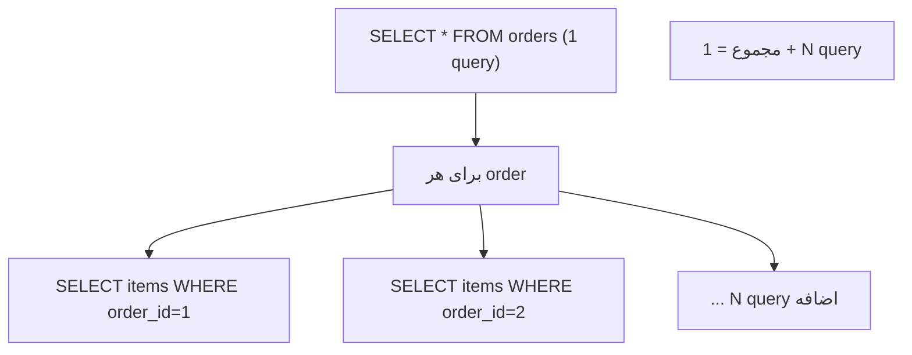
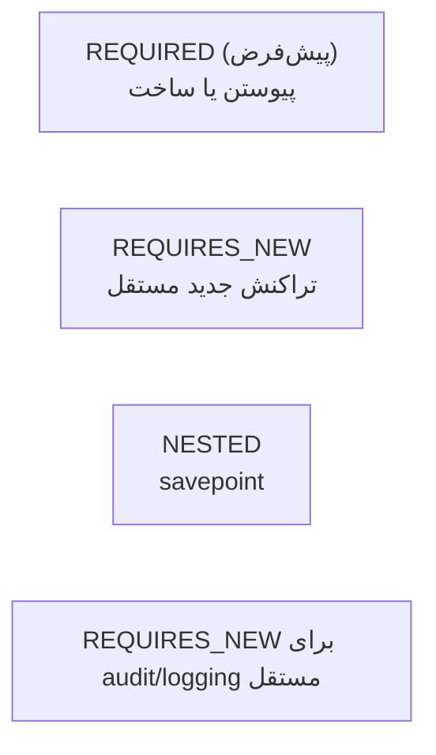
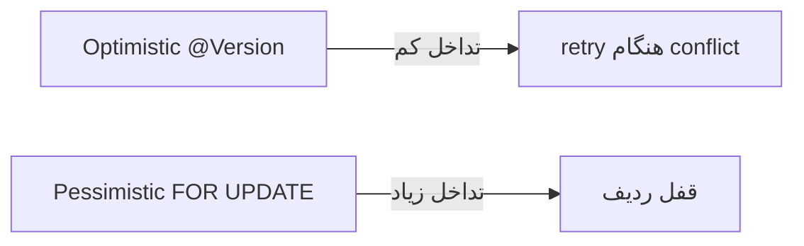

# Spring Data — JPA، Transactions، N+1، Locking

> Spring Data JPA پرتکرارترین موضوع مصاحبه‌ی backend است. N+1 و transaction propagation سوالات کلاسیک Senior هستند. این فایل با دیاگرام و مثال‌های متعدد گسترش یافته.

## فهرست
- [نقشه‌ی ذهنی](#نقشه‌ی-ذهنی)
- [📖 مفاهیم](#-مفاهیم)
- [🎯 سوالات مصاحبه](#-سوالات-مصاحبه)
- [⚠️ اشتباهات رایج](#️-اشتباهات-رایج)
- [🔗 ارتباط با سایر مفاهیم](#-ارتباط-با-سایر-مفاهیم)

---

## نقشه‌ی ذهنی



---

## 📖 مفاهیم

### Repository Abstraction

**توضیح:**

سلسله‌مراتب: `Repository` → `CrudRepository` → `PagingAndSortingRepository` → `JpaRepository`. شما فقط interface تعریف می‌کنید و Spring پیاده‌سازی را در runtime می‌سازد.



**Query derivation:** `findByNameAndAgeGreaterThan`. برای پیچیده‌تر `@Query` (JPQL/native). `@Modifying` برای update/delete.

**مثال کد:**

```java
public interface UserRepository extends JpaRepository<User, Long> {
    List<User> findByStatusAndCreatedAtAfter(Status status, Instant after); // derivation

    @Query("SELECT u FROM User u WHERE u.email = :email")
    Optional<User> findByEmail(@Param("email") String email);

    @Modifying
    @Query(value = "UPDATE users SET status = 'INACTIVE' WHERE last_login < :date", nativeQuery = true)
    int deactivateInactiveUsers(@Param("date") Instant date);
}
```

**نکات کلیدی:**

- query derivation برای ساده؛ `@Query` برای پیچیده.
- `@Modifying` به `@Transactional` نیاز دارد.
- از برگرداندن کل جدول بپرهیزید؛ `Pageable`.

---

### N+1 Problem

**توضیح:**

شایع‌ترین مشکل performance در JPA. وقتی association را `LAZY` بارگذاری می‌کنید و روی نتایج پیمایش می‌کنید، Hibernate برای هر رکورد یک query جداگانه می‌زند: ۱ + N.



راه‌حل‌ها: `JOIN FETCH`، `@EntityGraph`، batch fetching (`hibernate.default_batch_fetch_size`)، DTO projection.

**مثال کد:**

```java
// ❌ N+1
List<Order> orders = orderRepository.findAll();
orders.forEach(o -> o.getItems().size());

// ✅ JOIN FETCH
@Query("SELECT DISTINCT o FROM Order o LEFT JOIN FETCH o.items")
List<Order> findAllWithItems();

// ✅ EntityGraph
@EntityGraph(attributePaths = {"items", "customer"})
List<Order> findByStatus(Status status);
```

**نکات کلیدی:**

- پیش‌فرض `@ManyToOne` EAGER و `@OneToMany` LAZY؛ معمولاً همه LAZY + fetch انتخابی.
- `JOIN FETCH` با pagination مشکل دارد؛ از batch fetching استفاده کنید.
- SQL را در dev لاگ کنید (p6spy).

---

### Pagination & Projections

**توضیح:**

`Pageable`/`Page<T>` صفحه‌بندی + شمارش؛ `Slice<T>` فقط دانستن صفحه‌ی بعد (بدون count گران). **Projections**: interface-based یا class-based (DTO).

**مثال کد:**

```java
public interface UserSummary { Long getId(); String getName(); }
Page<UserSummary> findByStatus(Status status, Pageable pageable);

Page<UserSummary> page = repo.findByStatus(Status.ACTIVE, PageRequest.of(0, 20, Sort.by("name")));
```

**نکات کلیدی:**

- `Page` یک query شمارش اضافه می‌زند؛ اگر لازم نیست `Slice`.
- projection فقط ستون‌های لازم را select می‌کند.

---

### Transactions — Propagation & Isolation

**توضیح:**

`@Transactional` مرز تراکنش را تعریف می‌کند.

**Propagation:**



**Isolation:** `READ_UNCOMMITTED`, `READ_COMMITTED` (پیش‌فرض)، `REPEATABLE_READ`, `SERIALIZABLE`. هر سطح بالاتر anomalyهای بیشتری را حذف می‌کند اما concurrency کمتر.

نکته: rollback پیش‌فرض فقط **unchecked**. برای checked `rollbackFor`.

**مثال کد:**

```java
@Service
public class OrderService {
    @Transactional // REQUIRED
    public void placeOrder(Order order) {
        orderRepository.save(order);
        auditService.log("order placed"); // مستقل commit می‌شود
        paymentService.charge(order);      // اگر خطا → rollback همه جز audit
    }
}

@Service
class AuditService {
    @Transactional(propagation = Propagation.REQUIRES_NEW)
    public void log(String message) { auditRepository.save(new AuditEntry(message)); }
}
```

**نکات کلیدی:**

- rollback پیش‌فرض فقط unchecked؛ برای checked `rollbackFor`.
- `REQUIRES_NEW` برای audit مستقل.
- self-invocation تراکنش را می‌شکند (proxy؛ 2.1).

---

### Locking — Optimistic vs Pessimistic

**توضیح:**

**Optimistic** (با `@Version`): قفل نمی‌گیرد، هنگام commit چک می‌کند version عوض نشده باشد؛ مناسب read-heavy، تداخل کم. **Pessimistic** (`SELECT FOR UPDATE`): ردیف را قفل می‌کند؛ مناسب تداخل زیاد اما concurrency کمتر.



**مثال کد:**

```java
@Entity
class Product {
    @Id Long id;
    @Version Long version; // optimistic
    int stock;
}

public interface ProductRepository extends JpaRepository<Product, Long> {
    @Lock(LockModeType.PESSIMISTIC_WRITE)
    @Query("SELECT p FROM Product p WHERE p.id = :id")
    Optional<Product> findByIdForUpdate(@Param("id") Long id);
}
```

**نکات کلیدی:**

- optimistic برای تداخل کم (پیش‌فرض خوب)؛ pessimistic برای stock بحرانی.
- optimistic lock failure را با retry مدیریت کنید.

---

## 🎯 سوالات مصاحبه

### سوال ۱: N+1 problem چیست و چطور حل می‌شود؟

**سطح:** Senior
**تکرار:** خیلی زیاد

**جواب کامل:**

N+1 وقتی یک query اصلی N رکورد برمی‌گرداند و برای هر association (LAZY) یک query جداگانه زده می‌شود — 1+N. در dev با داده کم دیده نمی‌شود اما در production latency را منفجر می‌کند.

راه‌حل: `JOIN FETCH` برای بارگذاری یکجا؛ `@EntityGraph` declarative؛ batch fetching (N+1 → N/batch+1)؛ DTO projection. برای pagination، `JOIN FETCH` روی collection خطرناک است (صفحه‌بندی در حافظه)، پس batch fetching بهتر.

**کد توضیحی:**

```java
@EntityGraph(attributePaths = {"items"})
List<Order> findByCustomerId(Long customerId);
```

**نکته مصاحبه:**

تمایز Senior: مشکل `JOIN FETCH` با pagination و batch fetching. Follow-up: «چطور تشخیص می‌دهی؟» (p6spy، pg_stat_statements).

---

### سوال ۲: تفاوت `REQUIRED` و `REQUIRES_NEW`؟ سناریوی واقعی؟

**سطح:** Senior / Lead
**تکرار:** خیلی زیاد

**جواب کامل:**

`REQUIRED` به تراکنش جاری می‌پیوندد؛ اگر بیرونی rollback شود، این هم rollback می‌شود. `REQUIRES_NEW` تراکنش جدید مستقل می‌سازد و بیرونی را معلق می‌کند؛ commit/rollback مستقل.

سناریو: audit logging — می‌خواهید حتی اگر پرداخت fail و rollback شود، رکورد audit «تلاش» بماند. خطر: `REQUIRES_NEW` connection دوم می‌گیرد؛ استفاده‌ی بی‌رویه pool را تمام می‌کند و حتی self-deadlock.

**نکته مصاحبه:**

Lead به مصرف connection و pool exhaustion اشاره می‌کند.

---

### سوال ۳: isolation levels و anomalyها؟

**سطح:** Senior
**تکرار:** زیاد

**جواب کامل:**

`READ_UNCOMMITTED`: dirty read. `READ_COMMITTED` (پیش‌فرض): dirty حذف، اما non-repeatable ممکن. `REPEATABLE_READ`: non-repeatable حذف، اما phantom ممکن. `SERIALIZABLE`: همه حذف اما کمترین concurrency. trade-off consistency/throughput.

**نکته مصاحبه:**

Senior سه anomaly را به سطوح map می‌کند. Follow-up: «PostgreSQL با MVCC چطور؟»

---

### سوال ۴: optimistic در برابر pessimistic locking؟

**سطح:** Senior
**تکرار:** زیاد

**جواب کامل:**

optimistic (`@Version`) قفل نمی‌گیرد، هنگام commit چک می‌کند؛ مناسب read-heavy، scalable، اما نیاز retry. pessimistic ردیف را قفل می‌کند؛ مناسب تداخل زیاد (stock فروش لحظه‌ای) اما concurrency کم و خطر deadlock.

**کد توضیحی:**

```java
@Retryable(retryFor = OptimisticLockingFailureException.class, maxAttempts = 3)
@Transactional
public void updateStock(Long id, int delta) { /* ... */ }
```

**نکته مصاحبه:**

Senior به نیاز retry برای optimistic اشاره می‌کند.

---

### سوال ۵: چرا `@Transactional` گاهی rollback نمی‌کند؟

**سطح:** Senior
**تکرار:** زیاد

**جواب کامل:**

دلایل: (۱) استثنا **checked** است و پیش‌فرض فقط unchecked rollback می‌کند — `rollbackFor`. (۲) استثنا catch و swallow شده. (۳) **self-invocation**. (۴) متد `private`/`final` (proxy نمی‌تواند intercept). (۵) `@Async` (thread دیگر).

**نکته مصاحبه:**

Senior چندین علت می‌داند. Follow-up: «چرا checked پیش‌فرض rollback نمی‌کند؟»

---

## ⚠️ اشتباهات رایج

### اشتباه ۱: انتظار rollback برای checked

```java
// ❌
@Transactional public void process() throws IOException { throw new IOException(); }
```

```java
// ✅
@Transactional(rollbackFor = IOException.class)
public void process() throws IOException { throw new IOException(); }
```

**توضیح:** پیش‌فرض فقط unchecked rollback می‌شود.

---

### اشتباه ۲: N+1 با LAZY

```java
// ❌
orders.forEach(o -> o.getItems().size());
```

```java
// ✅
@Query("SELECT DISTINCT o FROM Order o JOIN FETCH o.items")
List<Order> findAllWithItems();
```

**توضیح:** هر دسترسی LAZY یک query می‌زند.

---

### اشتباه ۳: `JOIN FETCH` با pagination

```java
// ❌ صفحه‌بندی در حافظه
@Query("SELECT o FROM Order o JOIN FETCH o.items")
Page<Order> findAll(Pageable p);
```

```java
// ✅ batch fetching
// hibernate.default_batch_fetch_size: 50
@EntityGraph(attributePaths = "items")
Page<Order> findAll(Pageable p);
```

**توضیح:** `JOIN FETCH` روی collection با pagination، صفحه‌بندی را به حافظه می‌برد.

---

### اشتباه ۴: استفاده‌ی بیش از حد `REQUIRES_NEW`

```java
// ❌ هر فراخوانی connection دوم → pool exhaustion
@Transactional(propagation = Propagation.REQUIRES_NEW)
public void everyCall() {}
```

```java
// ✅ فقط برای audit مستقل
```

**توضیح:** `REQUIRES_NEW` connection دوم می‌گیرد.

---

## 🔗 ارتباط با سایر مفاهیم

- transaction propagation با **Spring Core AOP/proxy (2.1)** و self-invocation.
- N+1 با **DB indexing/query optimization (3.2, 14.1)**.
- locking با **PostgreSQL MVCC (3.3)** و **concurrency (1.6)**.
- `@Cacheable` با **Redis/Caching (9.1)**.
- DTO projection با **records (1.4)** و **API design (19.1)**.
