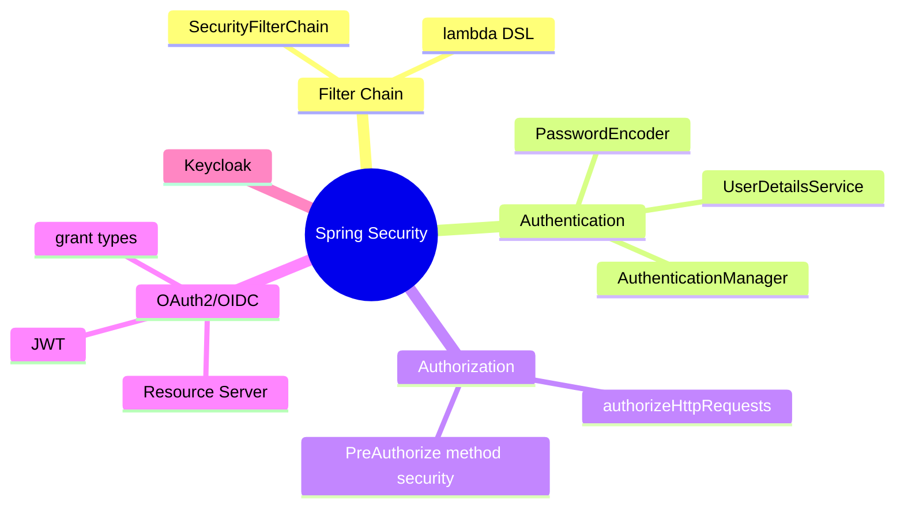
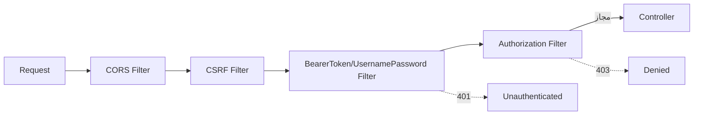
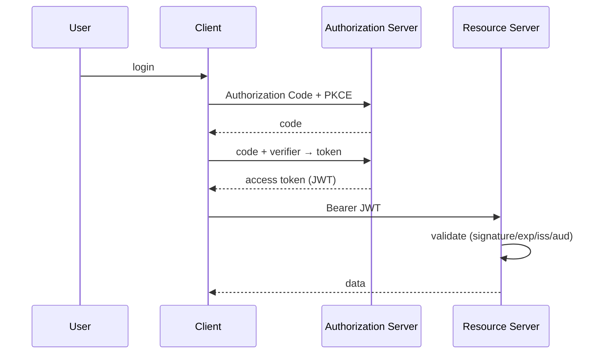

# Spring Security — Authentication، Authorization، OAuth2، Keycloak

> امنیت در هر مصاحبه‌ی backend پرسیده می‌شود. درک filter chain و JWT validation تمایز Senior است. این فایل با دیاگرام و مثال‌های متعدد گسترش یافته.

## فهرست
- [نقشه‌ی ذهنی](#نقشه‌ی-ذهنی)
- [📖 مفاهیم](#-مفاهیم)
- [🎯 سوالات مصاحبه](#-سوالات-مصاحبه)
- [⚠️ اشتباهات رایج](#️-اشتباهات-رایج)
- [🔗 ارتباط با سایر مفاهیم](#-ارتباط-با-سایر-مفاهیم)

---

## نقشه‌ی ذهنی



---

## جریان فیلتر امنیتی



---

## 📖 مفاهیم

### SecurityFilterChain (Spring Security 6+)

**توضیح:**

Spring Security روی زنجیره‌ای از servlet filterها بنا شده. هر request از این زنجیره عبور می‌کند و هر filter یک مسئولیت دارد. از Spring Security 6، پیکربندی با bean `SecurityFilterChain` و lambda DSL (روش قدیمی `WebSecurityConfigurerAdapter` حذف شده).

**مثال کد:**

```java
@Configuration
@EnableWebSecurity
@EnableMethodSecurity
public class SecurityConfig {
    @Bean
    SecurityFilterChain filterChain(HttpSecurity http) throws Exception {
        return http
            .csrf(csrf -> csrf.disable()) // برای API stateless با JWT
            .authorizeHttpRequests(auth -> auth
                .requestMatchers("/api/public/**").permitAll()
                .requestMatchers("/api/admin/**").hasRole("ADMIN")
                .anyRequest().authenticated())
            .oauth2ResourceServer(oauth -> oauth.jwt(Customizer.withDefaults()))
            .sessionManagement(s -> s.sessionCreationPolicy(SessionCreationPolicy.STATELESS))
            .build();
    }
}
```

**نکات کلیدی:**

- از Spring Security 6 lambda DSL و `SecurityFilterChain`.
- برای API با JWT: session STATELESS و CSRF disable.
- ترتیب requestMatcherها از خاص به عام.

---

### Authentication Components

**توضیح:**

`UserDetailsService` کاربر را بارگذاری می‌کند. `AuthenticationManager` فرایند را هماهنگ می‌کند. `PasswordEncoder` رمز را hash می‌کند — همیشه BCrypt یا Argon2، هرگز plaintext/MD5.

**مثال کد:**

```java
@Bean
PasswordEncoder passwordEncoder() { return new BCryptPasswordEncoder(12); }

@Service
class DbUserDetailsService implements UserDetailsService {
    private final UserRepository repo;
    DbUserDetailsService(UserRepository repo) { this.repo = repo; }
    @Override
    public UserDetails loadUserByUsername(String username) {
        User u = repo.findByUsername(username)
            .orElseThrow(() -> new UsernameNotFoundException(username));
        return org.springframework.security.core.userdetails.User
            .withUsername(u.getUsername()).password(u.getPasswordHash())
            .roles(u.getRoles().toArray(String[]::new)).build();
    }
}
```

**نکات کلیدی:**

- BCrypt/Argon2 با salt خودکار؛ هرگز plaintext.
- BCrypt strength را با سخت‌افزار تنظیم کنید.

---

### Authorization & Method Security

**توضیح:**

دو سطح: URL-based و method-based (`@PreAuthorize`, `@PostAuthorize`). `@PreAuthorize` قبل از اجرا با SpEL؛ `@PostAuthorize` بعد از اجرا روی نتیجه.

**مثال کد:**

```java
@Service
class DocumentService {
    @PreAuthorize("hasRole('ADMIN') or #ownerId == authentication.name")
    public Document getDocument(String ownerId, Long docId) { return null; }

    @PostAuthorize("returnObject.owner == authentication.name")
    public Document loadDocument(Long id) { return null; }
}
```

**نکات کلیدی:**

- `@EnableMethodSecurity` را فعال کنید.
- method security با AOP کار می‌کند → self-invocation محدودیت.

---

### CSRF — کِی لازم

**توضیح:**

CSRF فقط وقتی relevant است که **cookie-based session** دارید. برای API stateless با JWT در header `Authorization`، مرورگر آن را خودکار نمی‌فرستد پس CSRF موضوعیت ندارد.

**نکات کلیدی:**

- API stateless + JWT header → CSRF disable منطقی.
- اپ سنتی با session cookie → CSRF فعال بماند.

---

### OAuth 2.0 & OIDC

**توضیح:**

OAuth 2.0 چارچوب **authorization**. نقش‌ها: Resource Owner، Client، Authorization Server، Resource Server. **Grant types:** Authorization Code + PKCE (web/mobile)، Client Credentials (M2M)، Device Code. **OIDC** لایه‌ی authentication روی OAuth با **ID Token** (JWT).



**مثال کد:**

```java
@Bean
JwtAuthenticationConverter jwtAuthConverter() {
    JwtGrantedAuthoritiesConverter granted = new JwtGrantedAuthoritiesConverter();
    granted.setAuthoritiesClaimName("roles");
    granted.setAuthorityPrefix("ROLE_");
    JwtAuthenticationConverter converter = new JwtAuthenticationConverter();
    converter.setJwtGrantedAuthoritiesConverter(granted);
    return converter;
}
```

**نکات کلیدی:**

- OAuth = authorization، OIDC = authentication.
- Authorization Code + PKCE برای کلاینت عمومی.
- token را validate کنید: signature + expiry + issuer + audience.

---

### JWT & Keycloak

**توضیح:**

**JWT:** Header.Payload.Signature. امضا با HS256 (symmetric) یا RS256/ES256 (asymmetric — ترجیح microservice). مشکل: revocation سخت چون stateless. راه‌حل: expiry کوتاه + refresh token، یا blacklist در Redis.

**Keycloak:** Realm، Client، Realm/Client Roles، User Federation. روش مدرن: Keycloak به‌عنوان provider و Spring به‌عنوان Resource Server.

**مثال کد:**

```yaml
spring:
  security:
    oauth2:
      resourceserver:
        jwt:
          issuer-uri: https://keycloak.example.com/realms/myrealm
```

**نکات کلیدی:**

- RS256 در microservice بهتر از HS256.
- JWT را نمی‌توان به‌راحتی revoke کرد → expiry کوتاه.
- local validation (JWKS) سریع؛ introspection امکان revocation فوری.

---

## 🎯 سوالات مصاحبه

### سوال ۱: تفاوت authentication و authorization؟

**سطح:** Junior / Mid
**تکرار:** خیلی زیاد

**جواب کامل:**

Authentication: «تو کی هستی؟» — تأیید هویت. Authorization: «اجازه‌ی چه کاری داری؟» — کنترل دسترسی. اول authentication، سپس authorization. OAuth چارچوب authorization؛ OIDC لایه‌ی authentication.

**نکته مصاحبه:**

تمایز Senior: OAuth خودش authentication نیست.

---

### سوال ۲: JWT چطور validate و چرا revocation سخت است؟

**سطح:** Senior
**تکرار:** خیلی زیاد

**جواب کامل:**

validation: signature (با کلید/JWKS)، expiry، issuer، audience — بدون فراخوانی auth server (stateless). همین revocation را سخت می‌کند: token دزدیده‌شده تا expiry معتبر. راه‌حل: expiry کوتاه + refresh token؛ blacklist در Redis؛ یا introspection (revocation فوری اما کندتر).

**نکته مصاحبه:**

Senior trade-off local validation/introspection را می‌داند. Follow-up: «refresh token کجا ذخیره؟» (httpOnly cookie).

---

### سوال ۳: Authorization Code + PKCE چیست و چرا SPA؟

**سطح:** Senior
**تکرار:** زیاد

**جواب کامل:**

SPA/mobile نمی‌توانند client secret را امن نگه دارند. PKCE: کلاینت `code_verifier` تصادفی می‌سازد، `code_challenge` (hash) را می‌فرستد، و هنگام تبدیل code به token `code_verifier` را ارائه می‌دهد. حتی اگر code رهگیری شود، بدون verifier نمی‌توان token گرفت — جایگزین secret.

**نکته مصاحبه:**

Senior: PKCE حالا برای همه توصیه می‌شود.

---

### سوال ۴: introspection در برابر local JWT validation؟

**سطح:** Lead
**تکرار:** متوسط

**جواب کامل:**

local: Resource Server خودش با کلید عمومی validate می‌کند — سریع، scalable، اما بدون revocation تا expiry. introspection: هر بار از auth server می‌پرسد — کندتر اما revocation فوری. انتخاب: latency/scale → local؛ امنیت سخت‌گیرانه → introspection. ترکیب: local + expiry کوتاه + blacklist بحرانی.

**نکته مصاحبه:**

Lead trade-off latency/revocation را می‌فهمد.

---

### سوال ۵: چرا CSRF را برای API با JWT disable می‌کنیم؟

**سطح:** Senior
**تکرار:** متوسط

**جواب کامل:**

CSRF متکی بر ارسال خودکار cookie توسط مرورگر است. با JWT در header `Authorization`، مرورگر آن را خودکار نمی‌فرستد، پس سایت مخرب نمی‌تواند token را به request جعلی بچسباند. اما اگر token در cookie باشد، CSRF برمی‌گردد (SameSite لازم).

**نکته مصاحبه:**

Senior به شرط «token در header نه cookie» اشاره می‌کند.

---

## ⚠️ اشتباهات رایج

### اشتباه ۱: رمز plaintext یا hash ضعیف

```java
// ❌
user.setPassword(rawPassword); // یا MD5
```

```java
// ✅
user.setPasswordHash(passwordEncoder.encode(rawPassword));
```

**توضیح:** رمز باید با BCrypt/Argon2 و salt hash شود.

---

### اشتباه ۲: JWT در localStorage

```javascript
// ❌ آسیب‌پذیر XSS
localStorage.setItem('token', jwt);
```

```javascript
// ✅ httpOnly cookie برای refresh token
```

**توضیح:** localStorage در برابر XSS آسیب‌پذیر است.

---

### اشتباه ۳: expiry طولانی access token

```yaml
# ❌
access-token-validity: 86400
```

```yaml
# ✅
access-token-validity: 900  # 15 دقیقه + refresh
```

**توضیح:** چون revocation سخت است، پنجره را کوتاه کنید.

---

### اشتباه ۴: HS256 با کلید مشترک در microservice

```text
❌ کلید مشترک → فاش یکی = جعل همه
✅ RS256: کلید عمومی برای validation
```

**توضیح:** asymmetric کلید امضا را جدا نگه می‌دارد.

---

## 🔗 ارتباط با سایر مفاهیم

- filter chain با **Spring MVC (2.3)** و servlet.
- OAuth/OIDC/Keycloak با **Security (7.2)** و **microservices (6.1)**.
- JWT با **Redis blacklist (9.1)** و **API Gateway (2.6)**.
- method security با **AOP/proxy (2.1)**.
- `@PreAuthorize` با **IDOR/Security (7.1)**.
