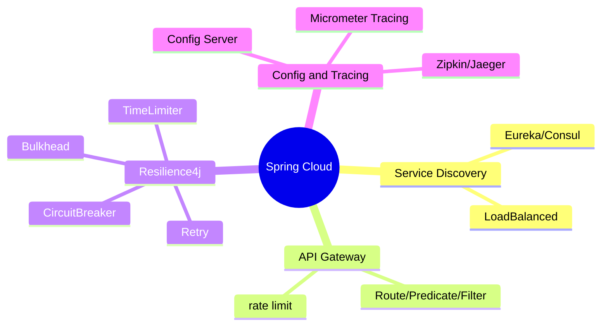
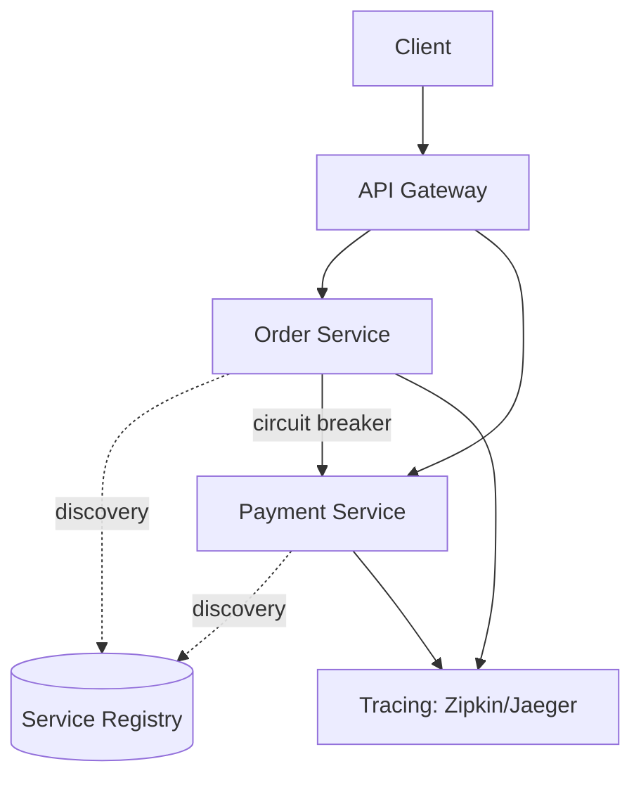
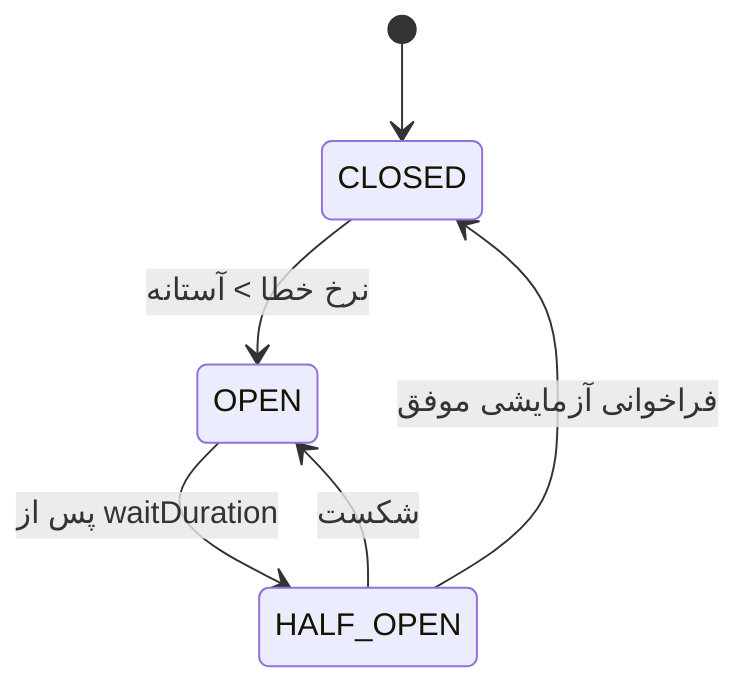
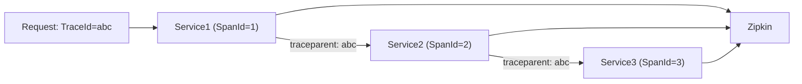

# Spring Cloud — Service Discovery، Gateway، Resilience، Tracing

> ابزارهای ساخت میکروسرویس در Spring. سوالات سطح Lead روی resilience و distributed concerns تمرکز دارند. این فایل با دیاگرام و مثال‌های متعدد گسترش یافته.

## فهرست
- [نقشه‌ی ذهنی](#نقشه‌ی-ذهنی)
- [📖 مفاهیم](#-مفاهیم)
- [🎯 سوالات مصاحبه](#-سوالات-مصاحبه)
- [⚠️ اشتباهات رایج](#️-اشتباهات-رایج)
- [🔗 ارتباط با سایر مفاهیم](#-ارتباط-با-سایر-مفاهیم)

---

## نقشه‌ی ذهنی



---

## معماری میکروسرویس با Spring Cloud



---

## 📖 مفاهیم

### Service Discovery

**توضیح:**

در محیط پویا، آدرس سرویس‌ها ثابت نیست. Service Discovery یک registry است که سرویس‌ها در آن ثبت می‌شوند. **Eureka** و **Consul**. دو مدل load balancing: client-side (با `@LoadBalanced`) و server-side.

نکته‌ی مدرن: در Kubernetes، خود K8s service discovery و LB (با Service و DNS) را فراهم می‌کند، پس Eureka اغلب غیرضروری است.

**مثال کد:**

```java
@Bean
@LoadBalanced
RestClient.Builder restClientBuilder() { return RestClient.builder(); }

// به‌جای host:port از نام سرویس
restClient.get().uri("http://order-service/api/orders/{id}", id).retrieve();
```

**نکات کلیدی:**

- در K8s معمولاً به Eureka نیازی نیست.
- client-side LB انعطاف بیشتر؛ server-side سادگی.

---

### API Gateway

**توضیح:**

نقطه‌ی ورود واحد. **Spring Cloud Gateway** (WebFlux، non-blocking) cross-cutting را متمرکز می‌کند: routing، auth، rate limiting، circuit breaker. مفاهیم: Route، Predicate، Filter.

**مثال کد:**

```yaml
spring:
  cloud:
    gateway:
      routes:
        - id: order-service
          uri: lb://order-service
          predicates: [Path=/api/orders/**]
          filters:
            - StripPrefix=1
            - name: CircuitBreaker
              args: { name: orderCB, fallbackUri: forward:/fallback/orders }
            - name: RequestRateLimiter
              args: { redis-rate-limiter.replenishRate: 100, redis-rate-limiter.burstCapacity: 200 }
```

**نکات کلیدی:**

- Gateway را برای auth/rate-limit/circuit-breaker متمرکز کنید.
- چون WebFlux، filterهای blocking ننویسید.

---

### Resilience (Resilience4j)

**توضیح:**

در سیستم توزیع‌شده، شکست بخشی اجتناب‌ناپذیر است. الگوها: **CircuitBreaker** (CLOSED → OPEN → HALF_OPEN)، **Retry** (با backoff)، **RateLimiter**، **Bulkhead** (ایزولاسیون منابع)، **TimeLimiter**.



ترتیب ترکیب معمول: `Retry(CircuitBreaker(RateLimiter(TimeLimiter(call))))`.

**مثال کد:**

```java
@Service
class PaymentClient {
    @CircuitBreaker(name = "payment", fallbackMethod = "fallback")
    @Retry(name = "payment")
    @TimeLimiter(name = "payment")
    public CompletableFuture<PaymentResult> charge(PaymentRequest req) {
        return CompletableFuture.supplyAsync(() -> externalGateway.charge(req));
    }
    public CompletableFuture<PaymentResult> fallback(PaymentRequest req, Throwable t) {
        return CompletableFuture.completedFuture(PaymentResult.pending()); // degradation
    }
}
```

**نکات کلیدی:**

- CircuitBreaker از cascade failure جلوگیری می‌کند.
- Retry فقط برای خطای گذرا و عملیات idempotent.
- fallback باید graceful degradation بدهد.

---

### Config & Tracing

**توضیح:**

**Spring Cloud Config** پیکربندی متمرکز از Git. **Distributed Tracing**: `TraceId`/`SpanId` که بین سرویس‌ها propagate می‌شود (W3C `traceparent`). **Micrometer Tracing** (Boot 3+). backendها: **Zipkin/Jaeger**.



**مثال کد:**

```yaml
management:
  tracing:
    sampling: { probability: 0.1 }   # 10% در production
  zipkin:
    tracing: { endpoint: http://zipkin:9411/api/v2/spans }
```

**نکات کلیدی:**

- TraceId را در لاگ‌ها بگذارید.
- sampling در production پایین.
- context باید بین سرویس‌ها propagate شود.

---

## 🎯 سوالات مصاحبه

### سوال ۱: Circuit Breaker چطور کار می‌کند و چه حالت‌هایی دارد؟

**سطح:** Senior / Lead
**تکرار:** خیلی زیاد

**جواب کامل:**

CLOSED (عادی، رصد نرخ خطا)، OPEN (نرخ خطا از آستانه گذشت، فراخوانی‌ها فوراً fail می‌شوند برای `waitDuration`)، HALF_OPEN (تعداد محدود آزمایشی؛ موفق → CLOSED، شکست → OPEN). هدف: جلوگیری از cascade failure — وقتی سرویس downstream کند است، بدون circuit breaker threadها انباشته و سرویس فراخوان هم down می‌شود.

**نکته مصاحبه:**

Lead به cascade failure و thread exhaustion اشاره می‌کند.

---

### سوال ۲: Retry کِی باید و کِی نباید؟

**سطح:** Senior
**تکرار:** زیاد

**جواب کامل:**

Retry فقط برای خطای **گذرا** (timeout موقت، 503، deadlock). نباید برای خطای **دائمی** (400، 404، validation). عملیات باید **idempotent** باشد. همیشه با **exponential backoff + jitter** تا retry storm رخ ندهد.

**نکته مصاحبه:**

تمایز Senior: idempotency، backoff+jitter.

---

### سوال ۳: Bulkhead pattern چیست؟

**سطح:** Senior / Lead
**تکرار:** متوسط

**جواب کامل:**

الهام از دیواره‌های ضدآب کشتی: منابع (thread pool/semaphore) را بین فراخوانی‌ها ایزوله می‌کند. اگر سرویس A و B یک pool مشترک داشته باشند و A کند شود، B هم گرسنه می‌ماند. با Bulkhead، pool جدا، پس کندی A روی B اثر نمی‌گذارد.

**نکته مصاحبه:**

Lead به resource isolation و starvation اشاره می‌کند.

---

### سوال ۴: distributed tracing چطور یک request را دنبال می‌کند؟

**سطح:** Senior / Lead
**تکرار:** متوسط

**جواب کامل:**

یک `TraceId` یکتا تولید و هر مرحله یک `SpanId` می‌گیرد. context از طریق header (W3C `traceparent`) بین سرویس‌ها propagate می‌شود. هر سرویس span را به backend (Zipkin/Jaeger) می‌فرستد که با TraceId همه را به یک نمودار end-to-end کنار هم می‌گذارد. sampling overhead را کنترل می‌کند.

**نکته مصاحبه:**

Senior به propagation و sampling اشاره می‌کند.

---

### سوال ۵: ترتیب annotationهای resilience4j چرا مهم است؟

**سطح:** Lead
**تکرار:** متوسط

**جواب کامل:**

هر کدام aspect جدا با ترتیب اجرای متفاوت‌اند. معمول: `Retry → CircuitBreaker → RateLimiter → TimeLimiter → call`. TimeLimiter داخلی‌ترین (هر تلاش timeout). Retry بیرونی‌تر تا کل چرخه دوباره تلاش شود — اما این یعنی retry می‌تواند circuit را زودتر باز کند. تصمیم آگاهانه نه پیش‌فرض.

**نکته مصاحبه:**

Lead نشان می‌دهد تصمیم با trade-off است.

---

## ⚠️ اشتباهات رایج

### اشتباه ۱: Retry بدون idempotency

```java
// ❌
@Retry(name = "payment")
public void charge(Card card, Money amount) { gateway.charge(card, amount); }
```

```java
// ✅ idempotency key
@Retry(name = "payment")
public void charge(String idemKey, Card card, Money amount) { gateway.charge(idemKey, card, amount); }
```

**توضیح:** retry عملیات غیرidempotent داده را خراب می‌کند.

---

### اشتباه ۲: fallback که خطای دیگری می‌دهد

```java
// ❌
public Result fallback(Req r, Throwable t) { return anotherRemoteCall(r); }
```

```java
// ✅
public Result fallback(Req r, Throwable t) { return Result.cachedOrDefault(); }
```

**توضیح:** fallback باید قطعی و بدون وابستگی خارجی باشد.

---

### اشتباه ۳: sampling 100% در production

```yaml
# ❌
management.tracing.sampling.probability: 1.0
```

```yaml
# ✅
management.tracing.sampling.probability: 0.1
```

**توضیح:** trace همه‌ی requestها گران است.

---

### اشتباه ۴: Eureka در K8s بدون نیاز

```text
❌ Eureka در حالی که K8s discovery دارد → پیچیدگی اضافه
✅ K8s Service + DNS
```

**توضیح:** K8s service discovery داخلی دارد.

---

## 🔗 ارتباط با سایر مفاهیم

- Resilience4j با **Architecture (SAGA، resilience 15.2)** و **circuit breaker**.
- tracing با **Observability (OpenTelemetry 16.4، Jaeger)** و **Scoped Values (1.6)**.
- API Gateway با **Security (2.5)** و **rate limiting (Redis 9.1)**.
- Service Discovery با **Kubernetes (10.2)**.
- Config Server با **12-Factor (15.3)**.
