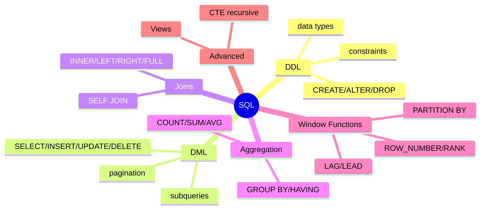
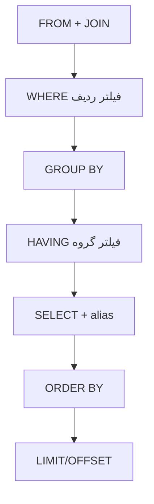
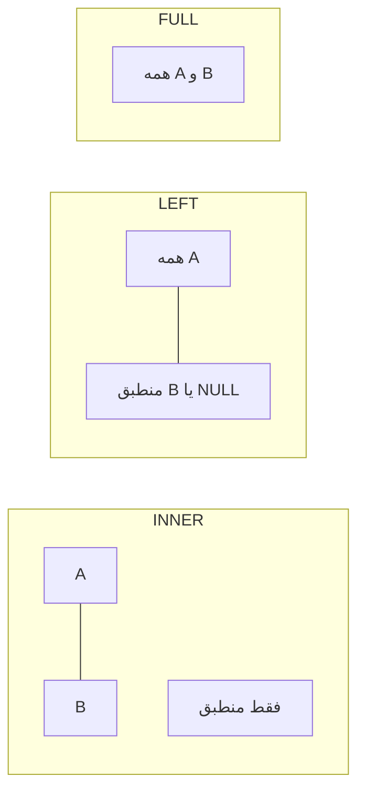
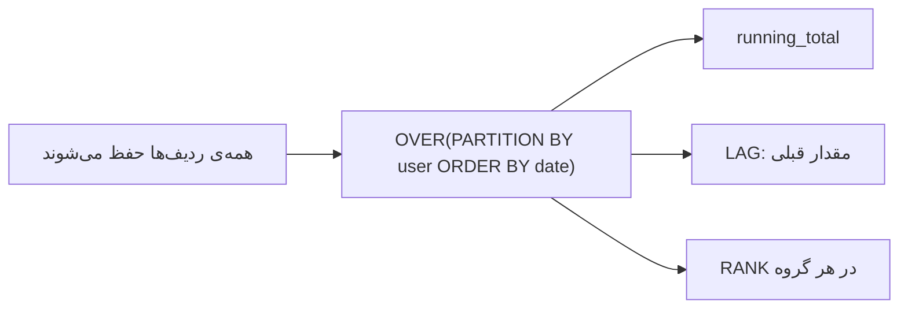

# مبانی SQL — DDL، DML، Joins، Aggregation، Window Functions

> SQL در هر مصاحبه‌ی backend پرسیده می‌شود. تسلط بر join، aggregation و window functions ضروری است. این فایل با دیاگرام و مثال‌های متعدد گسترش یافته.

## فهرست
- [نقشه‌ی ذهنی](#نقشه‌ی-ذهنی)
- [ترتیب منطقی اجرای query](#ترتیب-منطقی-اجرای-query)
- [📖 مفاهیم](#-مفاهیم)
- [🎯 سوالات مصاحبه](#-سوالات-مصاحبه)
- [⚠️ اشتباهات رایج](#️-اشتباهات-رایج)
- [🔗 ارتباط با سایر مفاهیم](#-ارتباط-با-سایر-مفاهیم)

---

## نقشه‌ی ذهنی



---

## ترتیب منطقی اجرای query



> به همین دلیل نمی‌توان در WHERE به alias در SELECT اشاره کرد (هنوز محاسبه نشده).

---

## 📖 مفاهیم

### DDL — تعریف ساختار

**توضیح:**

DDL ساختار داده را تعریف می‌کند: `CREATE`, `ALTER`, `DROP`, `TRUNCATE`. constraintها (`PRIMARY KEY`, `FOREIGN KEY`, `UNIQUE`, `NOT NULL`, `CHECK`, `DEFAULT`) قوانین کسب‌وکار را در سطح DB enforce می‌کنند — حتی اگر اپ باگ داشته باشد.

تفاوت: `DELETE` (با WHERE، loggable، rollback، trigger)؛ `TRUNCATE` (کل جدول سریع، بدون trigger)؛ `DROP` (حذف جدول).

**مثال کد:**

```sql
CREATE TABLE orders (
    id          BIGINT GENERATED ALWAYS AS IDENTITY PRIMARY KEY,
    user_id     BIGINT NOT NULL REFERENCES users(id),
    amount      DECIMAL(12, 2) NOT NULL CHECK (amount >= 0), -- نه FLOAT برای پول
    status      VARCHAR(20) NOT NULL DEFAULT 'PENDING',
    created_at  TIMESTAMPTZ NOT NULL DEFAULT NOW(),
    CONSTRAINT uq_user_status UNIQUE (user_id, status)
);
```

**نکات کلیدی:**

- برای پول `DECIMAL`/`NUMERIC` نه `FLOAT` (خطای گرد کردن).
- constraintها را در DB بگذارید.
- `TIMESTAMPTZ` برای زمان با منطقه؛ UTC ذخیره کنید.

---

### DML — دستکاری داده

**توضیح:**

`SELECT`, `INSERT`, `UPDATE`, `DELETE`. بندها: `WHERE`, `ORDER BY`, `GROUP BY`, `HAVING`, `LIMIT`/`OFFSET`. **Subquery**: non-correlated (مستقل) و correlated (به ردیف بیرونی وابسته، می‌تواند کند). `OFFSET` بزرگ کند است؛ keyset pagination بهتر.

**مثال کد:**

```sql
-- keyset pagination (بهتر از OFFSET بزرگ)
SELECT id, name FROM users WHERE id > 1000 ORDER BY id LIMIT 20;

-- correlated subquery
SELECT u.name,
       (SELECT MAX(o.created_at) FROM orders o WHERE o.user_id = u.id) AS last_order
FROM users u;

-- INSERT ... ON CONFLICT (upsert در PostgreSQL)
INSERT INTO counters(key, value) VALUES ('hits', 1)
ON CONFLICT (key) DO UPDATE SET value = counters.value + 1;
```

**نکات کلیدی:**

- `OFFSET` بزرگ کند است؛ keyset pagination.
- correlated subquery می‌تواند به join تبدیل شود.
- `WHERE` قبل از group، `HAVING` بعد.

---

### Joins

**توضیح:**



- `INNER JOIN`: فقط منطبق. `LEFT JOIN`: همه‌ی چپ + منطبق راست. `FULL OUTER`: همه. `CROSS`: دکارتی. `SELF JOIN`: جدول با خودش.

**مثال کد:**

```sql
-- LEFT JOIN: همه‌ی کاربران حتی بدون سفارش
SELECT u.name, COUNT(o.id) AS order_count
FROM users u LEFT JOIN orders o ON o.user_id = u.id
GROUP BY u.id, u.name;

-- SELF JOIN: کارمند و مدیر
SELECT e.name AS employee, m.name AS manager
FROM employees e LEFT JOIN employees m ON e.manager_id = m.id;
```

**نکات کلیدی:**

- فیلتر روی جدول راست در WHERE، `LEFT JOIN` را به INNER تبدیل می‌کند (تله).
- `EXISTS` معمولاً سریع‌تر از `IN` با subquery.

---

### Aggregation & GROUP BY

**توضیح:**

`COUNT`, `SUM`, `AVG`, `MIN`, `MAX`. `GROUP BY` گروه می‌کند، `HAVING` گروه‌ها را فیلتر. `COUNT(*)` همه، `COUNT(col)` non-NULL، `COUNT(DISTINCT col)` یکتا.

**مثال کد:**

```sql
SELECT user_id, COUNT(*) AS paid_orders, SUM(amount) AS total
FROM orders
WHERE status = 'PAID'        -- فیلتر ردیف
GROUP BY user_id
HAVING COUNT(*) > 5          -- فیلتر گروه
ORDER BY total DESC;
```

**نکات کلیدی:**

- `WHERE` قبل، `HAVING` بعد.
- `COUNT(col)` NULL را نمی‌شمارد.

---

### Window Functions

**توضیح:**

برخلاف `GROUP BY` که ردیف‌ها را جمع می‌کند، window function محاسبه را روی یک «پنجره» انجام می‌دهد اما **تک‌تک ردیف‌ها را حفظ می‌کند**. با `OVER (PARTITION BY ... ORDER BY ...)`.



**مثال کد:**

```sql
SELECT user_id, order_date, amount,
    SUM(amount) OVER (PARTITION BY user_id ORDER BY order_date) AS running_total,
    LAG(amount) OVER (PARTITION BY user_id ORDER BY order_date) AS prev_amount,
    RANK() OVER (PARTITION BY DATE_TRUNC('month', order_date) ORDER BY amount DESC) AS monthly_rank,
    NTILE(4) OVER (ORDER BY amount) AS quartile
FROM orders;
```

**نکات کلیدی:**

- window function ردیف‌ها را حفظ می‌کند.
- `RANK` فاصله می‌اندازد (1,1,3)؛ `DENSE_RANK` نه (1,1,2)؛ `ROW_NUMBER` همیشه یکتا.

---

### Advanced SQL — CTE، Views

**توضیح:**

**CTE** با `WITH` query موقت نام‌دار می‌سازد و **recursive CTE** برای داده‌ی سلسله‌مراتبی. **View** query ذخیره‌شده (هر بار اجرا)؛ **Materialized View** نتیجه را فیزیکی ذخیره (سریع‌تر، نیاز refresh).

**مثال کد:**

```sql
-- recursive CTE: کل زیرمجموعه‌های یک مدیر
WITH RECURSIVE subordinates AS (
    SELECT id, name, manager_id FROM employees WHERE id = 1
    UNION ALL
    SELECT e.id, e.name, e.manager_id
    FROM employees e JOIN subordinates s ON e.manager_id = s.id
)
SELECT * FROM subordinates;
```

**نکات کلیدی:**

- recursive CTE برای داده‌ی درختی.
- materialized view برای گزارش‌های گران اما کم‌تغییر.

---

## 🎯 سوالات مصاحبه

### سوال ۱: تفاوت `WHERE` و `HAVING`؟

**سطح:** Junior / Mid
**تکرار:** خیلی زیاد

**جواب کامل:**

`WHERE` ردیف‌ها را **قبل** از گروه‌بندی فیلتر می‌کند و نمی‌تواند تابع تجمعی استفاده کند. `HAVING` گروه‌ها را **بعد** از GROUP BY فیلتر و می‌تواند روی نتیجه‌ی تابع تجمعی شرط بگذارد. ترتیب منطقی: FROM → WHERE → GROUP BY → HAVING → SELECT → ORDER BY. به همین دلیل در WHERE نمی‌توان به alias اشاره کرد.

**نکته مصاحبه:**

Senior ترتیب منطقی را می‌داند.

---

### سوال ۲: تفاوت `RANK`, `DENSE_RANK`, `ROW_NUMBER`؟

**سطح:** Senior
**تکرار:** زیاد

**جواب کامل:**

`ROW_NUMBER` همیشه یکتا (1,2,3,4). `RANK` به مساوی‌ها یکسان و **می‌پرد** (1,1,3,4). `DENSE_RANK` یکسان بدون پرش (1,1,2,3). برای «نفر دوم واقعی» `DENSE_RANK`، برای شماره‌گذاری یکتا `ROW_NUMBER`.

**نکته مصاحبه:**

Follow-up: «رکورد دوم گران‌ترین هر دسته؟» (`DENSE_RANK = 2`).

---

### سوال ۳: join در برابر subquery — کدام بهینه‌تر؟

**سطح:** Senior
**تکرار:** زیاد

**جواب کامل:**

معمولاً join چون planner آزادی بیشتری دارد. اما برای existence check `EXISTS` اغلب بهتر؛ `IN` با لیست بزرگ کند؛ correlated subquery (برای هر ردیف) بدترین. با `EXPLAIN ANALYZE` بسنجید نه حدس.

**نکته مصاحبه:**

تمایز Senior: اندازه‌گیری + EXISTS. Follow-up: «`NOT IN` با NULL؟» (نتیجه‌ی خالی — تله).

---

### سوال ۴: چرا `OFFSET` بزرگ کند است؟

**سطح:** Senior
**تکرار:** متوسط

**جواب کامل:**

`OFFSET 100000 LIMIT 20` یعنی DB باید ۱۰۰٬۰۲۰ ردیف را پردازش و ۱۰۰٬۰۰۰ تا را دور بریزد — O(n). **keyset pagination**: `WHERE id > last_id ORDER BY id LIMIT 20` که با index مستقیماً به نقطه می‌رود — O(log n).

**نکته مصاحبه:**

Senior keyset pagination را می‌شناسد.

---

### سوال ۵: recursive CTE برای چه؟

**سطح:** Senior
**تکرار:** متوسط

**جواب کامل:**

داده‌ی سلسله‌مراتبی/گرافی: درخت سازمانی، دسته‌بندی تو در تو، graph traversal. دو بخش: anchor و recursive part. مراقب حلقه‌ی بی‌نهایت. در Oracle معادل `CONNECT BY`.

**نکته مصاحبه:**

Follow-up: «جلوگیری از حلقه در گراف؟»

---

## ⚠️ اشتباهات رایج

### اشتباه ۱: FLOAT برای پول

```sql
-- ❌
amount FLOAT
```

```sql
-- ✅
amount DECIMAL(12, 2)
```

**توضیح:** اعداد اعشاری باینری پول را دقیق نگه نمی‌دارند.

---

### اشتباه ۲: LEFT JOIN که به INNER تبدیل می‌شود

```sql
-- ❌
SELECT * FROM users u LEFT JOIN orders o ON o.user_id=u.id WHERE o.status='PAID';
```

```sql
-- ✅ شرط در ON
SELECT * FROM users u LEFT JOIN orders o ON o.user_id=u.id AND o.status='PAID';
```

**توضیح:** فیلتر روی جدول راست در WHERE رفتار LEFT JOIN را می‌شکند.

---

### اشتباه ۳: `NOT IN` با NULL

```sql
-- ❌ اگر subquery NULL داشته باشد، خالی
SELECT * FROM users WHERE id NOT IN (SELECT user_id FROM orders);
```

```sql
-- ✅
SELECT * FROM users u WHERE NOT EXISTS (SELECT 1 FROM orders o WHERE o.user_id=u.id);
```

**توضیح:** `NOT IN` با NULL به‌خاطر منطق سه‌وضعیتی نتیجه‌ی غیرمنتظره می‌دهد.

---

### اشتباه ۴: OFFSET بزرگ

```sql
-- ❌
SELECT * FROM events ORDER BY id LIMIT 20 OFFSET 500000;
```

```sql
-- ✅
SELECT * FROM events WHERE id > 500000 ORDER BY id LIMIT 20;
```

**توضیح:** OFFSET بزرگ همه‌ی ردیف‌های قبلی را اسکن می‌کند.

---

## 🔗 ارتباط با سایر مفاهیم

- با **Indexing & Performance (3.2)** — query بدون index کند است.
- با **Spring Data JPA (2.4)** (JPQL، N+1) و **transactions**.
- window functions با **PostgreSQL advanced (14.2)**.
- keyset pagination با **API design (19.1)** (cursor-based).
