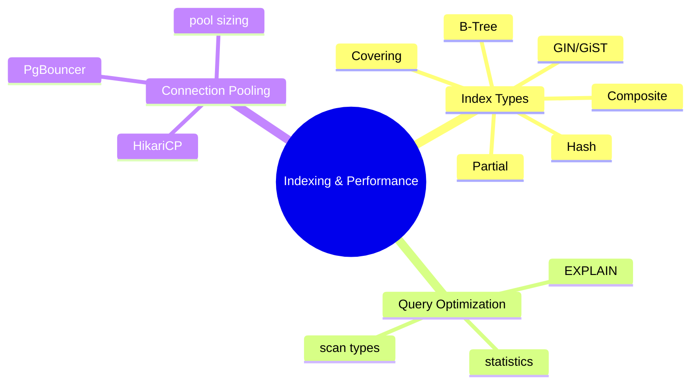
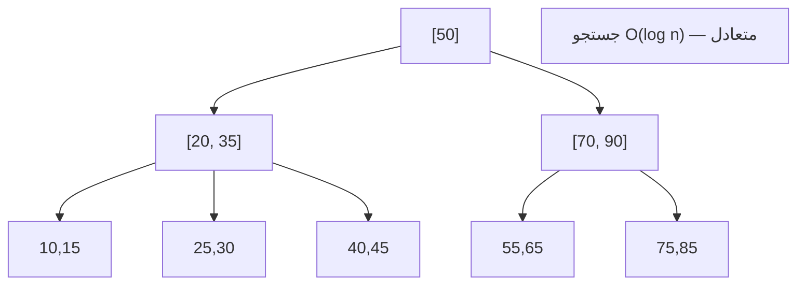
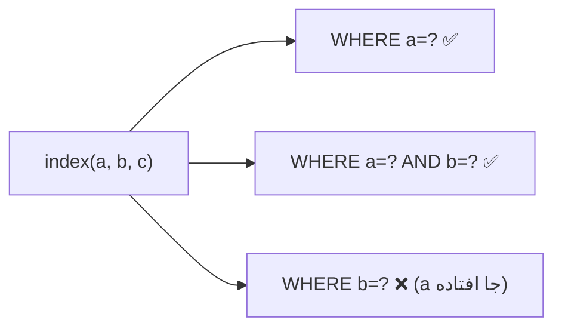
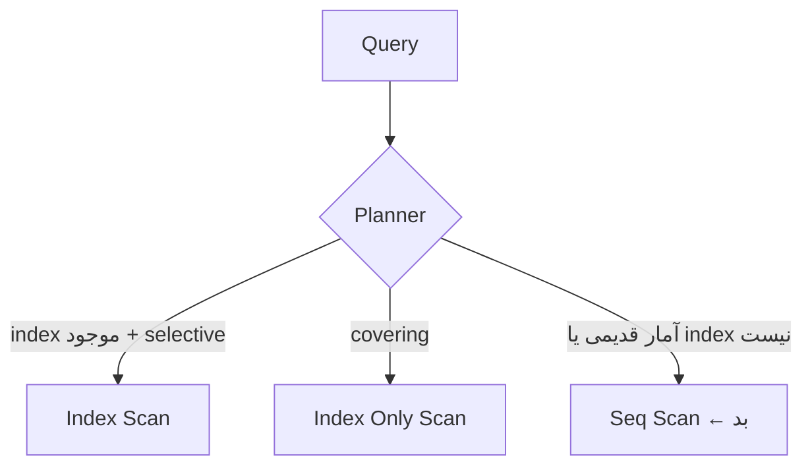
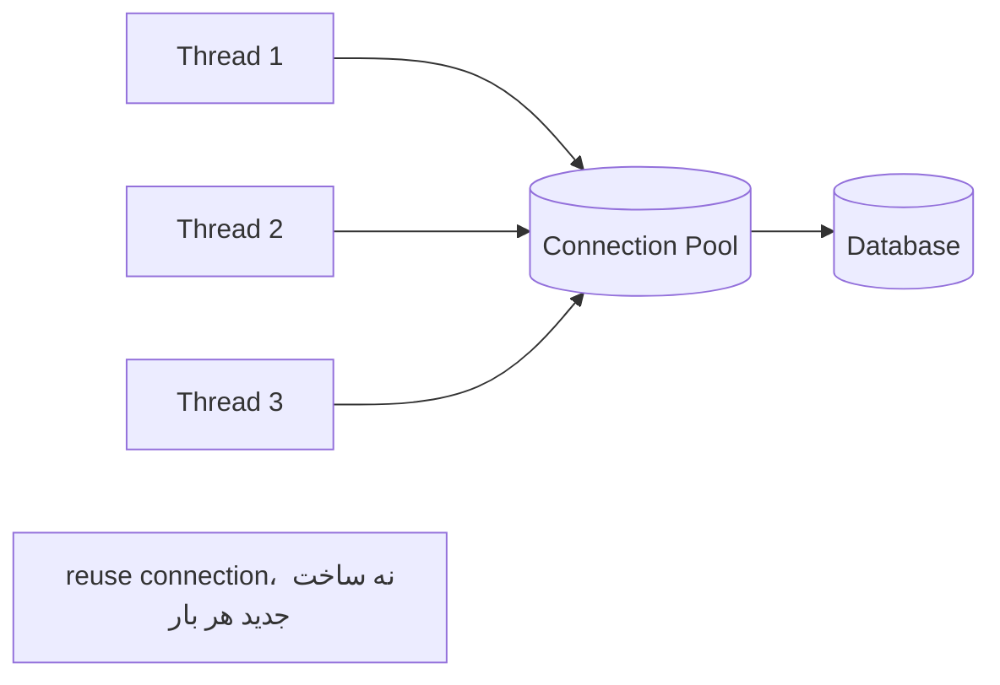

# Indexing & Performance — Index Types، Query Optimization، Connection Pooling

> ایندکس‌گذاری مهارت کلیدی هر backend Senior است. «چرا query کند است» سوال همیشگی مصاحبه‌هاست. این فایل با دیاگرام و مثال‌های متعدد گسترش یافته.

## فهرست
- [نقشه‌ی ذهنی](#نقشه‌ی-ذهنی)
- [📖 مفاهیم](#-مفاهیم)
- [🎯 سوالات مصاحبه](#-سوالات-مصاحبه)
- [⚠️ اشتباهات رایج](#️-اشتباهات-رایج)
- [🔗 ارتباط با سایر مفاهیم](#-ارتباط-با-سایر-مفاهیم)

---

## نقشه‌ی ذهنی



---

## ساختار B-Tree Index



---

## 📖 مفاهیم

### Index Types

**توضیح:**

ایندکس ساختار داده‌ای است که جستجو را سریع می‌کند (به‌جای full table scan):

- **B-Tree** (پیش‌فرض): equality و range. O(log n).
- **Hash:** فقط equality.
- **GiST/GIN:** GIN برای full-text/arrays/jsonb؛ GiST برای geometric/range.
- **Partial:** فقط زیرمجموعه (`WHERE status='ACTIVE'`).
- **Composite:** چند ستون؛ ترتیب حیاتی.
- **Covering:** با `INCLUDE` برای index-only scan.

**مثال کد:**

```sql
-- composite: ترتیب مهم (status equality، created_at range)
CREATE INDEX idx_orders_status_created ON orders(status, created_at DESC);

-- partial
CREATE INDEX idx_active_users ON users(email) WHERE active = true;

-- covering: index-only scan
CREATE INDEX idx_orders_covering ON orders(user_id) INCLUDE (amount, status);

-- expression index
CREATE INDEX idx_lower_email ON users(LOWER(email));
```

**نکات کلیدی:**

- در composite، equality قبل از range (leftmost prefix rule).
- partial برای فیلتر ثابت.
- هر index سرعت write را کاهش می‌دهد؛ index بی‌استفاده را حذف کنید.

---

### Leftmost Prefix Rule

**توضیح:**

index روی `(a, b, c)` فقط برای prefix چپ کارآمد است: `a`, `a+b`, `a+b+c`. برای `b` تنها معمولاً استفاده نمی‌شود.



**مثال کد:**

```sql
CREATE INDEX idx ON orders(user_id, status, created_at);
-- ✅ SELECT * FROM orders WHERE user_id = 1;
-- ✅ SELECT * FROM orders WHERE user_id = 1 AND status = 'PAID';
-- ❌ SELECT * FROM orders WHERE status = 'PAID'; (user_id جا افتاده)
```

**نکات کلیدی:**

- range را آخر بگذارید (range prefix را می‌شکند).
- equality columns قبل از range column.

---

### Query Optimization با EXPLAIN

**توضیح:**

`EXPLAIN ANALYZE` query plan را نشان می‌دهد. انواع scan: **Seq Scan** (کل جدول، بد)، **Index Scan** (index + heap fetch)، **Index Only Scan** (فقط index، بهترین)، **Bitmap Scan**. planner بر اساس **statistics** (با `ANALYZE`) تصمیم می‌گیرد.



**مثال کد:**

```sql
EXPLAIN (ANALYZE, BUFFERS)
SELECT u.name, COUNT(o.id)
FROM users u LEFT JOIN orders o ON o.user_id = u.id
WHERE u.created_at > '2024-01-01' GROUP BY u.name;
-- به دنبال: Seq Scan روی جدول بزرگ، rows تخمینی در برابر واقعی
```

**نکات کلیدی:**

- Seq Scan روی جدول بزرگ یعنی index کم.
- اختلاف زیاد rows تخمینی/واقعی یعنی آمار قدیمی → `ANALYZE`.
- `BUFFERS` مقدار I/O را نشان می‌دهد.

---

### Connection Pooling

**توضیح:**

باز کردن connection گران است. pool مجموعه‌ای آماده را reuse می‌کند. **HikariCP** پیش‌فرض Spring Boot. پارامتر اصلی `maximumPoolSize`. فرمول تقریبی: `(core_count * 2) + effective_spindles`. pool بزرگ بهتر نیست. **PgBouncer** برای PostgreSQL مقیاس بالا.



**مثال کد:**

```yaml
spring:
  datasource:
    hikari:
      maximum-pool-size: 20
      minimum-idle: 5
      connection-timeout: 5000
      max-lifetime: 1800000  # کمتر از DB/firewall idle timeout
```

**نکات کلیدی:**

- pool size را با محاسبه تنظیم کنید؛ بزرگ‌تر همیشه بهتر نیست.
- `max-lifetime` کمتر از DB idle timeout.
- pool exhaustion منشأ رایج timeout است.

---

## 🎯 سوالات مصاحبه

### سوال ۱: ترتیب ستون‌ها در composite index چرا مهم است؟

**سطح:** Senior
**تکرار:** خیلی زیاد

**جواب کامل:**

به‌خاطر **leftmost prefix rule**. index روی `(a,b,c)` مثل دفترچه‌ی مرتب اول بر a، سپس b، سپس c است. می‌توان با a، a+b، a+b+c جستجو کرد اما نه با b تنها. قاعده: equality اول، range آخر (بعد از range ستون‌ها مرتب نیستند). ستون پرselectivity زودتر.

**کد توضیحی:**

```sql
CREATE INDEX idx ON orders(status, created_at); -- equality اول، range آخر
```

**نکته مصاحبه:**

تمایز Senior: «equality قبل از range». Follow-up: «index روی (a,b) برای ORDER BY a,b؟» (بله).

---

### سوال ۲: index-only scan چیست و چرا سریع‌تر؟

**سطح:** Senior
**تکرار:** زیاد

**جواب کامل:**

در index scan معمولی، DB index را می‌خواند سپس به heap مراجعه می‌کند (heap fetch، I/O اضافه). در **index-only scan**، اگر همه‌ی ستون‌های لازم در index باشند (covering با `INCLUDE`)، نیازی به heap fetch نیست. در PostgreSQL به visibility map هم وابسته است (با VACUUM به‌روز).

**نکته مصاحبه:**

Senior به covering index و visibility map اشاره می‌کند.

---

### سوال ۳: چه زمانی index کمک نمی‌کند؟

**سطح:** Senior / Lead
**تکرار:** زیاد

**جواب کامل:**

(۱) selectivity پایین (boolean) — seq scan ارزان‌تر. (۲) جدول کوچک. (۳) function روی ستون (`LOWER(email)`) مگر expression index. (۴) leading wildcard (`'%abc'`). (۵) type mismatch. و هزینه: هر index write را کند می‌کند؛ over-indexing مضر.

**کد توضیحی:**

```sql
-- ❌ index بی‌اثر
WHERE LOWER(email) = 'x';
-- ✅
CREATE INDEX idx_lower_email ON users(LOWER(email));
```

**نکته مصاحبه:**

Lead به trade-off read/write و selectivity اشاره می‌کند.

---

### سوال ۴: HikariCP pool size را چطور تنظیم می‌کنی؟

**سطح:** Senior / Lead
**تکرار:** متوسط

**جواب کامل:**

pool بزرگ بهتر نیست. DB تعداد محدودی کار موازی واقعی دارد. فرمول HikariCP: `(core_count*2) + spindles`. pool بزرگ → context switching و فشار روی DB. با load test و رصد metric تنظیم کنید. باید با `max_connections` خود DB هماهنگ باشد (با چند instance). اگر connection کم می‌آید، اول ببینید چرا connection طولانی نگه داشته می‌شود (transaction طولانی، N+1).

**نکته مصاحبه:**

Lead به فرمول و هماهنگی با DB اشاره می‌کند.

---

### سوال ۵: N+1 را در سطح DB چطور تشخیص می‌دهی؟

**سطح:** Senior
**تکرار:** زیاد

**جواب کامل:**

علائم: تعداد زیاد query تقریباً یکسان در `pg_stat_statements` یا لاگ؛ endpoint که با افزایش داده queryها خطی رشد می‌کند. ابزار: SQL logging (p6spy/datasource-proxy)، `pg_stat_statements`، APM. حل با `JOIN FETCH`/`@EntityGraph`/batch.

**نکته مصاحبه:**

Senior ابزار مشخص می‌داند.

---

## ⚠️ اشتباهات رایج

### اشتباه ۱: function روی ستون indexed

```sql
-- ❌
WHERE DATE(created_at) = '2024-01-01';
```

```sql
-- ✅ range
WHERE created_at >= '2024-01-01' AND created_at < '2024-01-02';
```

**توضیح:** function روی ستون index B-Tree را بی‌اثر می‌کند.

---

### اشتباه ۲: over-indexing

```sql
-- ❌ index روی هر ستون
CREATE INDEX ON t(a); CREATE INDEX ON t(b); ...
```

```sql
-- ✅ composite بر اساس query واقعی
CREATE INDEX ON t(a, b);
```

**توضیح:** هر index هزینه‌ی write و storage دارد.

---

### اشتباه ۳: فراموشی ANALYZE بعد از bulk load

```sql
-- ❌ آمار قدیمی → plan بد
COPY orders FROM 'data.csv';
```

```sql
-- ✅
COPY orders FROM 'data.csv'; ANALYZE orders;
```

**توضیح:** planner بر اساس آمار تصمیم می‌گیرد.

---

### اشتباه ۴: pool size خیلی بزرگ

```yaml
# ❌
maximum-pool-size: 200
```

```yaml
# ✅
maximum-pool-size: 20
```

**توضیح:** pool بزرگ contention و فشار روی DB می‌سازد.

---

## 🔗 ارتباط با سایر مفاهیم

- indexing با **SQL (3.1)** و **query optimization عمیق (14.1)**.
- N+1 با **Spring Data JPA (2.4)**.
- connection pooling با **Spring Boot config (2.2)** و **performance**.
- EXPLAIN با **PostgreSQL MVCC (3.3)**.
- partial/covering با **PostgreSQL (3.3)**.
