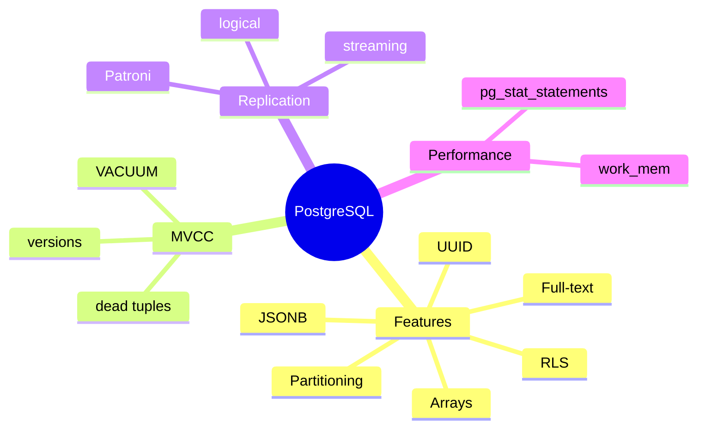
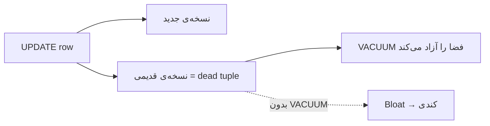
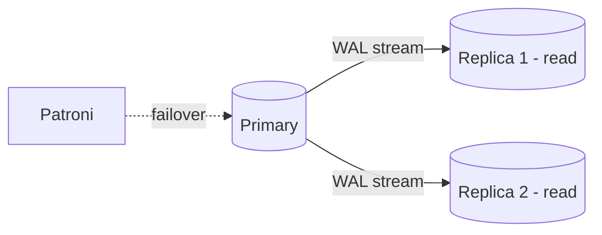

# PostgreSQL — JSONB، MVCC، Replication، Performance

> PostgreSQL محبوب‌ترین RDBMS مدرن است. MVCC و JSONB موضوعات کلیدی Senior هستند. این فایل با دیاگرام و مثال‌های متعدد گسترش یافته.

## فهرست
- [نقشه‌ی ذهنی](#نقشه‌ی-ذهنی)
- [📖 مفاهیم](#-مفاهیم)
- [🎯 سوالات مصاحبه](#-سوالات-مصاحبه)
- [⚠️ اشتباهات رایج](#️-اشتباهات-رایج)
- [🔗 ارتباط با سایر مفاهیم](#-ارتباط-با-سایر-مفاهیم)

---

## نقشه‌ی ذهنی



---

## MVCC و چرخه‌ی dead tuple



---

## 📖 مفاهیم

### ویژگی‌های خاص — JSONB، Arrays، UUID

**توضیح:**

- **JSONB:** ذخیره‌ی JSON باینری با index (GIN). برخلاف `JSON` متنی، parse‌شده ذخیره می‌شود.
- **Arrays:** `integer[]`, `text[]`.
- **UUID:** `gen_random_uuid()`.
- **Full-text:** `tsvector`/`tsquery`.
- **RLS:** کنترل دسترسی سطح ردیف.
- **Partitioning:** Range/List/Hash.

**مثال کد:**

```sql
CREATE TABLE products (
    id BIGINT GENERATED ALWAYS AS IDENTITY PRIMARY KEY,
    name TEXT NOT NULL, metadata JSONB
);
CREATE INDEX idx_metadata ON products USING GIN (metadata); -- index روی JSONB

SELECT * FROM products WHERE metadata @> '{"category": "electronics"}'; -- از GIN
SELECT metadata->>'name' FROM products WHERE metadata ? 'name';
SELECT * FROM products WHERE metadata #>> '{specs,ram}' = '16GB';
UPDATE products SET metadata = metadata || '{"discount": 10}'; -- merge
```

**نکات کلیدی:**

- JSONB با GIN برای query کارآمد؛ `@>` از index استفاده می‌کند.
- JSONB برای فیلدهای پویا؛ structured در ستون عادی.
- `->` مقدار JSON، `->>` مقدار text.

---

### MVCC (Multi-Version Concurrency Control)

**توضیح:**

قلب concurrency در PostgreSQL. به‌جای قفل برای خواندن، **چند نسخه** از هر ردیف نگه می‌دارد. هر تراکنش یک snapshot می‌بیند؛ خواننده‌ها نویسنده‌ها را بلاک نمی‌کنند و برعکس.

پیامد: `UPDATE` نسخه‌ی جدید می‌سازد و قدیمی را dead tuple می‌کند. باید با **VACUUM** (و autovacuum) پاک شوند وگرنه **bloat**.

**مثال کد:**

```sql
-- بررسی dead tuples و bloat
SELECT relname, n_live_tup, n_dead_tup, last_autovacuum
FROM pg_stat_user_tables ORDER BY n_dead_tup DESC;

-- قفل صریح
SELECT * FROM accounts WHERE id = 1 FOR UPDATE;
```

**نکات کلیدی:**

- UPDATE نسخه‌ی جدید می‌سازد → dead tuple → نیاز VACUUM.
- خواننده و نویسنده هم را بلاک نمی‌کنند.
- autovacuum را برای جداول پرتغییر tune کنید.

---

### Isolation Levels & Deadlocks

**توضیح:**

PostgreSQL با MVCC: `READ COMMITTED` (پیش‌فرض)، `REPEATABLE READ` (snapshot ثابت)، `SERIALIZABLE` (با SSI). `READ UNCOMMITTED` عملاً مثل READ COMMITTED (dirty read هرگز). deadlock را تشخیص و یکی را abort می‌کند. **Advisory Locks** application-level.

**مثال کد:**

```sql
-- advisory lock برای اجرای تک‌نمونه‌ای job
SELECT pg_try_advisory_lock(12345);
SELECT pg_advisory_unlock(12345);
```

**نکات کلیدی:**

- در SERIALIZABLE آماده‌ی serialization_failure و retry باشید.
- برای پیشگیری از deadlock، ترتیب قفل‌گیری ثابت.
- advisory lock برای هماهنگی توزیع‌شده‌ی سبک.

---

### Replication & HA

**توضیح:**

- **Streaming Replication:** physical، WAL به replica. async (loss کم) یا sync.
- **Logical Replication:** per-table، برای migration/CDC.
- **Patroni:** automatic failover.
- backup: `pg_dump` (logical)، `pgBackRest` (physical، PITR).



**نکات کلیدی:**

- replica برای read scaling و HA؛ اما lag یعنی read ممکن stale.
- failover خودکار نیاز Patroni.

---

### Performance Tools

**توضیح:**

`pg_stat_statements` (query کند)، `pg_stat_activity` (connection فعال)، تنظیمات: `shared_buffers` (~25% RAM)، `work_mem`، `max_connections`. autovacuum tuning.

**مثال کد:**

```sql
SELECT query, calls, mean_exec_time FROM pg_stat_statements ORDER BY mean_exec_time DESC LIMIT 10;
SELECT pid, state, now() - query_start AS duration, query FROM pg_stat_activity
WHERE state != 'idle' ORDER BY duration DESC;
```

**نکات کلیدی:**

- `pg_stat_statements` اولین ابزار یافتن query مشکل‌دار.
- `work_mem` بزرگ × connection می‌تواند RAM را تمام کند.

---

## 🎯 سوالات مصاحبه

### سوال ۱: MVCC چطور کار می‌کند و چه پیامدی دارد؟

**سطح:** Senior / Lead
**تکرار:** خیلی زیاد

**جواب کامل:**

به‌جای قفل برای خواندن، چند نسخه نگه می‌دارد. هر تراکنش snapshot سازگار می‌بیند → concurrency بالا. پیامد: `UPDATE`/`DELETE` ردیف قدیمی را dead tuple می‌کند که باید با VACUUM پاک شود وگرنه bloat (جدول/index بزرگ و کند). autovacuum خودکار اما برای جداول پرتغییر باید tune شود. خطر جدی: transaction id wraparound اگر VACUUM عقب بماند.

**نکته مصاحبه:**

Lead به bloat، VACUUM، wraparound اشاره می‌کند.

---

### سوال ۲: کِی JSONB و کِی ستون relational؟

**سطح:** Senior
**تکرار:** زیاد

**جواب کامل:**

JSONB برای داده‌ی نیمه‌ساختاریافته/پویا/اسپارس. ستون relational برای داده‌ای که join/constraint/aggregate می‌شود (type safety، index کارآمد). ضدالگو: همه‌چیز JSONB. قاعده: اگر join/constraint/aggregate می‌کنید ستون عادی؛ اگر فقط ذخیره و گاهی query، JSONB.

**نکته مصاحبه:**

Senior ضدالگوی «همه‌چیز JSONB» را می‌شناسد.

---

### سوال ۳: streaming در برابر logical replication؟

**سطح:** Senior / Lead
**تکرار:** متوسط

**جواب کامل:**

streaming (physical): کل WAL، replica کپی بایت‌به‌بایت فقط read، همان نسخه — برای HA و read scaling. logical: تغییرات منطقی per-table، انعطاف بیشتر (انتخاب جدول، بین نسخه‌ها، subscriber قابل‌نوشتن) — برای migration/CDC، کندتر.

**نکته مصاحبه:**

Lead به موارد استفاده اشاره می‌کند.

---

### سوال ۴: deadlock را چطور تشخیص و پیشگیری می‌کنی؟

**سطح:** Senior
**تکرار:** متوسط

**جواب کامل:**

PostgreSQL خودکار detect و یکی را abort می‌کند؛ از `pg_locks`+`pg_stat_activity` تحلیل. پیشگیری: ترتیب ثابت قفل‌گیری (مثلاً id صعودی)، تراکنش کوتاه، اجتناب از قفل گسترده، retry با backoff.

**نکته مصاحبه:**

Senior «ترتیب ثابت قفل‌گیری» را می‌داند.

---

### سوال ۵: VACUUM چیست و چرا مهم؟

**سطح:** Senior
**تکرار:** متوسط

**جواب کامل:**

dead tupleها را برای reuse آزاد می‌کند، آمار را به‌روز، و از wraparound جلوگیری. بدون آن: bloat و در بدترین حالت توقف DB. `VACUUM` فضا را به OS برنمی‌گرداند؛ `VACUUM FULL` برمی‌گرداند ولی جدول را قفل (در production از `pg_repack`). autovacuum برای جداول پرترافیک باید tune شود.

**نکته مصاحبه:**

Lead به wraparound و pg_repack اشاره می‌کند.

---

## ⚠️ اشتباهات رایج

### اشتباه ۱: همه‌چیز در JSONB

```sql
-- ❌
CREATE TABLE orders (id BIGINT, data JSONB);
```

```sql
-- ✅
CREATE TABLE orders (id BIGINT, user_id BIGINT, amount DECIMAL, status TEXT, metadata JSONB);
```

**توضیح:** فیلدهای مهم باید ستون باشند.

---

### اشتباه ۲: نادیده گرفتن autovacuum روی جدول پرتغییر

```sql
-- ✅
ALTER TABLE hot_table SET (autovacuum_vacuum_scale_factor = 0.05);
```

**توضیح:** پیش‌فرض autovacuum برای جداول بسیار پرتغییر کافی نیست.

---

### اشتباه ۳: `VACUUM FULL` در production

```sql
-- ❌ قفل جدول
VACUUM FULL big_table;
```

```text
✅ pg_repack
```

**توضیح:** `VACUUM FULL` exclusive lock می‌گیرد.

---

### اشتباه ۴: خواندن از replica بدون توجه به lag

```text
❌ نوشتن در primary و خواندن فوری از replica → داده‌ی قدیمی
✅ read-your-writes از primary
```

**توضیح:** replication async است.

---

## 🔗 ارتباط با سایر مفاهیم

- MVCC با **isolation levels** و **Spring transactions (2.4)**.
- JSONB با **MongoDB (4)** و **API design (19.1)**.
- replication با **System Design (CAP، read scaling 6.2)**.
- performance tools با **Indexing (3.2)** و **query optimization (14.1)**.
- advisory locks با **distributed lock (Redis 9.1)**.
