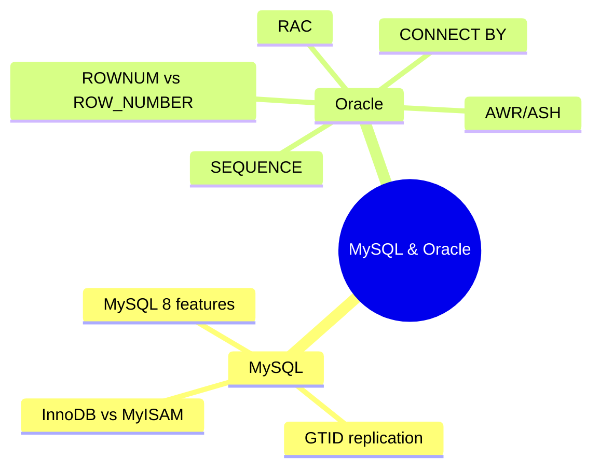
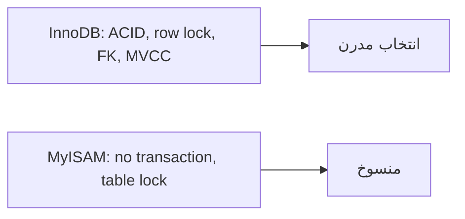

# MySQL / Oracle (مقایسه‌ای)

> آشنایی با تفاوت‌های MySQL و Oracle برای محیط‌هایی که این دیتابیس‌ها استفاده می‌شوند مهم است. این فایل با دیاگرام و مثال‌های بیشتر گسترش یافته.

## فهرست
- [نقشه‌ی ذهنی](#نقشه‌ی-ذهنی)
- [📖 مفاهیم](#-مفاهیم)
- [🎯 سوالات مصاحبه](#-سوالات-مصاحبه)
- [⚠️ اشتباهات رایج](#️-اشتباهات-رایج)
- [🔗 ارتباط با سایر مفاهیم](#-ارتباط-با-سایر-مفاهیم)

---

## نقشه‌ی ذهنی



---

## 📖 مفاهیم

### MySQL — Storage Engines

**توضیح:**

MySQL معماری pluggable storage engine دارد:

- **InnoDB** (پیش‌فرض): transactional، ACID، row-level locking، foreign key، MVCC. انتخاب درست.
- **MyISAM** (قدیمی): بدون transaction، table-level locking، بدون FK. منسوخ.

MySQL 8: Window Functions، CTEs، roles، invisible indexes، بهبود JSON.



**مثال کد:**

```sql
CREATE TABLE orders (
    id BIGINT AUTO_INCREMENT PRIMARY KEY,
    amount DECIMAL(12,2),
    created_at TIMESTAMP DEFAULT CURRENT_TIMESTAMP
) ENGINE=InnoDB;

-- invisible index (MySQL 8): تست حذف بدون drop
ALTER TABLE orders ALTER INDEX idx_amount INVISIBLE;
```

**نکات کلیدی:**

- همیشه InnoDB برای داده‌ی transactional.
- MySQL 8 window functions و CTE اضافه کرد.
- invisible index برای ارزیابی امن حذف.

---

### MySQL — Replication

**توضیح:**

دو روش: **Binary Log-based** و **GTID-based** (Global Transaction Identifier — هر transaction شناسه‌ی یکتای جهانی که failover را ساده می‌کند). slow query log برای یافتن کوئری کند.

**نکات کلیدی:**

- GTID-based replication مدیریت failover را ساده‌تر می‌کند.
- slow query log را فعال کنید.

---

### Oracle — ویژگی‌های خاص

**توضیح:**

- `ROWNUM` (قبل از ORDER BY اعمال می‌شود — تله) در برابر `ROW_NUMBER()` (window function).
- `SEQUENCE` با `NEXTVAL`/`CURRVAL`.
- `CONNECT BY` برای سلسله‌مراتبی (معادل recursive CTE).
- Tablespaces، Schemas.
- **AWR/ASH** برای performance.
- **RAC** برای HA و scaling افقی.

**مثال کد:**

```sql
-- ❌ تله: ROWNUM قبل از ORDER BY
SELECT * FROM orders WHERE ROWNUM <= 5 ORDER BY amount DESC;
-- ✅ subquery مرتب‌شده
SELECT * FROM (SELECT * FROM orders ORDER BY amount DESC) WHERE ROWNUM <= 5;
-- یا Oracle 12c+: FETCH FIRST
SELECT * FROM orders ORDER BY amount DESC FETCH FIRST 5 ROWS ONLY;

CREATE SEQUENCE order_seq START WITH 1 INCREMENT BY 1;
INSERT INTO orders (id) VALUES (order_seq.NEXTVAL);
```

**نکات کلیدی:**

- `ROWNUM` قبل از `ORDER BY` → برای top-N از subquery یا `FETCH FIRST`.
- Oracle 12c+ از `FETCH FIRST` استاندارد پشتیبانی می‌کند.

---

## 🎯 سوالات مصاحبه

### سوال ۱: InnoDB در برابر MyISAM؟

**سطح:** Mid / Senior
**تکرار:** زیاد

**جواب کامل:**

InnoDB: transactional (ACID)، row-level locking (concurrency بالا)، FK، crash recovery، MVCC. MyISAM: غیرtransactional، table-level locking (concurrency پایین)، بدون FK. MyISAM منسوخ است؛ پیش‌فرض از 5.5 InnoDB.

**نکته مصاحبه:**

Senior می‌داند MyISAM منسوخ است.

---

### سوال ۲: تفاوت `ROWNUM` و `ROW_NUMBER()` در Oracle؟

**سطح:** Senior
**تکرار:** متوسط

**جواب کامل:**

`ROWNUM` pseudo-column که **هنگام انتخاب ردیف** (قبل از ORDER BY) تخصیص می‌یابد، پس `WHERE ROWNUM<=5 ORDER BY x` نتیجه‌ی اشتباه می‌دهد. `ROW_NUMBER()` window function که **بعد از** ORDER BY شماره می‌دهد. برای top-N از subquery یا `FETCH FIRST`.

**نکته مصاحبه:**

تمایز Senior: تله‌ی ترتیب ROWNUM. Follow-up: «pagination Oracle 12c؟» (`OFFSET ... FETCH NEXT`).

---

### سوال ۳: GTID چه مزیتی دارد؟

**سطح:** Senior / Lead
**تکرار:** متوسط

**جواب کامل:**

در binlog سنتی، موقعیت با نام فایل و offset مشخص می‌شد که هنگام failover سخت بود. GTID به هر transaction شناسه‌ی یکتای جهانی می‌دهد، پس failover خودکار و امن می‌شود (بدون محاسبه‌ی دستی offset) و auto-positioning ممکن می‌شود.

**نکته مصاحبه:**

Lead به ساده‌سازی failover اشاره می‌کند.

---

### سوال ۴: AWR و ASH برای چه؟

**سطح:** Senior
**تکرار:** کم

**جواب کامل:**

**AWR** snapshot دوره‌ای آمار performance (top SQL، wait events) — برای تحلیل تاریخی. **ASH** نمونه‌برداری مکرر از sessionهای فعال — برای real-time. ترکیب برای troubleshooting (معادل `pg_stat_statements`).

**نکته مصاحبه:**

Senior معادل PostgreSQL را می‌داند.

---

## ⚠️ اشتباهات رایج

### اشتباه ۱: ROWNUM قبل از ORDER BY

```sql
-- ❌ ۵ ردیف تصادفی
SELECT * FROM orders WHERE ROWNUM <= 5 ORDER BY amount DESC;
```

```sql
-- ✅
SELECT * FROM orders ORDER BY amount DESC FETCH FIRST 5 ROWS ONLY;
```

**توضیح:** ROWNUM قبل از مرتب‌سازی اعمال می‌شود.

---

### اشتباه ۲: MyISAM برای داده‌ی transactional

```sql
-- ❌
CREATE TABLE payments (...) ENGINE=MyISAM;
```

```sql
-- ✅
CREATE TABLE payments (...) ENGINE=InnoDB;
```

**توضیح:** MyISAM transaction و FK ندارد.

---

### اشتباه ۳: فرض رفتار یکسان EXPLAIN

```text
❌ انتظار همان خروجی MySQL و PostgreSQL
✅ هر DB planner و فرمت متفاوت دارد
```

**توضیح:** مهارت EXPLAIN برای هر DB جداگانه.

---

## 🔗 ارتباط با سایر مفاهیم

- storage engine و locking با **transactions/isolation (3.1, 2.4)**.
- replication با **System Design (HA 6.2)** و **PostgreSQL replication (3.3)**.
- ROWNUM/ROW_NUMBER با **window functions (3.1)**.
- AWR/ASH با **performance tools (3.3)**.
