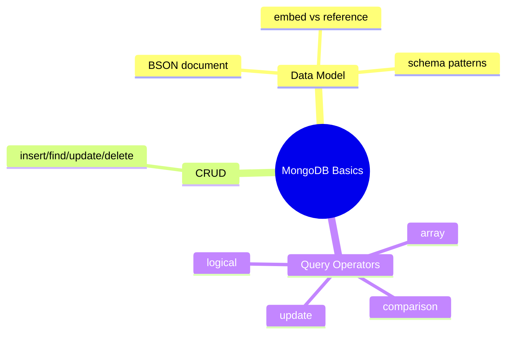
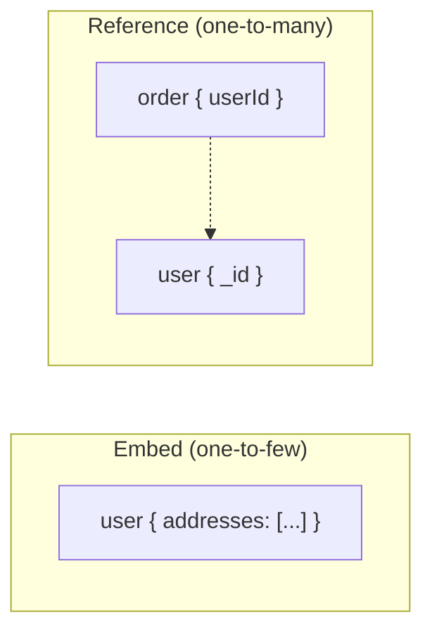

# MongoDB — مبانی، مدل داده، CRUD

> MongoDB محبوب‌ترین document database است. تصمیم embed در برابر reference مهم‌ترین مهارت طراحی است. این فایل با دیاگرام و مثال‌های متعدد گسترش یافته.

## فهرست
- [نقشه‌ی ذهنی](#نقشه‌ی-ذهنی)
- [📖 مفاهیم](#-مفاهیم)
- [🎯 سوالات مصاحبه](#-سوالات-مصاحبه)
- [⚠️ اشتباهات رایج](#️-اشتباهات-رایج)
- [🔗 ارتباط با سایر مفاهیم](#-ارتباط-با-سایر-مفاهیم)

---

## نقشه‌ی ذهنی



---

## Embed در برابر Reference



---

## 📖 مفاهیم

### مدل داده — Document-oriented

**توضیح:**

MongoDB داده را به‌صورت **document** (BSON — Binary JSON) ذخیره می‌کند. Collection ≈ table، Document ≈ row، اما schema-less. هر document یک `_id` (پیش‌فرض `ObjectId`).

تصمیم اصلی: **Embedded** (یک read، اما محدودیت 16MB) در برابر **Reference** (مثل FK، نیاز query/`$lookup`).

**مثال کد:**

```javascript
// Embedded: آدرس داخل user (یک read، اتمیک)
{ _id: ObjectId("..."), name: "Ali",
  addresses: [{ type: "home", city: "Tehran" }, { type: "work", city: "Karaj" }] }

// Reference: order به user اشاره می‌کند
{ _id: ObjectId("..."), userId: ObjectId("..."), amount: 5000 }
```

**نکات کلیدی:**

- embed برای داده‌ای که با هم خوانده می‌شود (one-to-few).
- reference برای داده‌ی بزرگ/مشترک/many.
- محدودیت 16MB برای هر document.

---

### Schema Design Patterns

**توضیح:**

- **Bucket:** گروه‌بندی time-series در یک document.
- **Outlier:** مدیریت موارد استثنایی جدا.
- **Computed:** ذخیره‌ی نتیجه به‌جای محاسبه‌ی هر بار.
- **Subset:** نگه‌داری زیرمجموعه‌ی پرکاربرد در document اصلی.
- **Extended Reference:** کپی چند فیلد پرکاربرد برای جلوگیری از join.

**نکات کلیدی:**

- denormalization عمدی برای read performance رایج است.
- trade-off بین read سریع و هزینه‌ی به‌روزرسانی تکراری.

---

### CRUD & Query Operators

**توضیح:**

`insertOne`/`insertMany`, `find`, `updateOne`/`updateMany`, `deleteOne`/`deleteMany`. operatorها:
- Comparison: `$eq`, `$gt`, `$in`, ...
- Logical: `$and`, `$or`, `$not`.
- Array: `$all`, `$elemMatch`, `$size`.
- Update: `$set`, `$inc`, `$push`, `$pull`, `$addToSet`.

**مثال کد:**

```javascript
db.users.insertOne({ name: "Ali", age: 30, status: "active" });
db.users.find({ age: { $gt: 25 } }).sort({ name: 1 }).limit(10);
db.users.updateOne({ _id: id }, { $set: { age: 31 }, $inc: { loginCount: 1 } });
db.users.deleteMany({ status: "inactive" });

// $elemMatch: شرط ترکیبی روی یک عنصر آرایه
db.users.find({ orders: { $elemMatch: { amount: { $gt: 100 }, status: "paid" } } });
// $addToSet: بدون تکرار
db.users.updateOne({ _id: id }, { $addToSet: { tags: "vip" } });
```

**نکات کلیدی:**

- `$elemMatch` برای شرط ترکیبی روی یک عنصر آرایه.
- `$addToSet` تکراری اضافه نمی‌کند؛ `$push` می‌کند.

---

## 🎯 سوالات مصاحبه

### سوال ۱: Embedding در برابر Referencing — کِی کدام؟

**سطح:** Senior
**تکرار:** خیلی زیاد

**جواب کامل:**

embedding: داده همیشه با هم خوانده می‌شود، رابطه one-to-few، فرزند مستقل query نمی‌شود. مزیت: یک read، atomicity. عیب: 16MB، به‌روزرسانی تکراری سخت. referencing: داده بزرگ/نامحدود (one-to-many/squillions)، مشترک، مستقل query. مزیت: نرمال. عیب: چند query یا `$lookup` گران. قاعده: «داده‌ای که با هم دسترسی می‌شود، با هم ذخیره». اغلب ترکیبی (Extended Reference).

**نکته مصاحبه:**

تمایز Senior: one-to-few/many/squillions و هزینه‌ی `$lookup`. Follow-up: «آرایه‌ی embedded نامحدود؟» (به 16MB می‌رسد → reference).

---

### سوال ۲: MongoDB کِی به‌جای relational؟

**سطح:** Senior / Lead
**تکرار:** زیاد

**جواب کامل:**

مناسب: schema پویا، داده‌ی document/سلسله‌مراتبی، scale افقی آسان (sharding)، read-heavy denormalized. نامناسب: تراکنش پیچیده‌ی چندموجودیتی، many-to-many با join مکرر، consistency قوی. سوءتفاهم: «NoSQL یعنی schema-less» — schema همچنان هست، فقط در کد enforce می‌شود (خطرناک).

**نکته مصاحبه:**

Lead فریب «MongoDB همیشه scalable‌تر» را نمی‌خورد.

---

### سوال ۳: ObjectId چیست و چه اطلاعاتی دارد؟

**سطح:** Mid / Senior
**تکرار:** متوسط

**جواب کامل:**

۱۲ بایت: ۴ timestamp + ۵ random (machine/process) + ۳ counter. یکتا بدون هماهنگی مرکزی و تقریباً مرتب بر زمان. مزیت: زمان ساخت از `_id` قابل‌استخراج. در sharding، چون ترتیبی است، می‌تواند hotspot ایجاد کند.

**نکته مصاحبه:**

Senior به hotspot در sharding با shard key ترتیبی اشاره می‌کند.

---

## ⚠️ اشتباهات رایج

### اشتباه ۱: embedding آرایه‌ی بی‌نهایت

```javascript
// ❌ comments بی‌نهایت → 16MB
{ _id: 1, post: "...", comments: [/* میلیون‌ها */] }
```

```javascript
// ✅ subset pattern
{ _id: 1, post: "...", recentComments: [/* ۱۰ تای اخیر */] }
```

**توضیح:** آرایه‌ی embedded نباید نامحدود رشد کند.

---

### اشتباه ۲: «schema-less یعنی بدون طراحی»

```text
❌ ریختن داده بدون فکر به الگوی دسترسی
✅ طراحی schema بر اساس query patterns
```

**توضیح:** در MongoDB schema بر اساس query طراحی می‌شود.

---

### اشتباه ۳: `$lookup` به‌جای embedding مناسب

```javascript
// ❌ join گران در هر query
db.orders.aggregate([{ $lookup: { from: "users", ... } }]);
```

```javascript
// ✅ Extended Reference
{ _id: 1, userId: 2, userName: "Ali", amount: 5000 }
```

**توضیح:** `$lookup` گران است؛ denormalize کنید.

---

## 🔗 ارتباط با سایر مفاهیم

- مدل document با **PostgreSQL JSONB (3.3)** و **API design (19.1)**.
- schema patterns با **System Design (6.2)**.
- referencing/embedding با **Aggregation `$lookup` (4.2)** و **Spring Data MongoDB (4.5)**.
- ObjectId با **Sharding (4.4)**.
