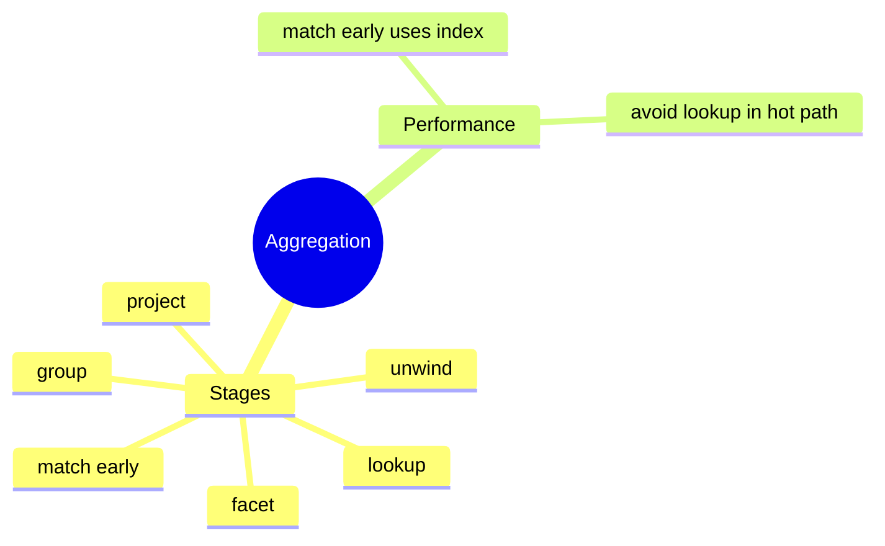
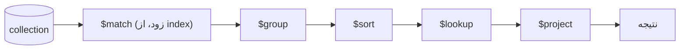

# MongoDB Aggregation Pipeline

> Aggregation Pipeline قدرتمندترین ابزار query در MongoDB است؛ معادل GROUP BY و JOIN و تحلیل پیچیده. این فایل با دیاگرام و مثال‌های متعدد گسترش یافته.

## فهرست
- [نقشه‌ی ذهنی](#نقشه‌ی-ذهنی)
- [📖 مفاهیم](#-مفاهیم)
- [🎯 سوالات مصاحبه](#-سوالات-مصاحبه)
- [⚠️ اشتباهات رایج](#️-اشتباهات-رایج)
- [🔗 ارتباط با سایر مفاهیم](#-ارتباط-با-سایر-مفاهیم)

---

## نقشه‌ی ذهنی



---

## جریان pipeline



---

## 📖 مفاهیم

### مفهوم Pipeline

**توضیح:**

داده از طریق دنباله‌ای از stage عبور می‌کند؛ خروجی هر مرحله ورودی بعدی (مثل pipe یا Stream). درک ترتیب stage برای performance حیاتی است (`$match` زود = داده‌ی کمتر و استفاده از index).

**مثال کد:**

```javascript
db.orders.aggregate([
  { $match: { status: "completed" } },          // فیلتر زود (از index)
  { $group: { _id: "$userId", total: { $sum: "$amount" }, count: { $sum: 1 } } },
  { $sort: { total: -1 } },
  { $limit: 10 },
  { $lookup: { from: "users", localField: "_id", foreignField: "_id", as: "user" } },
  { $project: { total: 1, count: 1, "user.name": 1 } }
]);
```

**نکات کلیدی:**

- `$match` و `$limit` را تا حد ممکن **زود** بگذارید.
- `$match` در ابتدا می‌تواند از index استفاده کند؛ بعد از `$group` نمی‌تواند.

---

### Stageهای مهم

**توضیح:**

- `$match` (فیلتر، زود)، `$group` (تجمیع با `$sum`, `$avg`, `$push`)، `$project`/`$addFields` (تبدیل فیلد)، `$unwind` (باز کردن آرایه)، `$lookup` (join)، `$facet` (چند pipeline موازی)، `$bucket` (histogram)، `$graphLookup` (recursive)، `$merge`/`$out` (نوشتن نتیجه).

**مثال کد:**

```javascript
// $unwind + $group: شمارش tag
db.products.aggregate([
  { $unwind: "$tags" },
  { $group: { _id: "$tags", count: { $sum: 1 } } },
  { $sort: { count: -1 } }
]);

// $facet: آمار و صفحه همزمان
db.products.aggregate([
  { $match: { category: "electronics" } },
  { $facet: { "totalCount": [{ $count: "count" }], "page": [{ $skip: 0 }, { $limit: 20 }] } }
]);
```

**نکات کلیدی:**

- `$unwind` برای آرایه‌ها؛ مراقب انفجار تعداد document.
- `$facet` برای محاسبات موازی (pagination با count).
- `$out`/`$merge` خروجی را persist می‌کند (مثل materialized view).

---

## 🎯 سوالات مصاحبه

### سوال ۱: چرا ترتیب stageها مهم است؟

**سطح:** Senior
**تکرار:** زیاد

**جواب کامل:**

ترتیب performance را تعیین می‌کند. `$match`/`$limit` زود حجم داده را کم می‌کنند. مهم‌تر: `$match` در ابتدا می‌تواند از **index** استفاده کند، اما بعد از `$group`/`$project` (که document را تغییر داده‌اند) نمی‌تواند → collection scan روی نتیجه‌ی میانی. optimizer برخی reorderها را خودکار انجام می‌دهد اما نباید تکیه کرد.

**نکته مصاحبه:**

تمایز Senior: `$match` زود = index. Follow-up: «`explain("executionStats")`».

---

### سوال ۲: `$lookup` چیست و چه محدودیتی دارد؟

**سطح:** Senior
**تکرار:** زیاد

**جواب کامل:**

معادل left outer join. گران (به‌خصوص بدون index روی foreignField)، فلسفه‌ی MongoDB embedding/denormalization را ترجیح می‌دهد. در sharded collection محدودیت دارد. برای join مکرر MongoDB انتخاب خوبی نیست؛ denormalize کنید. `$lookup` برای گزارش‌گیری گاه‌به‌گاه مناسب است نه مسیر داغ.

**نکته مصاحبه:**

Senior می‌داند join ضدالگوی مسیر داغ است.

---

### سوال ۳: `$unwind` چه می‌کند و چه خطری دارد؟

**سطح:** Mid / Senior
**تکرار:** متوسط

**جواب کامل:**

آرایه را باز می‌کند: document با آرایه‌ی N عنصری به N document. برای group/تحلیل روی عناصر آرایه. خطر: انفجار تعداد document → حافظه/زمان زیاد. قبل از `$unwind` با `$match` فیلتر کنید و در صورت امکان از operatorهای آرایه (`$size`, `$reduce`) استفاده کنید.

**نکته مصاحبه:**

Follow-up: «بدون unwind روی آرایه aggregate؟»

---

## ⚠️ اشتباهات رایج

### اشتباه ۱: `$match` بعد از `$group`

```javascript
// ❌ index بی‌استفاده
db.orders.aggregate([{ $group: {...} }, { $match: { _id: ObjectId("...") } }]);
```

```javascript
// ✅ فیلتر زود
db.orders.aggregate([{ $match: { userId: ObjectId("...") } }, { $group: {...} }]);
```

**توضیح:** `$match` زود از index استفاده می‌کند.

---

### اشتباه ۲: `$lookup` در مسیر داغ

```javascript
// ❌
{ $lookup: { from: "users", ... } }
```

```javascript
// ✅ denormalize
```

**توضیح:** join در hot path کند است.

---

### اشتباه ۳: فراموشی index روی foreignField

```text
❌ $lookup بدون index → collection scan
✅ index روی فیلد join
```

**توضیح:** بدون index، `$lookup` به‌شدت کند می‌شود.

---

## 🔗 ارتباط با سایر مفاهیم

- pipeline با **SQL GROUP BY/JOIN/Window (3.1)**.
- `$match` زود با **Indexing (4.3)**.
- `$lookup`/denormalization با **schema design (4.1)**.
- aggregation با **Spring Data MongoDB (4.5)**.
