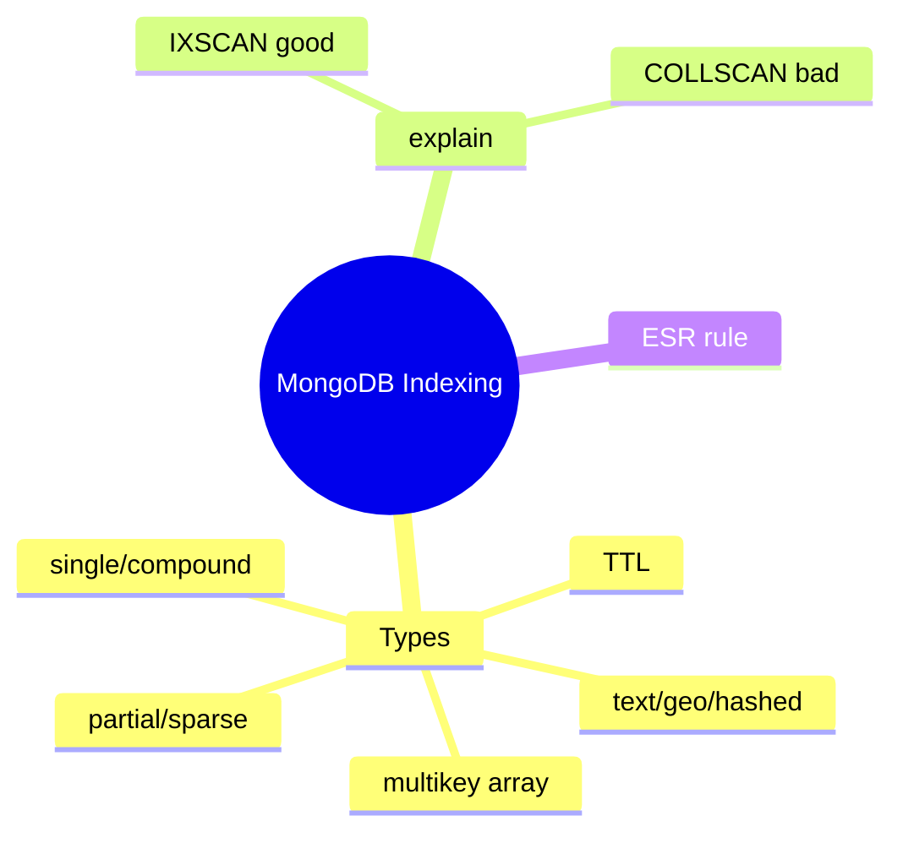
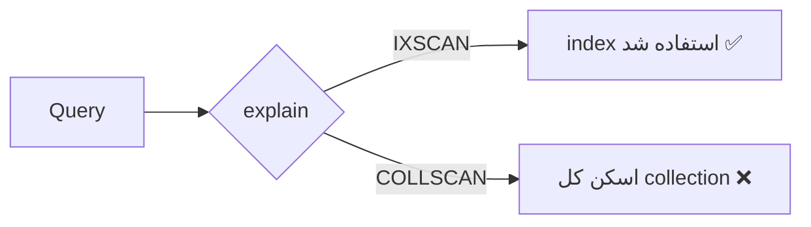

# MongoDB Indexing

> ایندکس‌گذاری در MongoDB مشابه relational اما با ویژگی‌های خاص document (multikey، TTL). تفاوت dev و production اینجاست. این فایل با دیاگرام گسترش یافته.

## فهرست
- [نقشه‌ی ذهنی](#نقشه‌ی-ذهنی)
- [📖 مفاهیم](#-مفاهیم)
- [🎯 سوالات مصاحبه](#-سوالات-مصاحبه)
- [⚠️ اشتباهات رایج](#️-اشتباهات-رایج)
- [🔗 ارتباط با سایر مفاهیم](#-ارتباط-با-سایر-مفاهیم)

---

## نقشه‌ی ذهنی



---

## 📖 مفاهیم

### انواع Index

**توضیح:**

- **Single/Compound:** compound با leftmost prefix rule.
- **Multikey:** خودکار روی فیلد آرایه‌ای (برای هر عنصر یک entry).
- **Text/Geospatial/Hashed.**
- **TTL:** auto-delete بعد از مدت (session/log/cache).
- **Sparse/Partial:** فقط documentهای دارای فیلد/برآورده‌کننده‌ی شرط.

**مثال کد:**

```javascript
db.orders.createIndex({ userId: 1, createdAt: -1 }); // compound
db.sessions.createIndex({ createdAt: 1 }, { expireAfterSeconds: 3600 }); // TTL
db.users.createIndex({ email: 1 }, { partialFilterExpression: { active: true } }); // partial
db.products.createIndex({ tags: 1 }); // multikey خودکار روی آرایه
```

**نکات کلیدی:**

- TTL برای session/log/cache.
- نمی‌توان دو فیلد آرایه‌ای در یک compound index.
- partial/sparse برای فیلد اختیاری → index کوچک‌تر.

---

### Covered Queries & explain

**توضیح:**

اگر همه‌ی فیلدهای لازم در index باشند → **covered query** (بدون مراجعه به document). `explain("executionStats")`: `IXSCAN` (خوب) در برابر `COLLSCAN` (بد).



**مثال کد:**

```javascript
db.users.find({ status: "active" }, { _id: 0, name: 1 }).explain("executionStats");
// به دنبال: stage: "IXSCAN"، totalDocsExamined کم
```

**نکات کلیدی:**

- نسبت `totalDocsExamined` به `nReturned` نزدیک ۱ یعنی index خوب.
- `COLLSCAN` روی collection بزرگ یعنی index لازم.

---

### Background & Index Stats

**توضیح:**

ساخت index در نسخه‌های جدید (4.2+) بهینه‌تر. `$indexStats` indexهای بی‌استفاده را نشان می‌دهد.

**نکات کلیدی:**

- index بی‌استفاده را حذف کنید (با `$indexStats`).
- ساخت index روی collection بزرگ در production با احتیاط.

---

## 🎯 سوالات مصاحبه

### سوال ۱: TTL index چیست و کجا استفاده می‌شود؟

**سطح:** Senior
**تکرار:** زیاد

**جواب کامل:**

single-field index روی فیلد date با `expireAfterSeconds`؛ یک background thread (هر ~۶۰ ثانیه) documentهای منقضی را حذف می‌کند. کاربرد: session، log retention، cache، OTP. مزیت: بدون cron دستی. محدودیت: دقت در سطح دقیقه، روی compound کار نمی‌کند، بار I/O حذف.

**نکته مصاحبه:**

Senior به دقت تقریبی و بار I/O اشاره می‌کند.

---

### سوال ۲: چرا query در dev سریع و production کند است؟

**سطح:** Senior
**تکرار:** زیاد

**جواب کامل:**

در dev داده کم است، پس `COLLSCAN` هم سریع و نبود index پنهان می‌ماند. در production با میلیون‌ها document فاجعه. تشخیص: `explain` که COLLSCAN و totalDocsExamined بالا را نشان می‌دهد. علل دیگر: working set بزرگ‌تر از RAM. راه‌حل: index مناسب + تست با حجم نزدیک production.

**نکته مصاحبه:**

Senior روی تست با حجم واقعی تأکید می‌کند.

---

### سوال ۳: multikey index چه محدودیتی دارد؟

**سطح:** Senior
**تکرار:** متوسط

**جواب کامل:**

خودکار روی فیلد آرایه‌ای. محدودیت اصلی: نمی‌توان در یک compound index روی **دو فیلد آرایه‌ای** index زد (انفجار ترکیبی). بزرگ‌تر است و برخی بهینه‌سازی‌ها (index-only sort) محدودند.

**نکته مصاحبه:**

Senior محدودیت «دو فیلد آرایه‌ای» را می‌داند.

---

## ⚠️ اشتباهات رایج

### اشتباه ۱: نبود index → COLLSCAN

```javascript
// ❌
db.users.find({ email: "a@b.com" });
```

```javascript
// ✅
db.users.createIndex({ email: 1 }, { unique: true });
```

**توضیح:** فیلدهای پرquery باید index داشته باشند.

---

### اشتباه ۲: index بیش از حد

```text
❌ index روی هر فیلد → write کند
✅ بر اساس query واقعی؛ بی‌استفاده‌ها را با $indexStats حذف کنید
```

**توضیح:** هر index هزینه‌ی write و حافظه دارد.

---

### اشتباه ۳: ترتیب اشتباه در compound (ESR)

```javascript
// ❌
db.orders.createIndex({ createdAt: 1, status: 1 });
```

```javascript
// ✅ Equality, Sort, Range
db.orders.createIndex({ status: 1, createdAt: -1 });
```

**توضیح:** ESR rule برای ترتیب compound.

---

## 🔗 ارتباط با سایر مفاهیم

- indexing با **relational indexing (3.2)** (leftmost prefix، covered).
- explain با **query optimization**.
- TTL با **Redis expiry (9.1)**.
- hashed با **Sharding (4.4)**.
