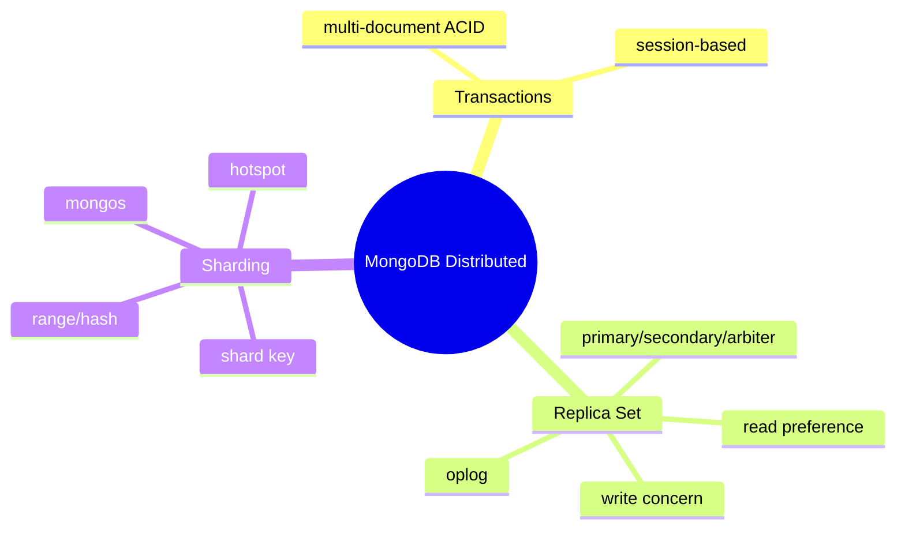
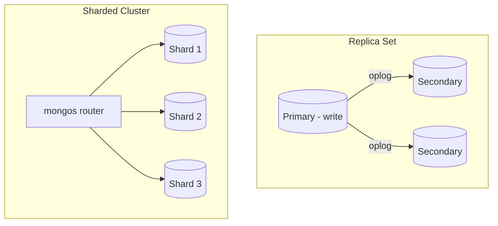
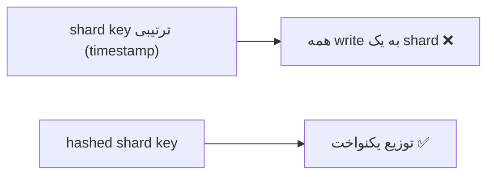

# MongoDB — Transactions، Replica Set، Sharding

> مفاهیم توزیع‌شده‌ی MongoDB. shard key مهم‌ترین تصمیم scale است و write concern روی consistency اثر می‌گذارد. این فایل با دیاگرام گسترش یافته.

## فهرست
- [نقشه‌ی ذهنی](#نقشه‌ی-ذهنی)
- [📖 مفاهیم](#-مفاهیم)
- [🎯 سوالات مصاحبه](#-سوالات-مصاحبه)
- [⚠️ اشتباهات رایج](#️-اشتباهات-رایج)
- [🔗 ارتباط با سایر مفاهیم](#-ارتباط-با-سایر-مفاهیم)

---

## نقشه‌ی ذهنی



---

## معماری Replica Set و Sharding



---

## 📖 مفاهیم

### Transactions

**توضیح:**

از MongoDB 4.0، multi-document ACID transactions با session. هزینه‌ی performance دارد؛ فلسفه‌ی MongoDB: با embedding اغلب نیازی به transaction چنددocument نیست.

**مثال کد:**

```javascript
const session = db.getMongo().startSession();
session.startTransaction();
try {
  db.accounts.updateOne({ _id: "A" }, { $inc: { balance: -100 } }, { session });
  db.accounts.updateOne({ _id: "B" }, { $inc: { balance: 100 } }, { session });
  session.commitTransaction();
} catch (e) { session.abortTransaction(); }
```

**نکات کلیدی:**

- transaction چندdocument گران؛ اول طراحی document را بازبینی کنید.
- atomicity تک‌document همیشه تضمین است.

---

### Replica Set

**توضیح:**

**Primary** (تنها write)، **Secondary** (کپی از oplog، read)، **Arbiter** (فقط رأی). **Read Preference:** `primary`, `secondary`, `nearest`. **Write Concern:** `w:1`, `w:majority`, `j:true`. **Oplog** لاگ عملیات. هنگام down شدن primary، election.

**مثال کد:**

```javascript
db.orders.insertOne(doc, { writeConcern: { w: "majority", j: true } }); // امن
db.orders.find().readPref("secondaryPreferred"); // read scaling
```

**نکات کلیدی:**

- `w:majority` durability بهتر اما latency بیشتر.
- read از secondary = احتمال stale (eventual consistency).

---

### Sharding

**توضیح:**

توزیع افقی روی چند نود. **Shard Key** مهم‌ترین تصمیم: Range (range query خوب اما hotspot با کلید ترتیبی) یا Hash (یکنواخت اما range query بد). `mongos` query router. **hotspot** خطر اصلی: کلید ترتیبی همه‌ی writeها را به یک shard می‌فرستد.



**نکات کلیدی:**

- shard key: cardinality بالا، توزیع یکنواخت write، هم‌راستا با query.
- کلید ترتیبی → hotspot.
- تغییر shard key بسیار سخت است.

---

## 🎯 سوالات مصاحبه

### سوال ۱: shard key را چطور انتخاب می‌کنی؟

**سطح:** Lead
**تکرار:** زیاد

**جواب کامل:**

سه ویژگی: (۱) **cardinality بالا** (نه boolean). (۲) **توزیع یکنواخت write** (کلید ترتیبی → hotspot). (۳) **هم‌راستا با query** (targeted نه scatter-gather). راه‌حل کلید ترتیبی: hashed یا compound (`{region, timestamp}`). تغییر shard key بسیار سخت است.

**نکته مصاحبه:**

Lead سه معیار + hotspot + scatter-gather را می‌داند.

---

### سوال ۲: write concern و trade-off؟

**سطح:** Senior
**تکرار:** زیاد

**جواب کامل:**

`w:1` فقط primary (سریع، اما اگر قبل از replication down شود loss). `w:majority` اکثریت (durable حتی با failover، اما latency). `j:true` روی journal. trade-off durability/latency؛ مرتبط با CAP. برای پرداخت `w:majority, j:true`؛ برای لاگ `w:1`.

**نکته مصاحبه:**

Senior به رابطه با CAP اشاره می‌کند.

---

### سوال ۳: read از secondary چه ریسکی دارد؟

**سطح:** Senior
**تکرار:** متوسط

**جواب کامل:**

secondary async از oplog به‌روز می‌شود → ممکن **stale** (replication lag). مشکل read-your-own-writes. برای داده با tolerance به staleness (گزارش) مناسب؛ برای consistency قوی از primary بخوانید. eventual consistency.

**نکته مصاحبه:**

Senior به read-your-writes اشاره می‌کند.

---

## ⚠️ اشتباهات رایج

### اشتباه ۱: shard key ترتیبی

```javascript
// ❌ hotspot
sh.shardCollection("db.events", { createdAt: 1 });
```

```javascript
// ✅
sh.shardCollection("db.events", { userId: "hashed" });
```

**توضیح:** کلید ترتیبی توزیع write را نامتعادل می‌کند.

---

### اشتباه ۲: transaction بی‌رویه

```text
❌ transaction برای کاری که می‌توانست تک‌document باشد
✅ embed → atomicity رایگان
```

**توضیح:** transaction چندdocument گران است.

---

### اشتباه ۳: `w:1` برای داده‌ی بحرانی

```javascript
// ❌
db.payments.insertOne(doc, { writeConcern: { w: 1 } });
```

```javascript
// ✅
db.payments.insertOne(doc, { writeConcern: { w: "majority", j: true } });
```

**توضیح:** برای داده‌ی مهم durability را با majority تضمین کنید.

---

## 🔗 ارتباط با سایر مفاهیم

- write concern/read preference با **CAP (6.2)**.
- sharding با **scalability** و **PostgreSQL partitioning (مقایسه)**.
- transactions با **SAGA (6.1)**.
- replica set با **HA** و **PostgreSQL replication (3.3)**.
