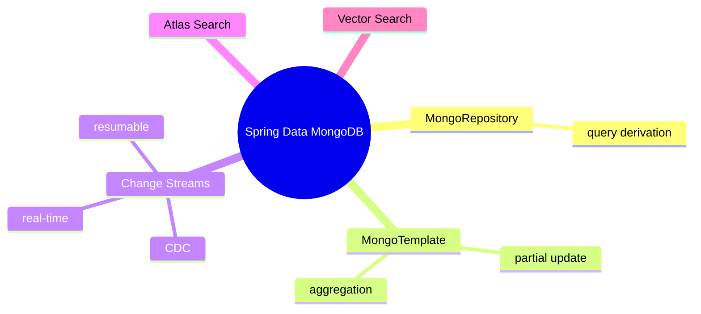
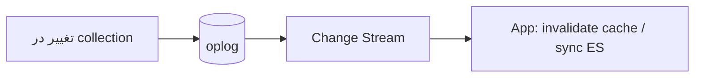

# MongoDB Performance & Spring Data MongoDB

> یکپارچگی MongoDB با Spring و ابزارهای performance/real-time (Change Streams، Atlas Search). این فایل با دیاگرام گسترش یافته.

## فهرست
- [نقشه‌ی ذهنی](#نقشه‌ی-ذهنی)
- [📖 مفاهیم](#-مفاهیم)
- [🎯 سوالات مصاحبه](#-سوالات-مصاحبه)
- [⚠️ اشتباهات رایج](#️-اشتباهات-رایج)
- [🔗 ارتباط با سایر مفاهیم](#-ارتباط-با-سایر-مفاهیم)

---

## نقشه‌ی ذهنی



---

## Change Streams (جایگزین polling)



---

## 📖 مفاهیم

### Spring Data MongoDB

**توضیح:**

`MongoRepository` (interface‌محور، query derivation) برای ساده، `MongoTemplate` برای پیچیده/aggregation/partial update. `@Document`, `@Id`, `@Field`. برای reactive، `ReactiveMongoTemplate`.

**مثال کد:**

```java
@Document(collection = "products")
public record Product(@Id String id, String name, @Field("cat") String category, double price) {}

public interface ProductRepository extends MongoRepository<Product, String> {
    List<Product> findByCategory(String category);
    List<Product> findByPriceBetween(double min, double max);
}

// aggregation با MongoTemplate
Aggregation agg = Aggregation.newAggregation(
    Aggregation.match(Criteria.where("category").is("electronics")),
    Aggregation.group("category").sum("price").as("total"),
    Aggregation.sort(Sort.Direction.DESC, "total"));
AggregationResults<CategoryTotal> r = mongoTemplate.aggregate(agg, "products", CategoryTotal.class);
```

**نکات کلیدی:**

- `MongoRepository` ساده، `MongoTemplate` پیچیده.
- `save()` کل document را بازنویسی می‌کند؛ برای یک فیلد `updateFirst` با `$set`.

---

### Change Streams

**توضیح:**

دریافت real-time تغییرات بدون polling. بر اساس oplog (نیاز replica set). resumable (با resume token). کاربرد: sync با Elasticsearch، notification، cache invalidation، CDC.

**مثال کد:**

```java
Flux<ChangeStreamEvent<Product>> changes = reactiveMongoTemplate
    .changeStream(Product.class).watchCollection("products")
    .filter(Criteria.where("operationType").is("update")).listen();
changes.subscribe(event -> updateSearchIndex(event.getBody()));
```

**نکات کلیدی:**

- نیاز replica set (oplog).
- resumable با resume token.
- جایگزین polling و راه‌حل CDC داخلی.

---

### Atlas Search & Vector Search

**توضیح:**

**Atlas Search** full-text مبتنی بر Lucene داخل Atlas (بدون Elasticsearch جدا). **Vector Search** (7/8) برای semantic/AI. **Queryable Encryption**.

**نکات کلیدی:**

- Atlas Search می‌تواند نیاز Elasticsearch جدا را حذف کند.
- Vector Search برای AI/LLM.

---

## 🎯 سوالات مصاحبه

### سوال ۱: `MongoRepository` در برابر `MongoTemplate`؟

**سطح:** Senior
**تکرار:** زیاد

**جواب کامل:**

`MongoRepository` برای CRUD و query ساده. `MongoTemplate` برای aggregation، partial update، query پویا، کنترل دقیق. در عمل هر دو. نکته‌ی performance: `save()` کل document را بازنویسی می‌کند؛ برای update یک فیلد، `updateFirst` با `$set` کارآمدتر.

**نکته مصاحبه:**

Senior به مشکل `save()` در برابر partial update اشاره می‌کند.

---

### سوال ۲: Change Streams چه مشکلی حل می‌کند؟

**سطح:** Senior
**تکرار:** متوسط

**جواب کامل:**

polling latency و بار اضافه دارد. Change Streams stream real-time تغییرات می‌دهد؛ resumable. کاربرد: CDC برای sync با Elasticsearch، Outbox. نیاز replica set (oplog).

**نکته مصاحبه:**

Senior به resume token و CDC اشاره می‌کند.

---

### سوال ۳: N+1 معادل در MongoDB چطور رخ می‌دهد؟

**سطح:** Senior
**تکرار:** متوسط

**جواب کامل:**

با referencing و query جدا برای هر document مرتبط (۱۰۰ order → ۱۰۰ query برای user). راه‌حل: `$lookup`، batch با `$in`، یا بهتر denormalization. فلسفه‌ی MongoDB: با مدل‌سازی درست جلوگیری کنید.

**نکته مصاحبه:**

Senior به denormalization اشاره می‌کند.

---

## ⚠️ اشتباهات رایج

### اشتباه ۱: `save()` برای update یک فیلد

```java
// ❌
Product p = repo.findById(id).get(); p.setPrice(newPrice); repo.save(p);
```

```java
// ✅
mongoTemplate.updateFirst(Query.query(Criteria.where("_id").is(id)),
    Update.update("price", newPrice), Product.class);
```

**توضیح:** `save` کل document را بازنویسی و race می‌سازد.

---

### اشتباه ۲: polling به‌جای Change Streams

```text
❌ هر 5 ثانیه چک کل collection
✅ Change Streams real-time
```

**توضیح:** polling latency و بار اضافه دارد.

---

### اشتباه ۳: blocking MongoTemplate در WebFlux

```java
// ❌
mongoTemplate.findById(id, Product.class);
```

```java
// ✅
reactiveMongoTemplate.findById(id, Product.class);
```

**توضیح:** در WebFlux از reactive template استفاده کنید.

---

## 🔗 ارتباط با سایر مفاهیم

- Spring Data MongoDB با **Spring Data JPA (2.4)** و **WebFlux (2.3)**.
- Change Streams با **Kafka/CDC/Debezium (8.1)**.
- Atlas Search با **Elasticsearch (17)**.
- partial update با **optimistic locking (14.3)**.
