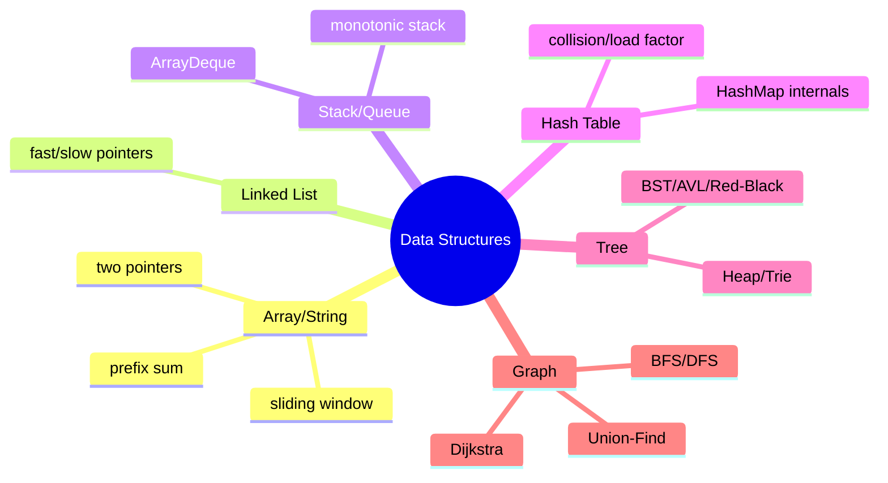
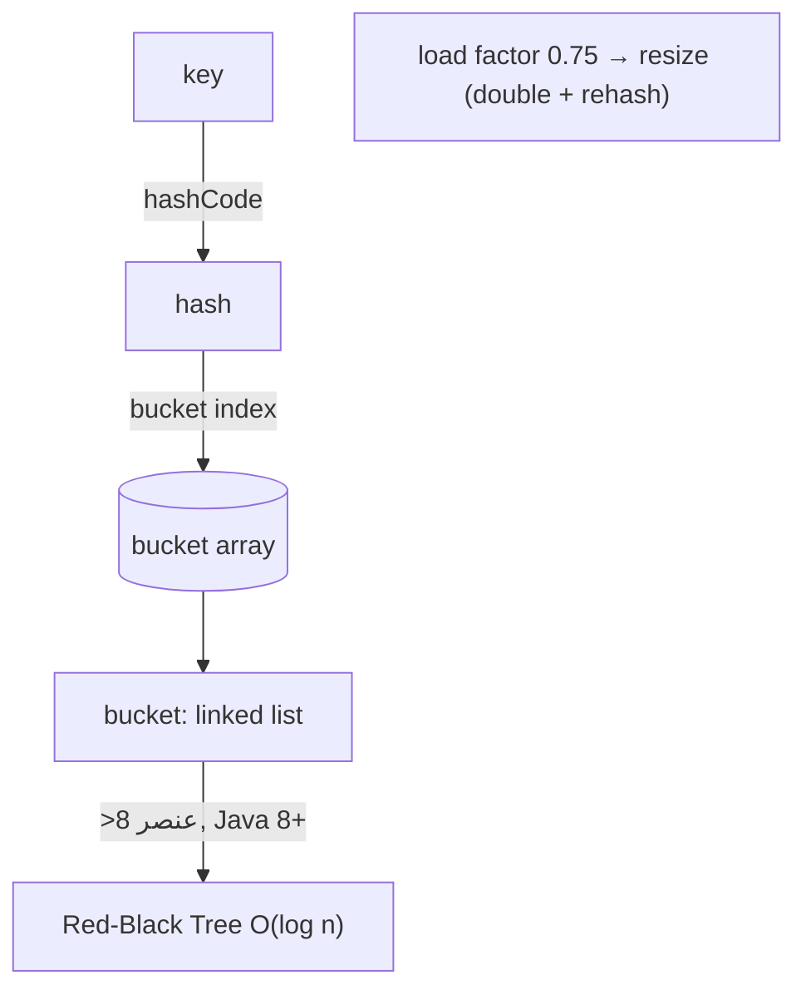
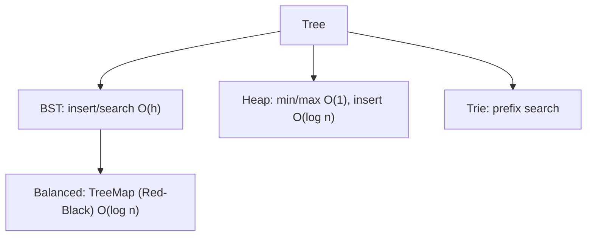
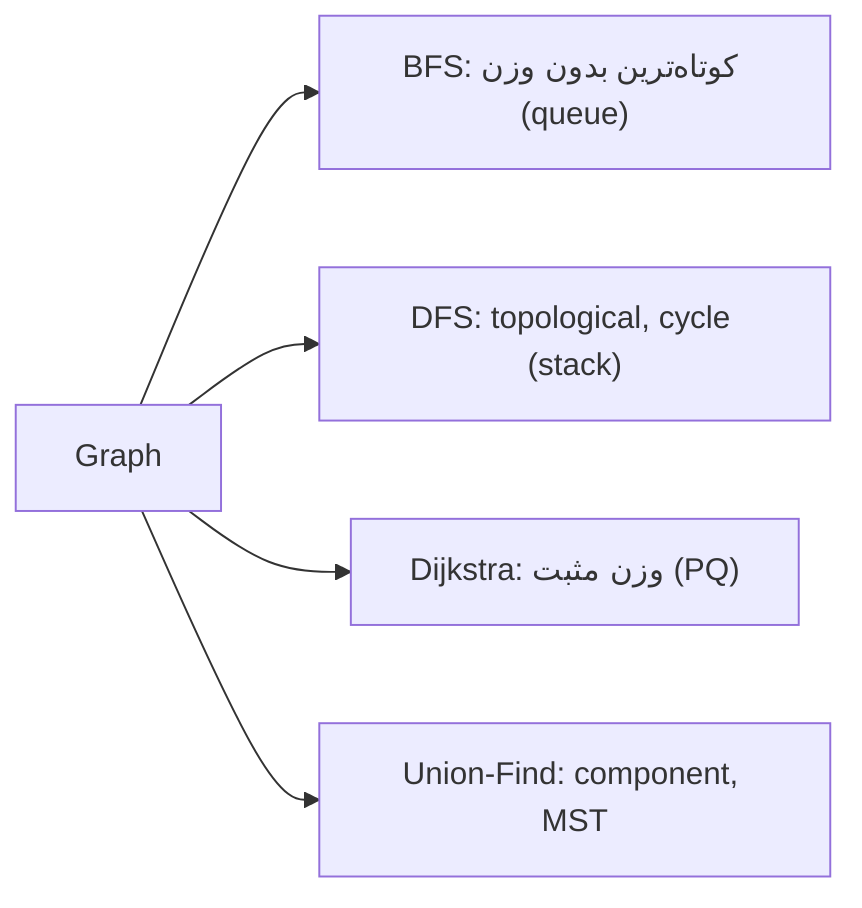

# Data Structures — Array، LinkedList، Stack/Queue، HashTable، Tree، Graph

> ساختار داده پایه‌ی هر سوال الگوریتمی و طراحی است. درک internals (مثل HashMap) تمایز Senior است. این فایل با دیاگرام و مثال‌های متعدد گسترش یافته.

## فهرست
- [نقشه‌ی ذهنی](#نقشه‌ی-ذهنی)
- [📖 مفاهیم](#-مفاهیم)
- [🎯 سوالات مصاحبه](#-سوالات-مصاحبه)
- [⚠️ اشتباهات رایج](#️-اشتباهات-رایج)
- [🔗 ارتباط با سایر مفاهیم](#-ارتباط-با-سایر-مفاهیم)

---

## نقشه‌ی ذهنی



---

## HashMap internals



---

## 📖 مفاهیم

### Array & String

**توضیح:**

dynamic array (`ArrayList`) با ضریب ۱.۵ resize. دسترسی index O(1)، cache locality عالی. الگوها: **two pointers**، **sliding window**، **prefix sum**. برای رشته: KMP، Rabin-Karp.

**مثال کد:**

```java
// sliding window: بزرگ‌ترین مجموع زیرآرایه‌ی k عنصری — O(n)
static int maxSum(int[] arr, int k) {
    int windowSum = 0;
    for (int i = 0; i < k; i++) windowSum += arr[i];
    int max = windowSum;
    for (int i = k; i < arr.length; i++) {
        windowSum += arr[i] - arr[i - k];
        max = Math.max(max, windowSum);
    }
    return max;
}
```

**نکات کلیدی:**

- sliding window O(n) به‌جای O(n*k).
- prefix sum برای range sum مکرر.

---

### Linked List

**توضیح:**

singly/doubly. درج/حذف O(1) اگر node را داشته باشید، دسترسی تصادفی O(n). الگوی **fast/slow pointers** (Floyd) برای وسط، تشخیص حلقه، node k-ام از آخر.

**مثال کد:**

```java
static boolean hasCycle(ListNode head) {
    ListNode slow = head, fast = head;
    while (fast != null && fast.next != null) {
        slow = slow.next; fast = fast.next.next;
        if (slow == fast) return true;
    }
    return false;
}
```

**نکات کلیدی:**

- fast/slow برای وسط، حلقه، node k-ام از آخر.
- در عمل ArrayList معمولاً سریع‌تر (cache locality).

---

### Stack & Queue

**توضیح:**

`ArrayDeque` بهترین برای هر دو (سریع‌تر از `Stack` legacy و `LinkedList`). **monotonic stack** برای Next Greater Element. Queue برای BFS.

**مثال کد:**

```java
static int[] nextGreater(int[] nums) {
    int[] res = new int[nums.length]; Arrays.fill(res, -1);
    Deque<Integer> stack = new ArrayDeque<>();
    for (int i = 0; i < nums.length; i++) {
        while (!stack.isEmpty() && nums[stack.peek()] < nums[i]) res[stack.pop()] = nums[i];
        stack.push(i);
    }
    return res;
}
```

**نکات کلیدی:**

- `ArrayDeque` به‌جای `Stack`/`LinkedList`.
- monotonic stack برای «بعدی بزرگ‌تر/کوچک‌تر».

---

### Hash Table — HashMap internals

**توضیح:**

hashing کلید → bucket. دسترسی متوسط O(1). collision با chaining؛ از Java 8 bucket بزرگ (>۸) به درخت قرمز-سیاه (O(log n)). load factor ۰.۷۵ → resize و rehash. کیفیت `hashCode` حیاتی؛ کلید باید immutable و `equals/hashCode` درست داشته باشد.

**مثال کد:**

```java
record CacheKey(String tenant, Long userId) {} // immutable، equals/hashCode خودکار
Map<CacheKey, User> cache = new HashMap<>();
cache.put(new CacheKey("t1", 5L), user);
```

**نکات کلیدی:**

- از Java 8 treeification (O(log n)).
- load factor ۰.۷۵.
- کلید mutable = باگ.

---

### Tree

**توضیح:**

Binary Tree و پیمایش‌ها (inorder/preorder/postorder/level-order). BST O(h). Balanced (AVL، Red-Black = `TreeMap`). Heap (`PriorityQueue`). Trie (prefix). Segment/Fenwick (range query).



**مثال کد:**

```java
static void inorder(TreeNode node, List<Integer> out) {
    if (node == null) return;
    inorder(node.left, out); out.add(node.val); inorder(node.right, out); // BST → مرتب
}
```

**نکات کلیدی:**

- inorder روی BST خروجی مرتب.
- `TreeMap` برای کلید مرتب و range؛ `PriorityQueue` برای top-k.

---

### Graph

**توضیح:**

نمایش: Adjacency List (sparse) یا Matrix (dense). BFS (کوتاه‌ترین مسیر بدون وزن)، DFS (topological sort، cycle، components)، Dijkstra (وزن مثبت)، Bellman-Ford (وزن منفی)، Floyd-Warshall (همه‌جفت)، Prim/Kruskal (MST)، Union-Find.



**مثال کد:**

```java
static int shortestPath(Map<Integer, List<Integer>> graph, int start, int target) {
    Queue<Integer> queue = new ArrayDeque<>();
    Map<Integer, Integer> dist = new HashMap<>();
    queue.add(start); dist.put(start, 0);
    while (!queue.isEmpty()) {
        int node = queue.poll();
        if (node == target) return dist.get(node);
        for (int next : graph.getOrDefault(node, List.of()))
            if (!dist.containsKey(next)) { dist.put(next, dist.get(node) + 1); queue.add(next); }
    }
    return -1;
}
```

**نکات کلیدی:**

- BFS برای کوتاه‌ترین بدون وزن؛ Dijkstra برای وزن‌دار.
- Union-Find برای cycle و MST (Kruskal).

---

## 🎯 سوالات مصاحبه

### سوال ۱: HashMap چطور کار می‌کند و در Java 8 چه تغییری کرد؟

**سطح:** Senior
**تکرار:** خیلی زیاد

**جواب کامل:**

کلید با `hashCode` به bucket map می‌شود (با bitwise). دسترسی متوسط O(1). collision در bucket؛ تا Java 7 لیست پیوندی (بدترین O(n) — بردار DoS). از **Java 8**، bucket بزرگ (>۸) به **درخت قرمز-سیاه** تبدیل می‌شود (بدترین O(log n)). load factor ۰.۷۵ → resize (double + rehash).

**کد توضیحی:**

```java
class BadKey { public int hashCode() { return 1; } } // ❌ همه در یک bucket
```

**نکته مصاحبه:**

تمایز Senior: treeification، load factor، DoS. Follow-up: «چرا کلید immutable؟»

---

### سوال ۲: ArrayList در برابر LinkedList از نظر complexity؟

**سطح:** Mid / Senior
**تکرار:** زیاد

**جواب کامل:**

ArrayList: index O(1)، add انتها amortized O(1)، درج/حذف وسط O(n). LinkedList: index O(n)، درج/حذف سر O(1). در نظریه LinkedList برای درج زیاد بهتر، اما در عمل به‌خاطر cache locality و سربار pointer، ArrayList برنده. برای صف/پشته `ArrayDeque`.

**نکته مصاحبه:**

Senior می‌داند نظریه و عمل فرق دارند.

---

### سوال ۳: BFS در برابر DFS — کِی کدام؟

**سطح:** Senior
**تکرار:** زیاد

**جواب کامل:**

BFS سطح‌به‌سطح، برای **کوتاه‌ترین مسیر بدون وزن** و نزدیک‌ترین گره (queue، حافظه‌ی عرض). DFS عمق، برای **topological sort، cycle، components، backtracking** (stack/recursion، حافظه‌ی عمق). DFS recursive روی گراف عمیق → StackOverflow (iterative). کوتاه‌ترین مسیر وزن‌دار → Dijkstra.

**نکته مصاحبه:**

Follow-up: «کوتاه‌ترین مسیر وزن‌دار؟» (Dijkstra نه BFS).

---

### سوال ۴: PriorityQueue چطور کار می‌کند و کجا؟

**سطح:** Senior
**تکرار:** متوسط

**جواب کامل:**

binary heap: درج/حذف min/max O(log n)، دسترسی min/max O(1). برای top-k، merge k لیست، Dijkstra، scheduling. برای top-k بزرگ‌ترین، min-heap اندازه‌ی k نگه دارید — O(n log k).

**کد توضیحی:**

```java
PriorityQueue<Integer> heap = new PriorityQueue<>(); // min-heap
for (int n : nums) { heap.offer(n); if (heap.size() > k) heap.poll(); }
return heap.peek(); // k-امین بزرگ‌ترین
```

**نکته مصاحبه:**

Senior الگوی min-heap اندازه k را می‌داند.

---

## ⚠️ اشتباهات رایج

### اشتباه ۱: کلید mutable در HashMap

```java
// ❌
class Key { int id; public int hashCode(){return id;} }
Key k = new Key(); map.put(k, v); k.id = 99; // get → null
```

```java
// ✅
record Key(int id) {}
```

**توضیح:** تغییر کلید hashCode را عوض می‌کند.

---

### اشتباه ۲: `Stack` legacy

```java
// ❌
Stack<Integer> stack = new Stack<>();
```

```java
// ✅
Deque<Integer> stack = new ArrayDeque<>();
```

**توضیح:** `Stack` قدیمی و synchronized است.

---

### اشتباه ۳: DFS recursive روی گراف عمیق

```java
// ❌ StackOverflow
void dfs(int node) { ...; dfs(next); }
```

```java
// ✅ iterative
Deque<Integer> stack = new ArrayDeque<>();
```

**توضیح:** عمق زیاد recursion → StackOverflowError.

---

## 🔗 ارتباط با سایر مفاهیم

- HashMap internals با **Collections (1.1)** و **ConcurrentHashMap (1.6)**.
- Tree (Red-Black) با **TreeMap** و **DB index B-Tree (3.2)**.
- Graph با **System Design (6.2)**.
- complexity با **Algorithms (5.2)**.
