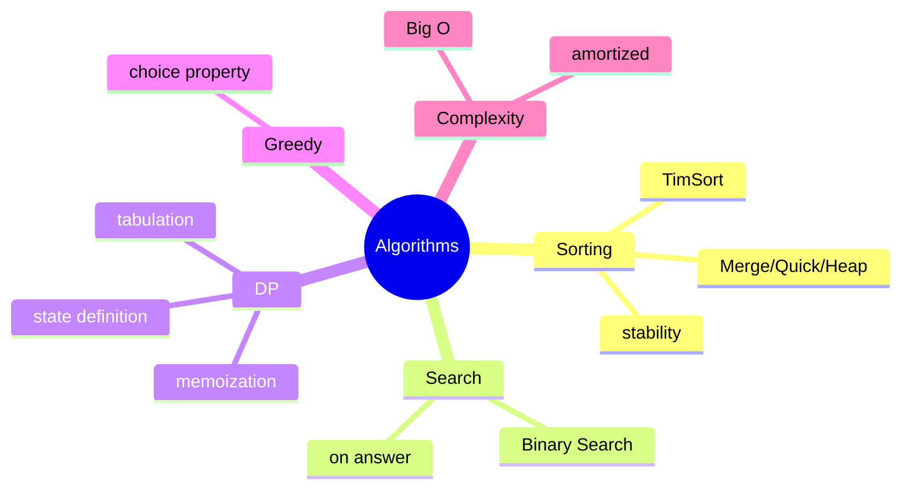
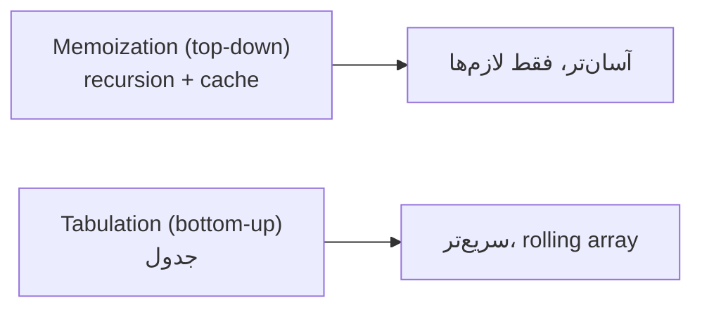

# Algorithms — Sorting، Search، DP، Greedy، Complexity

> الگوریتم‌ها در مصاحبه‌های coding و تحلیل complexity در طراحی سیستم پرسیده می‌شوند. این فایل با دیاگرام و مثال‌های متعدد گسترش یافته.

## فهرست
- [نقشه‌ی ذهنی](#نقشه‌ی-ذهنی)
- [📖 مفاهیم](#-مفاهیم)
- [🎯 سوالات مصاحبه](#-سوالات-مصاحبه)
- [⚠️ اشتباهات رایج](#️-اشتباهات-رایج)
- [🔗 ارتباط با سایر مفاهیم](#-ارتباط-با-سایر-مفاهیم)

---

## نقشه‌ی ذهنی



---

## 📖 مفاهیم

### Sorting

**توضیح:**

| Algorithm | Best | Average | Worst | Space | Stable |
|-----------|------|---------|-------|-------|--------|
| Merge | O(n log n) | O(n log n) | O(n log n) | O(n) | بله |
| Quick | O(n log n) | O(n log n) | O(n²) | O(log n) | خیر |
| Heap | O(n log n) | O(n log n) | O(n log n) | O(1) | خیر |
| TimSort | O(n) | O(n log n) | O(n log n) | O(n) | بله |

**stability**: ترتیب نسبی عناصر مساوی حفظ شود — مهم برای مرتب‌سازی چندمرحله‌ای. Java: TimSort (object، پایدار)، dual-pivot quicksort (primitive).

**مثال کد:**

```java
people.sort(Comparator.comparingInt(Person::age).thenComparing(Person::name));
```

**نکات کلیدی:**

- Java: TimSort (object)، quicksort (primitive).
- stability برای مرتب‌سازی چند کلید.
- quicksort worst O(n²)؛ TimSort تضمین O(n log n).

---

### Search — Binary Search

**توضیح:**

روی داده‌ی مرتب O(log n). مراقب overflow در mid. **binary search on answer**: روی فضای جواب monotonic.

**مثال کد:**

```java
static int binarySearch(int[] arr, int target) {
    int low = 0, high = arr.length - 1;
    while (low <= high) {
        int mid = low + (high - low) / 2; // جلوگیری از overflow
        if (arr[mid] == target) return mid;
        if (arr[mid] < target) low = mid + 1; else high = mid - 1;
    }
    return -1;
}
```

**نکات کلیدی:**

- overflow را با `low + (high-low)/2` رفع کنید.
- binary search on answer برای بهینه‌سازی monotonic.

---

### Dynamic Programming

**توضیح:**

برای مسائل با **overlapping subproblems** و **optimal substructure**. **memoization** (top-down) یا **tabulation** (bottom-up). مهم‌ترین مرحله: **تعریف state**. کلاسیک: Fibonacci، Knapsack، LCS، LIS، Edit Distance، Coin Change.



**مثال کد:**

```java
static int coinChange(int[] coins, int amount) {
    int[] dp = new int[amount + 1]; Arrays.fill(dp, amount + 1); dp[0] = 0;
    for (int i = 1; i <= amount; i++)
        for (int coin : coins)
            if (coin <= i) dp[i] = Math.min(dp[i], dp[i - coin] + 1);
    return dp[amount] > amount ? -1 : dp[amount];
}
```

**نکات کلیدی:**

- تشخیص DP: overlapping + optimal substructure.
- تعریف state سخت‌ترین بخش.
- rolling array برای کاهش فضا.

---

### Greedy & Divide and Conquer

**توضیح:**

**Greedy** انتخاب محلی بهینه؛ فقط با **greedy choice property** درست (Activity Selection، Huffman). **D&C** تقسیم/حل/ترکیب (Merge/Quick Sort)؛ تحلیل با Master Theorem.

**نکات کلیدی:**

- greedy همیشه بهینه نیست؛ باید اثبات شود (coin change دلخواه جواب نمی‌دهد).
- در شک، DP امن‌تر.

---

### Complexity Analysis

**توضیح:**

Big O/Ω/Θ. **amortized**: میانگین در دنباله (مثل `ArrayList.add` که گاهی O(n) resize اما amortized O(1)). space complexity. recurrence relations.

**نکات کلیدی:**

- amortized با worst-case تک‌عملیات فرق دارد.
- هم time هم space را تحلیل کنید.

---

## 🎯 سوالات مصاحبه

### سوال ۱: stability در مرتب‌سازی چیست و چرا مهم؟

**سطح:** Senior
**تکرار:** زیاد

**جواب کامل:**

پایدار = ترتیب نسبی مساوی‌ها حفظ شود. مهم برای مرتب‌سازی چندمرحله‌ای (اول name، بعد age؛ در هم‌سن‌ها ترتیب name حفظ). Java برای object TimSort (پایدار)، برای primitive quicksort (ناپایدار، چون primitiveها قابل‌تمایز نیستند).

**نکته مصاحبه:**

تمایز Senior: چرا Java primitive ناپایدار.

---

### سوال ۲: memoization در برابر tabulation؟

**سطح:** Senior
**تکرار:** زیاد

**جواب کامل:**

memoization: recursion طبیعی + cache؛ آسان‌تر، فقط زیرمسائل لازم، اما سربار recursion و خطر StackOverflow. tabulation: جدول bottom-up؛ سریع‌تر، rolling array، اما ترتیب وابستگی را دستی بفهمید. memoization برای شروع، tabulation برای بهینه‌سازی.

**نکته مصاحبه:**

Follow-up: «کاهش فضا از O(n²) به O(n)؟» (rolling array).

---

### سوال ۳: amortized complexity یعنی چه؟ ArrayList.add؟

**سطح:** Senior
**تکرار:** متوسط

**جواب کامل:**

میانگین هزینه در یک **دنباله**. `ArrayList.add` معمولاً O(1) اما گاهی resize O(n)؛ چون دوبرابر می‌کند، resize نادر است و amortized O(1). با worst-case تک‌عملیات (O(n)) فرق دارد.

**نکته مصاحبه:**

Senior تفاوت amortized با worst-case را روشن می‌کند.

---

### سوال ۴: کِی greedy و کِی DP؟

**سطح:** Senior
**تکرار:** متوسط

**جواب کامل:**

greedy با **greedy choice property** (Activity Selection، Huffman، Dijkstra) — سریع‌تر اما باید اثبات شود؛ Coin Change دلخواه (۱،۳،۴ برای ۶) با greedy بهینه نیست. DP همه را بررسی می‌کند، همیشه بهینه اما کندتر. در شک DP.

**نکته مصاحبه:**

Senior مثال نقض greedy را می‌داند.

---

## ⚠️ اشتباهات رایج

### اشتباه ۱: overflow در binary search

```java
// ❌
int mid = (low + high) / 2;
```

```java
// ✅
int mid = low + (high - low) / 2;
```

**توضیح:** `low + high` می‌تواند overflow شود.

---

### اشتباه ۲: greedy برای coin change

```text
❌ greedy برای سکه‌های دلخواه غلط
✅ DP
```

**توضیح:** greedy فقط برای سیستم سکه‌ی canonical.

---

### اشتباه ۳: DP recursive بدون memoization

```java
// ❌ O(2^n)
int fib(int n) { return n < 2 ? n : fib(n-1) + fib(n-2); }
```

```java
// ✅ با memo/tabulation O(n)
```

**توضیح:** بدون cache زیرمسائل بارها محاسبه می‌شوند.

---

## 🔗 ارتباط با سایر مفاهیم

- complexity با **performance** و **System Design (6.2)**.
- sorting با **Collections.sort/Comparator (1.1)**.
- graph algorithms با **Data Structures (5.1)**.
- DP با مسائل **LeetCode**.
