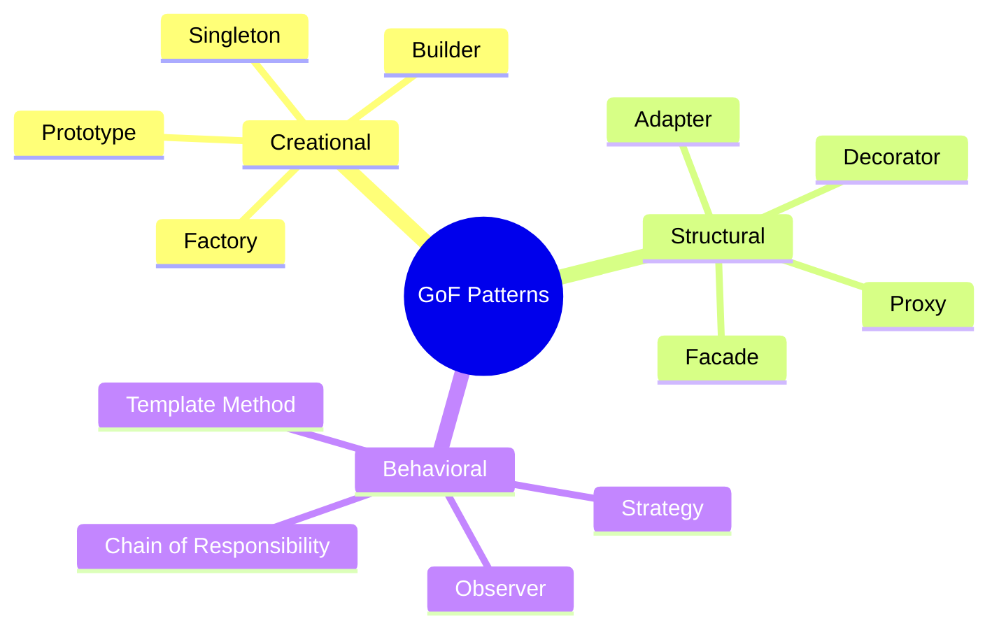
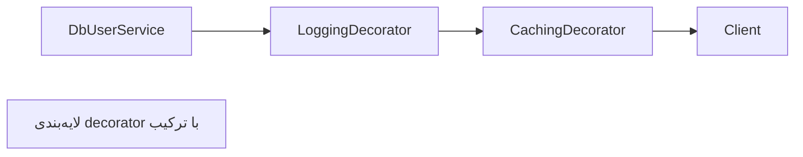

# Design Patterns (Gang of Four)

> الگوهای طراحی زبان مشترک مهندسان‌اند. شناخت آن‌ها در کد Spring/JDK تمایز Senior است. این فایل با دیاگرام و مثال‌های متعدد گسترش یافته.

## فهرست
- [نقشه‌ی ذهنی](#نقشه‌ی-ذهنی)
- [📖 مفاهیم](#-مفاهیم)
- [🎯 سوالات مصاحبه](#-سوالات-مصاحبه)
- [⚠️ اشتباهات رایج](#️-اشتباهات-رایج)
- [🔗 ارتباط با سایر مفاهیم](#-ارتباط-با-سایر-مفاهیم)

---

## نقشه‌ی ذهنی



---

## 📖 مفاهیم

### Creational Patterns

**توضیح:**

- **Singleton:** یک نمونه. بهترین با **enum** (serialization/reflection-safe). در Spring beanها singleton.
- **Factory Method:** `@Bean`.
- **Builder:** ساخت گام‌به‌گام immutable.
- **Prototype:** کپی.

**مثال کد:**

```java
public enum ConnectionPool { // بهترین Singleton
    INSTANCE;
    private final DataSource dataSource = createDataSource();
    public Connection get() { return dataSource.getConnection(); }
}

public record HttpRequest(String url, String method, Map<String,String> headers) {
    public static class Builder {
        private String url, method = "GET";
        private final Map<String,String> headers = new HashMap<>();
        public Builder url(String u) { this.url = u; return this; }
        public Builder header(String k, String v) { headers.put(k, v); return this; }
        public HttpRequest build() { return new HttpRequest(url, method, headers); }
    }
}
```

**نکات کلیدی:**

- enum بهترین Singleton.
- Builder برای پارامترهای اختیاری زیاد.
- در Spring از container singleton استفاده کنید.

---

### Structural Patterns

**توضیح:**

- **Adapter:** wrap interface ناسازگار.
- **Decorator:** افزودن رفتار با wrap (`BufferedReader`).
- **Proxy:** کنترل دسترسی (Spring AOP).
- **Facade:** interface ساده روی زیرسیستم.
- **Composite:** ساختار درختی.



**مثال کد:**

```java
interface UserService { User find(Long id); }
class CachingUserService implements UserService {
    private final UserService delegate;
    private final Map<Long,User> cache = new ConcurrentHashMap<>();
    CachingUserService(UserService d) { this.delegate = d; }
    public User find(Long id) { return cache.computeIfAbsent(id, delegate::find); }
}
```

**نکات کلیدی:**

- Decorator رفتار را با ترکیب می‌چسباند.
- Proxy و Decorator ساختار مشابه، قصد متفاوت.

---

### Behavioral Patterns

**توضیح:**

- **Strategy:** الگوریتم‌های قابل‌تعویض (`Comparator`)؛ در Spring با تزریق `List`/`Map`.
- **Observer:** Spring Events.
- **Template Method:** `JdbcTemplate`.
- **Chain of Responsibility:** Servlet Filter، Spring Security.
- **Iterator/State/Command.**

**مثال کد:**

```java
interface PaymentStrategy { boolean supports(String type); void pay(Order o); }

@Service
class PaymentProcessor {
    private final List<PaymentStrategy> strategies; // Spring همه را تزریق می‌کند
    PaymentProcessor(List<PaymentStrategy> strategies) { this.strategies = strategies; }
    void process(String type, Order order) {
        strategies.stream().filter(s -> s.supports(type)).findFirst().orElseThrow().pay(order);
    }
}
```

**نکات کلیدی:**

- Strategy جایگزین if/else بزرگ.
- Spring لیست/map پیاده‌سازی‌ها را خودکار تزریق می‌کند.
- Chain of Responsibility پایه‌ی filter chain.

---

## 🎯 سوالات مصاحبه

### سوال ۱: بهترین راه Singleton thread-safe؟

**سطح:** Senior
**تکرار:** زیاد

**جواب کامل:**

(۱) **enum** — بهترین، serialization/reflection-safe، thread-safe ذاتی. (۲) eager static. (۳) double-checked locking — باید فیلد `volatile` باشد (reordering). (۴) initialization-on-demand holder. در Spring اصلاً دستی ننویسید؛ bean singleton.

**کد توضیحی:**

```java
class Config {
    private static volatile Config instance; // volatile ضروری
    static Config getInstance() {
        if (instance == null) synchronized (Config.class) {
            if (instance == null) instance = new Config();
        }
        return instance;
    }
}
```

**نکته مصاحبه:**

تمایز Senior: چرا volatile و چرا enum. Follow-up: «reflection چطور Singleton را می‌شکند؟»

---

### سوال ۲: Strategy pattern کجا و چرا؟

**سطح:** Senior
**تکرار:** زیاد

**جواب کامل:**

چند الگوریتم جایگزین که در runtime انتخاب می‌شوند، بدون if/else بزرگ. هر استراتژی interface مشترک. رعایت Open/Closed، تست‌پذیری. در Spring با تزریق `List`/`Map`. مثال: روش پرداخت، قیمت‌گذاری، notification.

**نکته مصاحبه:**

Senior به Open/Closed و تزریق Spring اشاره می‌کند.

---

### سوال ۳: کدام pattern را در Spring/JDK دیده‌ای؟

**سطح:** Senior
**تکرار:** زیاد

**جواب کامل:**

Proxy (AOP، `@Transactional`)، Template Method (`JdbcTemplate`)، Factory (`@Bean`)، Singleton (beans)، Observer (`ApplicationEvent`)، Decorator (`BufferedReader`)، Builder (`UriComponentsBuilder`)، Strategy (`Comparator`)، Chain of Responsibility (Filter chain).

**نکته مصاحبه:**

Senior مثال concrete می‌آورد.

---

### سوال ۴: Proxy در برابر Decorator؟

**سطح:** Senior
**تکرار:** متوسط

**جواب کامل:**

ساختار مشابه (هر دو wrap + همان interface) اما قصد متفاوت. Decorator رفتار جدید **اضافه** می‌کند (caching، logging). Proxy دسترسی را **کنترل** می‌کند (lazy، security، remote). در Spring AOP از proxy استفاده می‌کند.

**نکته مصاحبه:**

Senior تمایز «افزودن رفتار» در برابر «کنترل دسترسی».

---

## ⚠️ اشتباهات رایج

### اشتباه ۱: DCL بدون volatile

```java
// ❌
private static Config instance;
```

```java
// ✅
private static volatile Config instance;
```

**توضیح:** reordering می‌تواند نمونه‌ی نیمه‌ساخته منتشر کند.

---

### اشتباه ۲: Singleton دستی در Spring

```java
// ❌
class MyService { private static MyService instance = new MyService(); }
```

```java
// ✅
@Service class MyService {}
```

**توضیح:** Spring lifecycle و singleton را مدیریت می‌کند.

---

### اشتباه ۳: switch/if بزرگ به‌جای Strategy

```java
// ❌
if (type.equals("card")) {...} else if (type.equals("paypal")) {...}
```

```java
// ✅ Strategy + تزریق
```

**توضیح:** Strategy افزودن نوع جدید را بدون تغییر کد موجود ممکن می‌کند.

---

## 🔗 ارتباط با سایر مفاهیم

- patternها با **SOLID (1.1)** و **Clean Architecture (15.1)**.
- Strategy/Factory با **Spring DI (2.1)**.
- Proxy/Decorator با **Spring AOP/`@Transactional` (2.1)**.
- Chain of Responsibility با **Spring Security filter chain (2.5)**.
