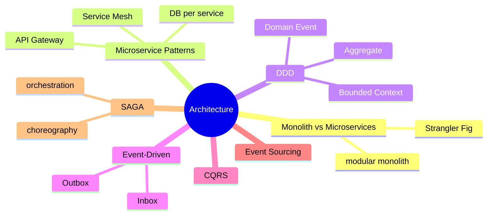
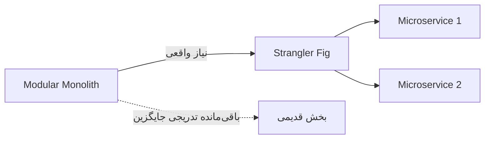
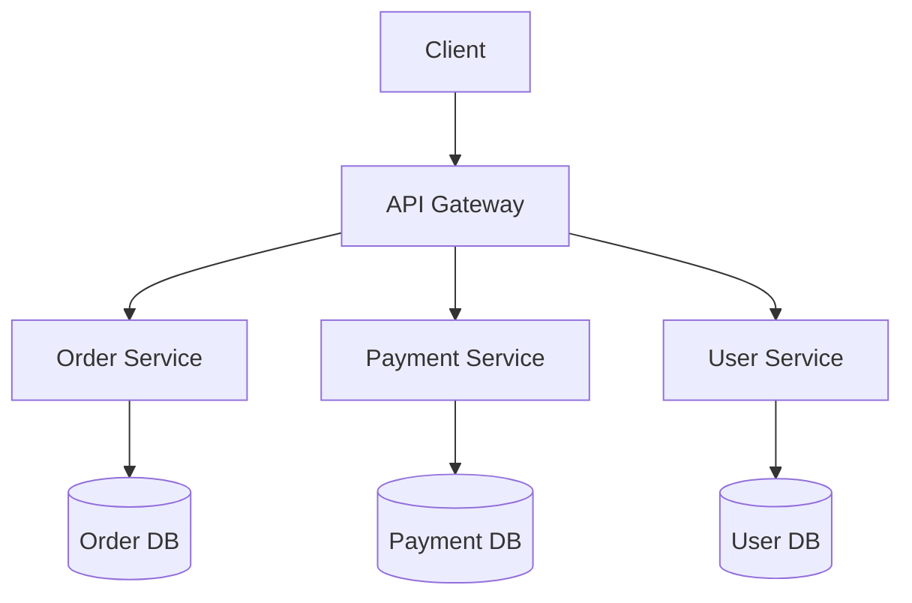
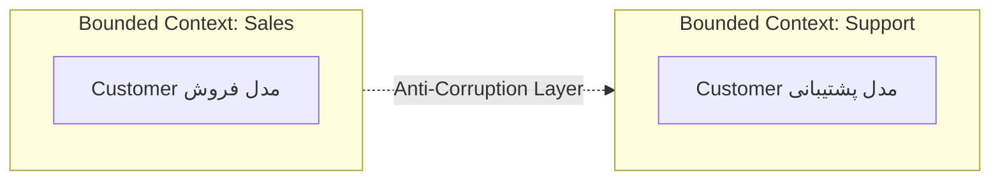
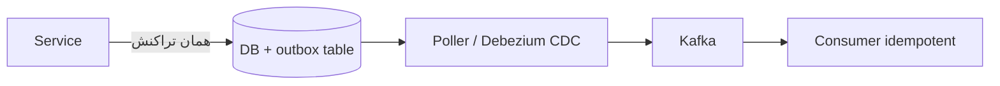
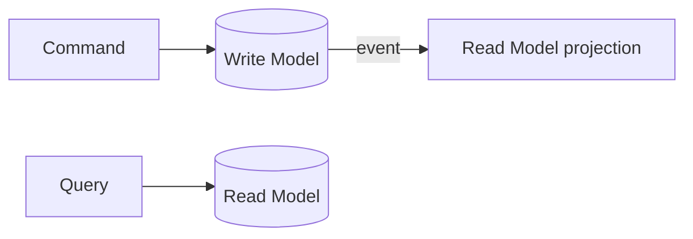
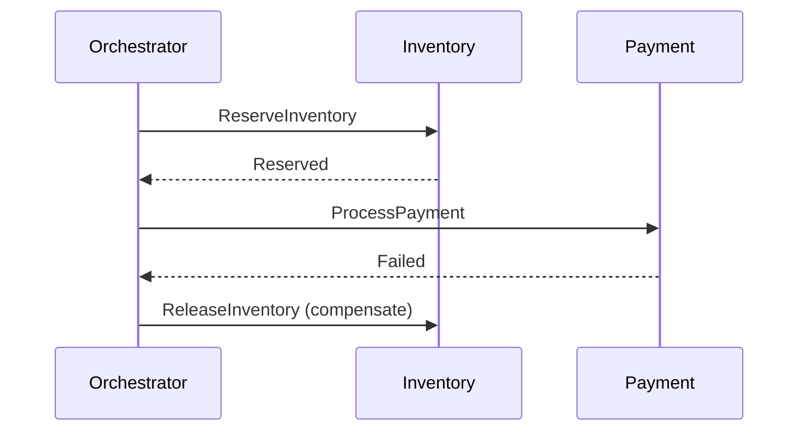

# Architectural Patterns — Microservices، DDD، Event-Driven، CQRS، SAGA

> معماری در سطح Lead متمایزکننده است. این مفاهیم در هر مصاحبه‌ی ارشد عمیق پرسیده می‌شوند. این فایل با دیاگرام و عمق کامل گسترش یافته.

## فهرست
- [نقشه‌ی ذهنی](#نقشه‌ی-ذهنی)
- [📖 مفاهیم](#-مفاهیم)
- [🎯 سوالات مصاحبه](#-سوالات-مصاحبه)
- [⚠️ اشتباهات رایج](#️-اشتباهات-رایج)
- [🔗 ارتباط با سایر مفاهیم](#-ارتباط-با-سایر-مفاهیم)

---

## نقشه‌ی ذهنی



---

## 📖 مفاهیم

### Monolith vs Microservices

**توضیح:**

**Monolith** یک deployable unit: ساده، تراکنش ساده، اما scale و deploy مستقل سخت. **Microservices** سرویس‌های مستقل: deploy/scale جداگانه، fault isolation، اما پیچیدگی عملیاتی بالا.

نکته‌ی Lead: microservices پیش‌فرض نیست. با **modular monolith** شروع کنید و فقط هنگام نیاز با **Strangler Fig** مهاجرت کنید.



**نکات کلیدی:**

- با modular monolith شروع کنید.
- Strangler Fig برای مهاجرت تدریجی.
- مرز سرویس = bounded context.

---

### Microservice Patterns

**توضیح:**

- **Decomposition:** by business capability / subdomain.
- **Database per Service:** استقلال، اما distributed transaction (SAGA/Outbox).
- **API Gateway:** ورود واحد.
- **Service Mesh** (Istio/Linkerd): mTLS، traffic، observability در infra.
- **Sidecar، BFF.**



**نکات کلیدی:**

- Database per Service استقلال می‌دهد اما distributed transaction اجتناب‌ناپذیر.
- Service Mesh cross-cutting شبکه را به infra منتقل می‌کند.

---

### Domain-Driven Design (DDD)

**توضیح:**

مدل‌سازی حول دامنه. **Ubiquitous Language**، **Bounded Context** (مرز microservice)، **Aggregate** (consistency boundary)، **Entity** در برابر **Value Object** (record)، **Domain Event**، **Repository**، **Anti-Corruption Layer**.



**نکات کلیدی:**

- مرز microservice = bounded context، نه تجزیه‌ی فنی.
- Aggregate مرز consistency تراکنشی (یک aggregate در یک تراکنش).
- Value Object را با record مدل کنید.

---

### Event-Driven Architecture

**توضیح:**

ارتباط از طریق رویداد. سبک‌ها: Event Notification، Event-Carried State Transfer، Event Sourcing. هماهنگی: Choreography (غیرمتمرکز) یا Orchestration. الگوهای reliability: **Outbox** (نوشتن رویداد در همان تراکنش DB)، **Inbox** (idempotent consumer).



**نکات کلیدی:**

- Outbox برای اتمیک بودن «تغییر DB + انتشار رویداد».
- Inbox/idempotent consumer برای at-least-once.
- choreography برای decoupling، orchestration برای کنترل.

---

### CQRS & Event Sourcing

**توضیح:**

**CQRS:** جداسازی مدل نوشتن (Command) از خواندن (Query)؛ scale مستقل، معمولاً eventual consistency. **Event Sourcing:** ذخیره‌ی دنباله‌ی رویدادها به‌جای state؛ audit کامل، نیاز snapshot.



**نکات کلیدی:**

- CQRS و Event Sourcing مستقل‌اند.
- پیچیدگی زیاد؛ فقط با مزیت واقعی.
- eventual consistency را در UX لحاظ کنید.

---

### SAGA Pattern

**توضیح:**

برای تراکنش توزیع‌شده. دنباله‌ای از تراکنش‌های محلی؛ شکست → **compensating transactions**. **Choreography** (غیرمتمرکز) یا **Orchestration** (هماهنگ‌کننده مرکزی). مقایسه با 2PC: SAGA بدون قفل توزیع‌شده، eventual consistency.



**نکات کلیدی:**

- SAGA به‌جای 2PC در microservices.
- compensation باید idempotent و قابل‌اعتماد.
- orchestration visibility بهتر.

---

## 🎯 سوالات مصاحبه

### سوال ۱: کِی monolith و کِی microservices؟

**سطح:** Lead
**تکرار:** خیلی زیاد

**جواب کامل:**

monolith برای شروع تقریباً همیشه درست: ساده‌تر، انعطاف refactor مرز. microservices وقتی: تیم بزرگ، scale متفاوت بخش‌ها، fault isolation. هزینه‌اش: شبکه، distributed transaction، observability، consistency. ضدالگو: microservices زودهنگام. توصیه: modular monolith + Strangler Fig.

**نکته مصاحبه:**

تمایز Lead: modular monolith و Strangler Fig.

---

### سوال ۲: SAGA در برابر 2PC؟

**سطح:** Lead
**تکرار:** زیاد

**جواب کامل:**

2PC consistency قوی اما coordinator و قفل توزیع‌شده (availability/scale کم، اگر coordinator down شود همه بلاک). SAGA دنباله‌ی تراکنش محلی + compensation؛ بدون قفل، availability بهتر، اما eventual consistency و باید compensation را طراحی کنید (چطور ایمیل را compensate کنی؟). در microservices با DB per Service، SAGA عملی است.

**نکته مصاحبه:**

Lead به availability در 2PC و چالش compensation اشاره می‌کند.

---

### سوال ۳: Outbox Pattern چه مشکلی حل می‌کند؟

**سطح:** Senior / Lead
**تکرار:** زیاد

**جواب کامل:**

مشکل **dual write**: نوشتن همزمان در DB و Kafka اتمیک نیست. اگر DB commit شود اما Kafka fail (یا برعکس)، ناسازگاری. Outbox: رویداد را در جدول outbox در **همان تراکنش DB** درج کنید (اتمیک)؛ سپس فرایند جدا (polling/CDC با Debezium) منتشر می‌کند. at-least-once → consumer باید idempotent (Inbox).

**نکته مصاحبه:**

تمایز Senior: dual-write و ربط به CDC.

---

### سوال ۴: bounded context چیست و چرا مهم؟

**سطح:** Lead
**تکرار:** زیاد

**جواب کامل:**

مرز یک مدل منسجم که یک اصطلاح معنای واحد دارد. مرز microservice باید بر اساس آن باشد نه تجزیه‌ی فنی. مرز اشتباه → coupling زیاد و **distributed monolith** (بدترین حالت). تعیین درست (با event storming) مهم‌ترین قدم است.

**نکته مصاحبه:**

Lead به distributed monolith اشاره می‌کند.

---

### سوال ۵: CQRS کِی ارزش دارد؟

**سطح:** Lead
**تکرار:** متوسط

**جواب کامل:**

وقتی read/write به‌شدت متفاوت‌اند، scale مستقل، یا read modelهای متعدد denormalized. هزینه: پیچیدگی، sync، eventual consistency. برای CRUD ساده over-engineering؛ اغلب نسخه‌ی سبک (جداسازی query/command بدون event sourcing) کافی.

**نکته مصاحبه:**

Lead over-engineering را تشخیص می‌دهد.

---

## ⚠️ اشتباهات رایج

### اشتباه ۱: microservices زودهنگام

```text
❌ پروژه‌ی کوچک با ۱۵ microservice
✅ modular monolith، تجزیه هنگام نیاز
```

**توضیح:** پیچیدگی توزیع‌شده را قبل از نیاز نیاورید.

---

### اشتباه ۲: dual write بدون Outbox

```java
// ❌
orderRepository.save(order);
kafkaTemplate.send("orders", event);
```

```java
// ✅
@Transactional void place(Order o) { orderRepository.save(o); outboxRepository.save(event); }
```

**توضیح:** نوشتن همزمان DB و broker اتمیک نیست.

---

### اشتباه ۳: shared database

```text
❌ چند سرویس به یک DB → distributed monolith
✅ Database per Service + SAGA/Outbox
```

**توضیح:** DB مشترک استقلال را نابود می‌کند.

---

### اشتباه ۴: SAGA بدون compensation قابل‌اعتماد

```text
❌ compensation که خودش fail می‌شود و نادیده گرفته می‌شود
✅ compensation idempotent + retry + dead letter + alerting
```

**توضیح:** شکست compensation باید مدیریت شود.

---

## 🔗 ارتباط با سایر مفاهیم

- microservices با **Spring Cloud (2.6)** و **Kubernetes (10.2)**.
- Event-Driven/Outbox با **Kafka (8.1)** و **CDC (Debezium)**.
- SAGA با **resilience (15.2)** و **transactions**.
- DDD با **Clean/Hexagonal (15.1)** و **Event Storming (19.4)**.
- CQRS با **read replicas** و **caching (9)**.
