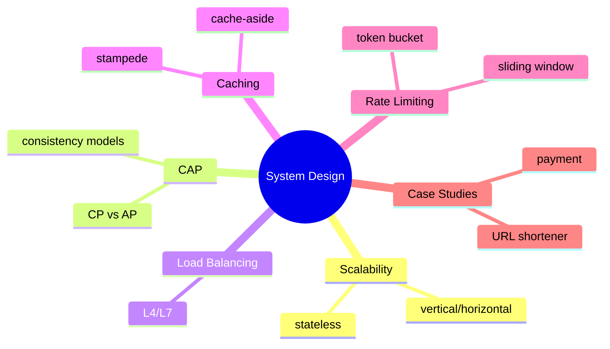
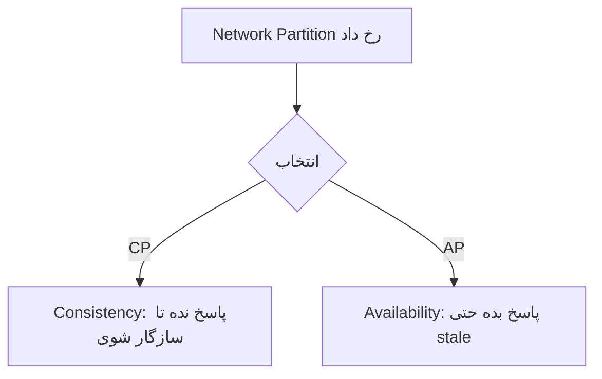
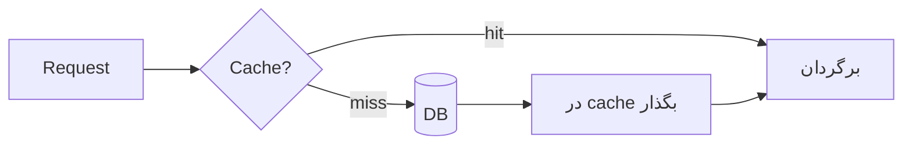

# System Design — Scalability، CAP، Caching، Rate Limiting، Case Studies

> طراحی سیستم در مصاحبه‌ی Lead متمایزکننده است. CAP، caching strategy و rate limiting موضوعات کلیدی هستند. این فایل با دیاگرام و عمق کامل گسترش یافته.

## فهرست
- [نقشه‌ی ذهنی](#نقشه‌ی-ذهنی)
- [📖 مفاهیم](#-مفاهیم)
- [🎯 سوالات مصاحبه](#-سوالات-مصاحبه)
- [⚠️ اشتباهات رایج](#️-اشتباهات-رایج)
- [🔗 ارتباط با سایر مفاهیم](#-ارتباط-با-سایر-مفاهیم)

---

## نقشه‌ی ذهنی



---

## CAP Theorem



---

## 📖 مفاهیم

### اصول پایه — Scalability، Availability

**توضیح:**

**Scalability:** Vertical (سقف دارد) در برابر Horizontal (مقیاس‌پذیر، نیاز stateless). **Availability:** 99.9% ≈ ۸.۷h/سال، 99.99% ≈ ۵۲m. هر «۹» هزینه‌ی غیرخطی.

**نکات کلیدی:**

- horizontal scaling به stateless نیاز دارد.
- هدف availability را واقع‌بینانه انتخاب کنید.

---

### CAP Theorem & Consistency Models

**توضیح:**

هنگام **Partition** باید بین **Consistency** و **Availability** یکی را انتخاب کنید (P اجباری). **CP** (etcd، MongoDB majority)، **AP** (Cassandra، DynamoDB). Consistency models: Strong، Eventual، Causal. **BASE** در برابر **ACID**.

**نکات کلیدی:**

- فقط هنگام partition trade-off است؛ در حالت عادی هم C و هم A ممکن.
- اکثر سیستم‌ها قابل‌تنظیم‌اند (write concern).

---

### Load Balancing

**توضیح:**

Round Robin، Weighted، IP Hash، Least Connections. **L4** (transport، سریع) در برابر **L7** (application، routing هوشمند). Health check.

**نکات کلیدی:**

- L7 امکان routing هوشمند (path-based، canary).
- sticky session مقیاس را محدود می‌کند.

---

### Caching Strategy

**توضیح:**

- **Cache-Aside:** اپ ابتدا cache، miss → DB → cache. رایج‌ترین.
- **Write-Through:** همزمان cache و DB.
- **Write-Behind:** cache، سپس async DB.
- **Refresh-Ahead.**

**Cache Stampede**: کلید پرطرفدار expire → هزاران request به DB. راه‌حل: lock، probabilistic early expiration، stale-while-revalidate.



**نکات کلیدی:**

- Cache-Aside پیش‌فرض؛ مراقب stale و stampede.
- invalidation سخت است؛ TTL + event-based.

---

### Rate Limiting

**توضیح:**

- **Token Bucket:** burst مجاز.
- **Leaky Bucket:** smoothing.
- **Fixed Window:** مشکل لبه.
- **Sliding Window:** دقیق‌تر.

توزیع‌شده با Redis (counter/sorted set).

**مثال کد:**

```java
Bucket bucket = Bucket.builder()
    .addLimit(Bandwidth.classic(100, Refill.greedy(100, Duration.ofMinutes(1)))).build();
if (bucket.tryConsume(1)) { /* پردازش */ } else { /* 429 */ }
```

**نکات کلیدی:**

- Token Bucket برای burst؛ Sliding Window برای دقت.
- counter باید مشترک (Redis) باشد.

---

### Case Studies

**توضیح:**

URL Shortener، Notification System، Chat، Payment (exactly-once)، Autocomplete، News Feed، Ride-Sharing. روش: requirements → estimation (QPS/storage) → API → data model → high-level → deep dive → trade-offs.

**نکات کلیدی:**

- با clarifying requirements و estimation شروع کنید.
- trade-off را صریح بیان کنید.

---

## 🎯 سوالات مصاحبه

### سوال ۱: CAP theorem و یک تصمیم واقعی؟

**سطح:** Lead
**تکرار:** خیلی زیاد

**جواب کامل:**

در حضور partition نمی‌توان C و A کامل داشت. سوءفهم: «همیشه trade-off»؛ درست‌تر: فقط هنگام partition. تصمیم: بانکی/پرداخت → CP (بهتر است پاسخ ندهد تا موجودی اشتباه نشان دهد)؛ feed/cart → AP (داده‌ی کمی stale بهتر از در دسترس نبودن). سیستم‌ها قابل‌تنظیم‌اند.

**نکته مصاحبه:**

Lead سوءفهم را تصحیح و به دامنه گره می‌زند. Follow-up: «PACELC؟»

---

### سوال ۲: cache stampede و راه‌حل؟

**سطح:** Senior / Lead
**تکرار:** زیاد

**جواب کامل:**

کلید پرطرفدار expire → هزاران miss همزمان به DB. راه‌حل: (۱) lock/mutex (یکی محاسبه، بقیه منتظر/قدیمی). (۲) probabilistic early expiration. (۳) stale-while-revalidate. (۴) cache warming. ترکیب lock + TTL با jitter.

**نکته مصاحبه:**

Lead چند راه‌حل می‌داند. Follow-up: «distributed lock با Redis؟» (`SET NX PX`).

---

### سوال ۳: Token Bucket در برابر Sliding Window؟

**سطح:** Senior
**تکرار:** متوسط

**جواب کامل:**

Token Bucket سطل با نرخ ثابت، **burst** مجاز. Fixed Window مشکل لبه (۲× limit در مرز). Sliding Window دقیق‌تر اما حافظه/محاسبه بیشتر. Token Bucket برای burst+سادگی، Sliding Window برای دقت.

**نکته مصاحبه:**

Senior مشکل لبه‌ی fixed window را می‌داند.

---

### سوال ۴: یک URL Shortener طراحی کن.

**سطح:** Senior / Lead
**تکرار:** زیاد

**جواب کامل:**

requirements: کوتاه کردن، redirect، آمار. estimation: read >> write. short code: base62 از id incremental یا hash + collision. data model: `(short_code PK, long_url)`. read با cache (Redis) جلوی DB. scale: shard، CDN. trade-off: base62 incremental قابل‌حدس (امنیت)، hash نیاز collision handling. redirect 301 (cache) یا 302 (آمار).

**نکته مصاحبه:**

Lead با estimation و read/write ratio شروع می‌کند.

---

### سوال ۵: exactly-once در Payment System؟

**سطح:** Lead
**تکرار:** زیاد

**جواب کامل:**

exactly-once واقعی غیرممکن؛ **at-least-once + idempotency**. client **idempotency key** می‌فرستد؛ سرور key را چک می‌کند، اگر پردازش‌شده نتیجه را برمی‌گرداند. + Outbox برای انتشار اتمیک، SAGA برای هماهنگی، unique constraint به‌عنوان دفاع نهایی.

**نکته مصاحبه:**

Lead «exactly-once = at-least-once + idempotency» را می‌داند.

---

## ⚠️ اشتباهات رایج

### اشتباه ۱: stateful سرویس و horizontal scaling

```text
❌ session در حافظه‌ی هر instance
✅ session در Redis، سرویس stateless
```

**توضیح:** state محلی horizontal scaling را غیرممکن می‌کند.

---

### اشتباه ۲: cache بدون TTL/invalidation

```text
❌ داده‌ی stale برای همیشه
✅ TTL + invalidation رویداد-محور
```

**توضیح:** بدون invalidation، داده‌ی قدیمی سرو می‌شود.

---

### اشتباه ۳: rate limiter محلی در توزیع‌شده

```text
❌ counter per-instance → limit واقعی = limit × instance
✅ counter مشترک در Redis
```

**توضیح:** limit باید سراسری باشد.

---

### اشتباه ۴: system design بدون estimation

```text
❌ پریدن به جزئیات
✅ requirements → estimation → design → deep dive
```

**توضیح:** estimation مقیاس و bottleneck را مشخص می‌کند.

---

## 🔗 ارتباط با سایر مفاهیم

- CAP با **MongoDB write concern (4.4)** و **PostgreSQL replication (3.3)**.
- caching با **Redis (9.1)** و **Spring Cache**.
- rate limiting با **Redis** و **API Gateway (2.6)**.
- idempotency با **Idempotency (19.2)** و **Kafka (8.1)**.
- horizontal scaling با **Kubernetes HPA (10.2)** و **12-factor (15.3)**.
