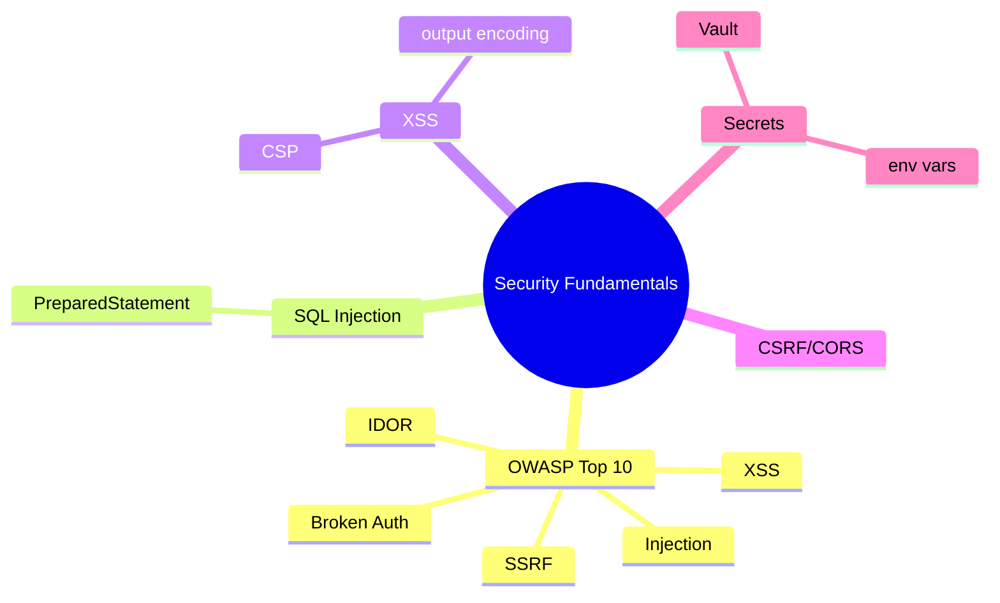
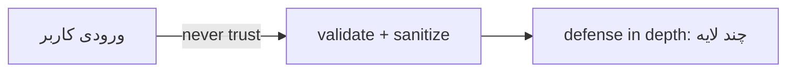
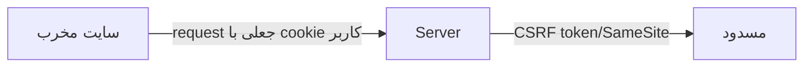

# مبانی امنیت — OWASP Top 10، Injection، XSS، CSRF، Secrets

> امنیت مسئولیت هر مهندس است. OWASP Top 10 و defense in depth در مصاحبه‌های Senior پرسیده می‌شوند. این فایل با دیاگرام و مثال‌های متعدد گسترش یافته.

## فهرست
- [نقشه‌ی ذهنی](#نقشه‌ی-ذهنی)
- [📖 مفاهیم](#-مفاهیم)
- [🎯 سوالات مصاحبه](#-سوالات-مصاحبه)
- [⚠️ اشتباهات رایج](#️-اشتباهات-رایج)
- [🔗 ارتباط با سایر مفاهیم](#-ارتباط-با-سایر-مفاهیم)

---

## نقشه‌ی ذهنی



---

## 📖 مفاهیم

### OWASP Top 10

**توضیح:**

رایج‌ترین آسیب‌پذیری‌ها: Injection، Broken Authentication، XSS، Broken Access Control (IDOR)، Security Misconfiguration، SSRF، Cryptographic Failures، Vulnerable Components، Insufficient Logging.



**نکات کلیدی:**

- defense in depth: چند لایه، نه یک نقطه.
- never trust user input.

---

### SQL Injection

**توضیح:**

تزریق ورودی مخرب برای تغییر منطق SQL (`' OR '1'='1`). علت: concatenation. راه‌حل قطعی: **PreparedStatement / parameterized query**.

**مثال کد:**

```java
// ❌ آسیب‌پذیر
String sql = "SELECT * FROM users WHERE email = '" + email + "'";

// ✅ parameterized
PreparedStatement ps = conn.prepareStatement("SELECT * FROM users WHERE email = ?");
ps.setString(1, email);

// ✅ JPA
@Query("SELECT u FROM User u WHERE u.email = :email")
Optional<User> findByEmail(@Param("email") String email);
```

**نکات کلیدی:**

- همیشه parameterized؛ هرگز concatenation.
- ORM/JPA پیش‌فرض امن مگر native با concatenation.

---

### XSS (Cross-Site Scripting)

**توضیح:**

تزریق اسکریپت مخرب در صفحه که در مرورگر قربانی اجرا می‌شود. انواع: Stored، Reflected، DOM-based. دفاع: **output encoding** (بر اساس context)، **CSP** header، sanitize.

**نکات کلیدی:**

- output encoding بر اساس context.
- CSP لایه‌ی دوم.
- `innerHTML`/`dangerouslySetInnerHTML` خطرناک.

---

### CSRF & CORS

**توضیح:**

**CSRF:** سوءاستفاده از session cookie برای request جعلی. دفاع: CSRF token، SameSite. فقط برای cookie-based auth. **CORS:** کنترل origin مجاز؛ `*` با credentials خطرناک.



**مثال کد:**

```java
@Bean
CorsConfigurationSource corsConfig() {
    CorsConfiguration config = new CorsConfiguration();
    config.setAllowedOrigins(List.of("https://app.example.com")); // نه *
    config.setAllowedMethods(List.of("GET", "POST", "PUT", "DELETE"));
    config.setAllowCredentials(true);
    UrlBasedCorsConfigurationSource source = new UrlBasedCorsConfigurationSource();
    source.registerCorsConfiguration("/**", config);
    return source;
}
```

**نکات کلیدی:**

- CSRF فقط برای cookie-based session؛ JWT header نیازی ندارد.
- CORS `*` + credentials = آسیب‌پذیری.

---

### Security Headers & Secrets Management

**توضیح:**

**Headers:** HSTS، X-Frame-Options، X-Content-Type-Options، CSP. **Secrets:** هرگز hardcode؛ environment/Vault/cloud secret manager. اسرار در Git history برای همیشه می‌مانند.

**نکات کلیدی:**

- اسرار در environment/Vault.
- security headers لایه‌ی ارزان و مؤثر.

---

## 🎯 سوالات مصاحبه

### سوال ۱: SQL Injection را چطور کاملاً جلوگیری می‌کنی؟

**سطح:** Senior
**تکرار:** خیلی زیاد

**جواب کامل:**

**parameterized query / PreparedStatement** که داده را از ساختار SQL جدا می‌کند. ORMها پیش‌فرض امن مگر native با concatenation. لایه‌های اضافی: validation (whitelist)، least privilege DB user. escape دستی کافی نیست.

**نکته مصاحبه:**

تمایز Senior: escape کافی نیست. Follow-up: «ORDER BY پویا؟» (whitelist نام ستون).

---

### سوال ۲: تفاوت XSS و CSRF؟

**سطح:** Senior
**تکرار:** زیاد

**جواب کامل:**

XSS اجرای **کد مخرب در مرورگر** (سرقت token)؛ دفاع: output encoding، CSP. CSRF **request ناخواسته** با سوءاستفاده از cookie؛ دفاع: CSRF token، SameSite. XSS اعتماد به محتوا، CSRF اعتماد به منشأ. نکته: XSS می‌تواند CSRF protection را دور بزند.

**نکته مصاحبه:**

تمایز Senior: «XSS می‌تواند CSRF را دور بزند».

---

### سوال ۳: IDOR چیست و چطور جلوگیری؟

**سطح:** Senior
**تکرار:** زیاد

**جواب کامل:**

Insecure Direct Object Reference: تغییر شناسه برای دسترسی به منبع دیگران (`/orders/123` → `124`). علت: چک authentication بدون authorization (مالکیت). راه‌حل: بررسی مالکیت در سرور (`order.userId == currentUser.id`)، نه فقط login. UUID کمک می‌کند اما کافی نیست.

**کد توضیحی:**

```java
@PreAuthorize("@orderService.isOwner(#id, authentication.name)")
@GetMapping("/orders/{id}")
public Order get(@PathVariable Long id) { return null; }
```

**نکته مصاحبه:**

Senior به «authentication ≠ authorization» اشاره می‌کند.

---

### سوال ۴: اسرار را در production چطور مدیریت می‌کنی؟

**سطح:** Senior / Lead
**تکرار:** متوسط

**جواب کامل:**

هرگز hardcode (Git history می‌ماند). environment variables → secret manager (Vault، AWS Secrets Manager) با rotation/audit → در K8s External Secrets/Sealed Secrets. اصول: least privilege، rotation، audit، رمزنگاری at-rest. ابزار scanning (trufflehog) برای جلوگیری از commit.

**نکته مصاحبه:**

Lead به rotation، Vault، Git history اشاره می‌کند.

---

## ⚠️ اشتباهات رایج

### اشتباه ۱: concatenation در query

```java
// ❌
"SELECT * FROM users WHERE name = '" + name + "'"
```

```java
// ✅
"SELECT * FROM users WHERE name = ?"
```

**توضیح:** الحاق ورودی کلاسیک‌ترین آسیب‌پذیری است.

---

### اشتباه ۲: CORS با `*` و credentials

```java
// ❌
config.setAllowedOrigins(List.of("*")); config.setAllowCredentials(true);
```

```java
// ✅
config.setAllowedOrigins(List.of("https://app.example.com"));
```

**توضیح:** `*` با credentials اجازه‌ی دسترسی هر سایت با cookie می‌دهد.

---

### اشتباه ۳: hardcode secret

```java
// ❌
String apiKey = "sk-live-abc123";
```

```java
// ✅
String apiKey = System.getenv("API_KEY");
```

**توضیح:** secret در کد = نشت دائمی.

---

### اشتباه ۴: authentication بدون authorization

```java
// ❌ IDOR
@GetMapping("/orders/{id}") Order get(@PathVariable Long id) { return repo.findById(id).get(); }
```

```java
// ✅ بررسی مالکیت
```

**توضیح:** login بودن کافی نیست.

---

## 🔗 ارتباط با سایر مفاهیم

- با **Spring Security (2.5)** و **OAuth/JWT (7.2)**.
- secrets با **Vault (16.5)** و **K8s Secrets (10.2)**.
- SQL injection با **PreparedStatement** و **Spring Data**.
- scanning با **DevSecOps (16.5)**.
