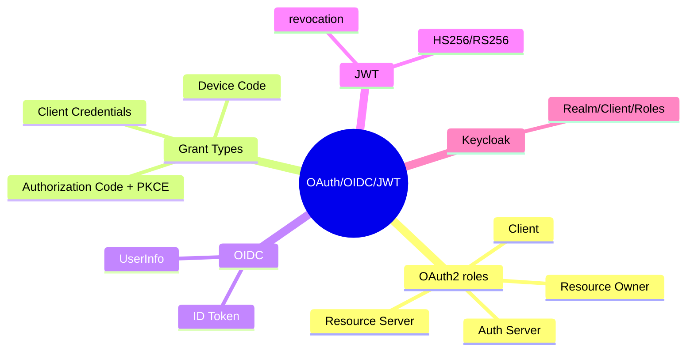
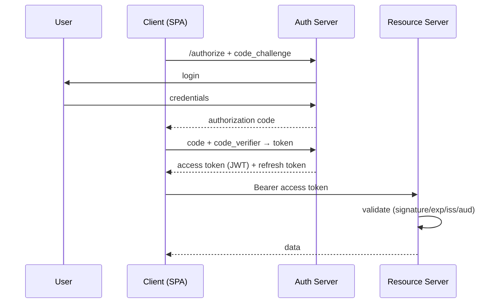
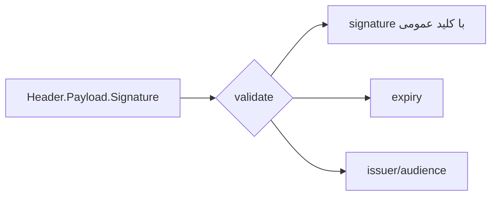

# OAuth 2.0، OIDC، JWT، Keycloak

> استاندارد auth در سیستم‌های مدرن. درک عمیق grant types و JWT در مصاحبه‌های Senior/Lead ضروری است. این فایل با دیاگرام و مثال‌های متعدد گسترش یافته.

## فهرست
- [نقشه‌ی ذهنی](#نقشه‌ی-ذهنی)
- [📖 مفاهیم](#-مفاهیم)
- [🎯 سوالات مصاحبه](#-سوالات-مصاحبه)
- [⚠️ اشتباهات رایج](#️-اشتباهات-رایج)
- [🔗 ارتباط با سایر مفاهیم](#-ارتباط-با-سایر-مفاهیم)

---

## نقشه‌ی ذهنی



---

## جریان Authorization Code + PKCE



---

## 📖 مفاهیم

### OAuth 2.0 — Roles & Grant Types

**توضیح:**

OAuth 2.0 چارچوب **authorization**. نقش‌ها: Resource Owner، Client، Authorization Server، Resource Server. Grant Types: **Authorization Code + PKCE** (web/mobile/SPA)، **Client Credentials** (M2M)، **Device Code** (IoT/CLI). Deprecated: Implicit، Password. Tokens: Access (کوتاه)، Refresh (بلند).

**نکات کلیدی:**

- OAuth = authorization؛ برای authentication از OIDC.
- Authorization Code + PKCE برای کلاینت عمومی.
- refresh در httpOnly cookie، access در memory.

---

### OpenID Connect (OIDC)

**توضیح:**

لایه‌ی **authentication** روی OAuth. **ID Token** (JWT با هویت: `sub`, `email`, `name`). UserInfo Endpoint. Discovery (`/.well-known/openid-configuration`).

**نکات کلیدی:**

- ID Token برای authentication، Access Token برای authorization.
- `sub` شناسه‌ی پایدار (نه email).

---

### JWT — ساختار و validation

**توضیح:**

سه بخش base64: Header.Payload.Signature. امضا با **HS256** (symmetric) یا **RS256/ES256** (asymmetric — ترجیح microservice). validation: signature، exp، iss، aud. مشکل: revocation سخت (stateless). راه‌حل: expiry کوتاه + refresh، blacklist.



**مثال کد:**

```yaml
spring:
  security:
    oauth2:
      resourceserver:
        jwt:
          issuer-uri: https://keycloak.example.com/realms/myrealm
```

**نکات کلیدی:**

- payload فقط base64 است → داده‌ی حساس نگذارید.
- RS256 در microservice (کلید خصوصی فقط در auth server).
- revocation سخت → expiry کوتاه.

---

### Keycloak

**توضیح:**

IAM متن‌باز. **Realm** (tenant)، **Client** (public/confidential/bearer-only)، **Realm/Client Roles**، **User Federation** (LDAP/AD)، **Identity Provider** (Google/GitHub). روش مدرن: Keycloak provider + Spring Resource Server.

**نکات کلیدی:**

- Realm برای multi-tenancy.
- confidential برای backend؛ public + PKCE برای SPA.
- از OAuth2 Resource Server نه adapter قدیمی.

---

## 🎯 سوالات مصاحبه

### سوال ۱: تفاوت OAuth و OIDC؟

**سطح:** Senior
**تکرار:** خیلی زیاد

**جواب کامل:**

OAuth چارچوب **authorization** (دسترسی محدود بدون رمز)؛ هویت را به اپ نمی‌گوید — پس برای login خام ناامن. OIDC لایه‌ی **authentication** روی OAuth: **ID Token** و UserInfo. «Login with Google» در واقع OIDC است.

**نکته مصاحبه:**

تمایز Senior: چرا OAuth خام برای authentication ناکافی.

---

### سوال ۲: PKCE چیست و چرا لازم؟

**سطح:** Senior
**تکرار:** زیاد

**جواب کامل:**

محافظت از interception code برای کلاینت عمومی. کلاینت `code_verifier` تصادفی، `code_challenge` (hash) را می‌فرستد، هنگام تبدیل code به token verifier را ارائه می‌دهد. اگر code رهگیری شود، بدون verifier نمی‌توان token گرفت — جایگزین secret. حالا برای همه توصیه می‌شود.

**نکته مصاحبه:**

Senior: PKCE حالا برای همه.

---

### سوال ۳: revocation در JWT چرا سخت و راه‌حل‌ها؟

**سطح:** Senior / Lead
**تکرار:** خیلی زیاد

**جواب کامل:**

JWT stateless است (validation محلی بدون auth server)؛ پس نمی‌توان قبل از expiry باطل کرد. راه‌حل: (۱) expiry کوتاه + refresh token. (۲) blacklist در Redis (نقض stateless اما revocation فوری). (۳) introspection (هر بار از auth server). (۴) token versioning. معمولاً ترکیب expiry کوتاه + refresh + blacklist.

**نکته مصاحبه:**

Lead چند راه‌حل و trade-off. Follow-up: «refresh token rotation؟»

---

### سوال ۴: HS256 در برابر RS256 در microservice؟

**سطح:** Senior
**تکرار:** زیاد

**جواب کامل:**

HS256 symmetric: کلید مشترک هم امضا هم validate؛ هر سرویس می‌تواند token **جعل** کند — فاش یکی = خطر همه. RS256 asymmetric: auth server با کلید خصوصی امضا، سرویس‌ها با کلید عمومی validate؛ کلید عمومی جعل نمی‌کند. RS256/ES256 استاندارد microservice.

**نکته مصاحبه:**

Senior: «کلید عمومی نمی‌تواند جعل کند».

---

### سوال ۵: Realm Role در برابر Client Role در Keycloak؟

**سطح:** Senior
**تکرار:** متوسط

**جواب کامل:**

Realm Roles سراسری (همه‌ی clientها). Client Roles مخصوص یک client. در token: realm در `realm_access.roles`، client در `resource_access.<client>.roles` که باید در `JwtAuthenticationConverter` map شوند.

**نکته مصاحبه:**

Senior می‌داند roleها کجای token قرار می‌گیرند.

---

## ⚠️ اشتباهات رایج

### اشتباه ۱: داده‌ی حساس در JWT payload

```text
❌ رمز/شماره کارت در claims (base64، رمزنگاری نشده)
✅ فقط شناسه و roleهای لازم
```

**توضیح:** هر کسی payload را decode می‌کند.

---

### اشتباه ۲: Implicit flow

```text
❌ Implicit (token در URL) — deprecated
✅ Authorization Code + PKCE
```

**توضیح:** Implicit token را در URL فاش می‌کند.

---

### اشتباه ۳: HS256 با کلید مشترک در microservice

```text
❌ کلید مشترک → جعل
✅ RS256
```

**توضیح:** symmetric ریسک جعل دارد.

---

### اشتباه ۴: email به‌عنوان شناسه‌ی کاربر

```text
❌ email (تغییرپذیر)
✅ sub (پایدار)
```

**توضیح:** `sub` پایدار است.

---

## 🔗 ارتباط با سایر مفاهیم

- با **Spring Security (2.5)** و **API Gateway (2.6)**.
- JWT با **Redis blacklist (9.1)**.
- Keycloak با **microservices (6.1)** و multi-tenancy.
- با **security fundamentals (7.1)** و **DevSecOps (16.5)**.
