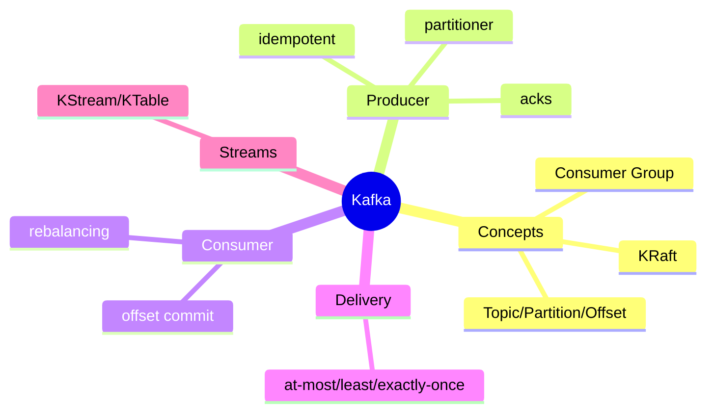
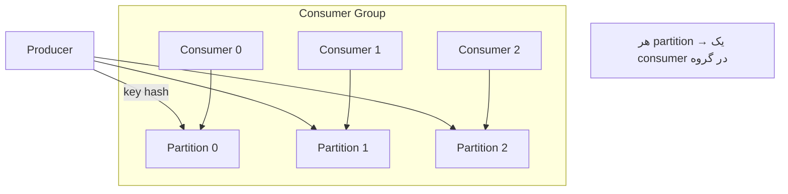
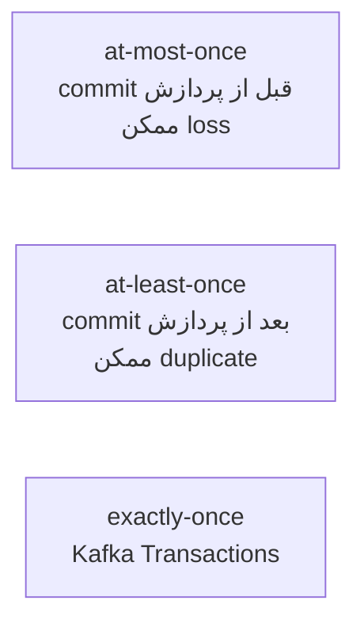

# Apache Kafka — مفاهیم، Producer/Consumer، Delivery، Streams

> Kafka ستون فقرات سیستم‌های event-driven مدرن است. delivery guarantees و rebalancing سوالات کلیدی Senior هستند. این فایل با دیاگرام و مثال‌های متعدد گسترش یافته.

## فهرست
- [نقشه‌ی ذهنی](#نقشه‌ی-ذهنی)
- [📖 مفاهیم](#-مفاهیم)
- [🎯 سوالات مصاحبه](#-سوالات-مصاحبه)
- [⚠️ اشتباهات رایج](#️-اشتباهات-رایج)
- [🔗 ارتباط با سایر مفاهیم](#-ارتباط-با-سایر-مفاهیم)

---

## نقشه‌ی ذهنی



---

## معماری Topic/Partition/Consumer Group



---

## 📖 مفاهیم

### مفاهیم پایه

**توضیح:**

distributed event streaming platform. **Topic** (دسته)، **Partition** (واحد parallelism، ترتیب فقط درون partition)، **Offset** (موقعیت)، **Consumer Group** (تقسیم بار، هر partition → یک consumer)، **Broker**، **KRaft** (جایگزین ZooKeeper). Kafka پیام را پس از مصرف حذف نمی‌کند (retention، replay).

**نکات کلیدی:**

- ترتیب فقط درون یک partition.
- consumer در گروه نباید از partition بیشتر باشد.
- Kafka پیام را نگه می‌دارد (retention).

---

### Producer

**توضیح:**

- **`acks`:** `0` (سریع، loss)، `1` (leader)، `all` (durable).
- **Idempotent Producer:** بدون duplicate هنگام retry.
- **`linger.ms`/`batch.size`:** batching.
- **Partitioner:** کلید یکسان → یک partition (ترتیب per-key).

**مثال کد:**

```java
props.put(ProducerConfig.ACKS_CONFIG, "all");
props.put(ProducerConfig.ENABLE_IDEMPOTENCE_CONFIG, true);
props.put(ProducerConfig.LINGER_MS_CONFIG, 10);
producer.send(new ProducerRecord<>("orders", order.userId(), event)); // key=userId
```

**نکات کلیدی:**

- `acks=all` + idempotence برای durability و بدون duplicate.
- کلید ترتیب per-key را تضمین می‌کند.

---

### Consumer

**توضیح:**

- **`auto.offset.reset`:** earliest/latest.
- **`enable.auto.commit`:** خطر loss/duplicate.
- **commit:** `commitSync` در برابر `commitAsync`.
- **Rebalancing:** بازتوزیع partition؛ **Cooperative** (2.4+) تدریجی.

**مثال کد:**

```java
props.put(ConsumerConfig.ENABLE_AUTO_COMMIT_CONFIG, false);
while (true) {
    ConsumerRecords<String, Event> records = consumer.poll(Duration.ofMillis(100));
    for (var record : records) process(record.value());
    consumer.commitSync(); // commit بعد از پردازش → at-least-once
}
```

**نکات کلیدی:**

- manual commit بعد از پردازش = at-least-once.
- consumer باید idempotent باشد.

---

### Delivery Guarantees

**توضیح:**



در عمل **at-least-once + idempotent consumer** رایج‌ترین.

**نکات کلیدی:**

- exactly-once گران؛ at-least-once + idempotency معمول.
- exactly-once فقط درون Kafka؛ برای side-effect خارجی idempotency لازم.

---

### Spring Kafka & Kafka Streams

**توضیح:**

`@KafkaListener`, `KafkaTemplate`, `DefaultErrorHandler` + Dead Letter Topic. Kafka Streams: `KStream` (رویداد)، `KTable` (state/changelog)، State Store (RocksDB). Kafka Connect + Debezium (CDC).

**مثال کد:**

```java
@KafkaListener(topics = "orders", groupId = "order-processor")
public void handle(OrderEvent event) {
    if (processedRepository.existsById(event.eventId())) return; // idempotent
    process(event);
    processedRepository.save(new Processed(event.eventId()));
}
```

**نکات کلیدی:**

- Dead Letter Topic برای پیام‌های مکرر fail.
- Kafka Streams برای stateful؛ Debezium برای CDC.

---

## 🎯 سوالات مصاحبه

### سوال ۱: delivery guarantees و کدام در عمل؟

**سطح:** Senior / Lead
**تکرار:** خیلی زیاد

**جواب کامل:**

at-most-once (offset قبل از پردازش، loss اما بدون duplicate). at-least-once (offset بعد از پردازش، بدون loss اما duplicate). exactly-once (Kafka Transactions، atomic write+offset + idempotent producer). در عمل **at-least-once + idempotent consumer** چون exactly-once پیچیده و فقط درون Kafka است (side-effect خارجی idempotency لازم).

**نکته مصاحبه:**

Lead: exactly-once فقط درون Kafka.

---

### سوال ۲: ترتیب پیام چطور تضمین می‌شود؟

**سطح:** Senior
**تکرار:** زیاد

**جواب کامل:**

فقط **درون یک partition**. برای ترتیب پیام‌های مرتبط، کلید یکسان (userId/orderId). trade-off: همه یک کلید → یک partition → از دست رفتن parallelism. کلید را طوری انتخاب کنید که هم ترتیب لازم هم توزیع. برای حفظ ترتیب با retry، `max.in.flight` محدود یا idempotence.

**نکته مصاحبه:**

Senior به trade-off کلید/parallelism اشاره می‌کند.

---

### سوال ۳: consumer group و rebalancing؟

**سطح:** Senior
**تکرار:** زیاد

**جواب کامل:**

گروهی که بار را تقسیم می‌کنند؛ هر partition → یک consumer (parallelism = partition). rebalancing بازتوزیع هنگام تغییر consumer. eager (stop-the-world) در برابر **Cooperative** (2.4+، تدریجی). rebalancing مکرر (پردازش طولانی > max.poll.interval) مشکل رایج.

**نکته مصاحبه:**

Senior به cooperative rebalancing اشاره می‌کند.

---

### سوال ۴: Kafka در برابر RabbitMQ؟

**سطح:** Lead
**تکرار:** زیاد

**جواب کامل:**

Kafka log توزیع‌شده با throughput بالا، retention (replay)، چند consumer group. RabbitMQ broker سنتی با routing پیچیده (exchange)، per-message ack، الگوهای کلاسیک. تفاوت: Kafka dumb broker/smart consumer (retention)؛ RabbitMQ smart broker (حذف پس از ack). حجم بالا/replay → Kafka؛ routing پیچیده/task queue → RabbitMQ.

**نکته مصاحبه:**

Lead به «smart broker در برابر smart consumer» اشاره می‌کند.

---

### سوال ۵: KStream در برابر KTable؟

**سطح:** Senior
**تکرار:** متوسط

**جواب کامل:**

KStream رویدادهای مستقل (INSERT-only log). KTable changelog/snapshot آخرین مقدار per key (upsert). join قدرتمند (enrich stream با table). GlobalKTable در هر instance replicate می‌شود (lookup کوچک).

**نکته مصاحبه:**

Senior تشبیه INSERT log/upsert را می‌دهد.

---

## ⚠️ اشتباهات رایج

### اشتباه ۱: انتظار ترتیب global

```text
❌ فرض ترتیب در کل topic
✅ ترتیب فقط per-partition؛ کلید برای گروه‌بندی
```

**توضیح:** بدون کلید مناسب، ترتیب تضمین نیست.

---

### اشتباه ۲: auto-commit با پردازش طولانی

```java
// ❌
props.put(ENABLE_AUTO_COMMIT_CONFIG, true);
```

```java
// ✅
props.put(ENABLE_AUTO_COMMIT_CONFIG, false); // commitSync بعد از پردازش
```

**توضیح:** auto-commit زمان commit را از پردازش جدا می‌کند.

---

### اشتباه ۳: consumer بیشتر از partition

```text
❌ ۱۰ consumer برای ۳ partition → ۷ idle
✅ partition >= consumer
```

**توضیح:** هر partition یک consumer در گروه.

---

### اشتباه ۴: consumer بدون idempotency

```text
❌ duplicate → دوبار side-effect
✅ dedup با eventId یا upsert
```

**توضیح:** at-least-once یعنی duplicate ممکن است.

---

## 🔗 ارتباط با سایر مفاهیم

- Kafka با **Event-Driven/Outbox/CDC (6.1)**.
- idempotency با **Idempotency (19.2)**.
- Kafka Streams با **CQRS**.
- Spring Kafka با **resilience (DLT)**.
- Debezium با **PostgreSQL replication (3.3)** و **Change Streams (4.5)**.
