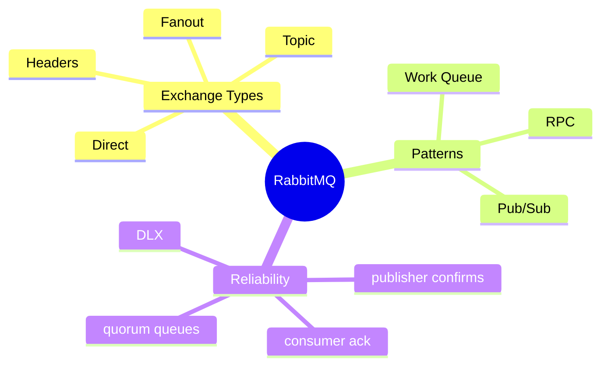
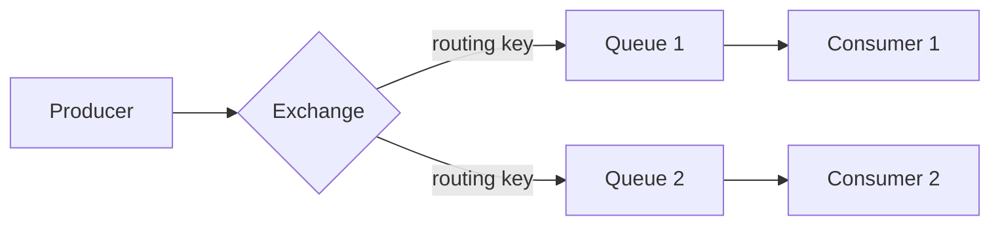
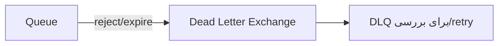

# RabbitMQ — Exchanges، Patterns، Reliability

> RabbitMQ یک message broker با routing قدرتمند است. درک exchange types و reliability مهم است. این فایل با دیاگرام گسترش یافته.

## فهرست
- [نقشه‌ی ذهنی](#نقشه‌ی-ذهنی)
- [📖 مفاهیم](#-مفاهیم)
- [🎯 سوالات مصاحبه](#-سوالات-مصاحبه)
- [⚠️ اشتباهات رایج](#️-اشتباهات-رایج)
- [🔗 ارتباط با سایر مفاهیم](#-ارتباط-با-سایر-مفاهیم)

---

## نقشه‌ی ذهنی



---

## جریان پیام



---

## 📖 مفاهیم

### مفاهیم پایه — Exchange Types

**توضیح:**

producer به **exchange** می‌فرستد؛ exchange بر اساس routing به **queue** هدایت می‌کند. انواع: **Direct** (تطابق دقیق key)، **Topic** (wildcard `*`/`#`)، **Fanout** (broadcast)، **Headers**. **Binding** queue را با routing key وصل می‌کند. **Virtual Host** isolation.

**نکات کلیدی:**

- producer به exchange نه queue.
- Topic برای routing انعطاف‌پذیر.
- Fanout برای pub/sub.

---

### Messaging Patterns

**توضیح:**

Work Queue (load distribution)، Publish/Subscribe (Fanout)، Routing (Direct)، Topics (wildcard)، RPC (correlation id + reply queue).

**مثال کد:**

```java
@RabbitListener(queues = "orders.processing")
public void handleOrder(OrderMessage message) { process(message); }

rabbitTemplate.convertAndSend("orders.exchange", "order.created", message);
```

**نکات کلیدی:**

- Work Queue برای توزیع بار.
- Topic برای routing پیچیده.

---

### Reliability

**توضیح:**

- **Publisher Confirms:** ack از broker (رسیدن به broker).
- **Consumer Acknowledgements:** `basicAck`/`basicNack`/`basicReject`.
- **Dead Letter Exchange (DLX):** پیام‌های reject/expire/queue پر.
- **Quorum Queues** (Raft) به‌جای Classic.
- **Persistence:** durable exchange + queue + persistent message.



**نکات کلیدی:**

- durability: هر سه (exchange + queue + message).
- DLX برای پیام‌های مشکل‌دار؛ از requeue بی‌نهایت بپرهیزید.
- Quorum Queues برای production.

---

## 🎯 سوالات مصاحبه

### سوال ۱: exchange types را توضیح بده.

**سطح:** Senior
**تکرار:** زیاد

**جواب کامل:**

**Direct** تطابق دقیق routing key. **Topic** wildcard (`*`=یک کلمه، `#`=صفر یا چند). **Fanout** broadcast (key نادیده). **Headers** بر اساس header. انتخاب: ساده → Direct، دسته‌بندی → Topic، broadcast → Fanout.

**نکته مصاحبه:**

Senior wildcardهای topic را دقیق می‌داند.

---

### سوال ۲: DLX چیست و کِی؟

**سطح:** Senior
**تکرار:** زیاد

**جواب کامل:**

exchange برای پیام‌های مشکل‌دار (reject با requeue=false، TTL منقضی، queue پر). از گم شدن جلوگیری و امکان بررسی/retry با تأخیر. الگو: retry با backoff (DLX + TTL). از requeue بی‌نهایت بپرهیزید (poison message → حلقه‌ی بی‌نهایت)؛ پس از N تلاش به DLX دائمی.

**نکته مصاحبه:**

Senior به poison message اشاره می‌کند.

---

### سوال ۳: publisher confirm در برابر consumer ack؟

**سطح:** Senior
**تکرار:** متوسط

**جواب کامل:**

publisher confirm: پیام به **broker** رسیده. consumer ack: پیام **پردازش شده** (تا ack نشود broker نگه می‌دارد). دو نقطه‌ی متفاوت مسیر. برای no-loss هر دو + persistence. auto-ack → خطر loss (حذف قبل از پردازش).

**نکته مصاحبه:**

Senior دو نقطه‌ی مسیر را تفکیک می‌کند.

---

## ⚠️ اشتباهات رایج

### اشتباه ۱: auto-ack با پردازش حساس

```text
❌ پیام قبل از پردازش حذف → loss در crash
✅ manual ack بعد از پردازش
```

**توضیح:** auto-ack پیام را قبل از اتمام پردازش حذف می‌کند.

---

### اشتباه ۲: requeue بی‌نهایت poison message

```text
❌ fail → requeue → حلقه‌ی بی‌نهایت
✅ بعد از N تلاش به DLX
```

**توضیح:** poison message منابع را هدر می‌دهد.

---

### اشتباه ۳: queue غیرdurable برای پیام مهم

```text
❌ پس از restart broker گم می‌شود
✅ durable exchange + queue + persistent message
```

**توضیح:** بدون durability پیام در حافظه است.

---

## 🔗 ارتباط با سایر مفاهیم

- در برابر **Kafka (8.1)** (smart broker در برابر log).
- DLX با **retry/resilience (2.6)**.
- patterns با **Enterprise Integration (6.1، 13.2)**.
- Spring AMQP با **event-driven**.
