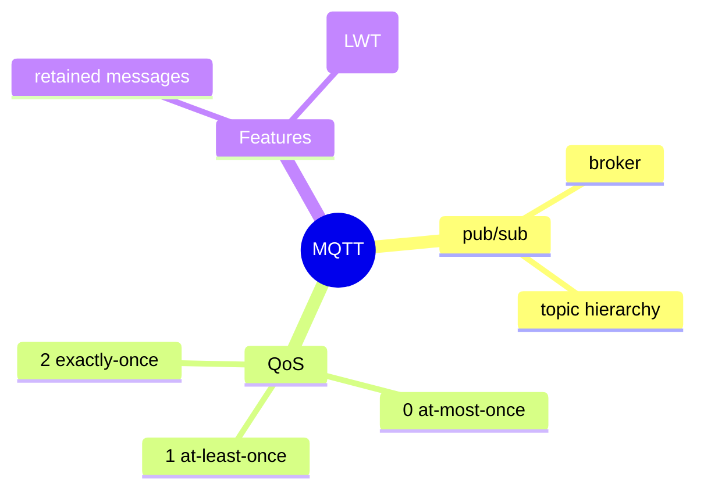
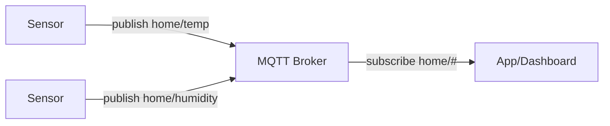
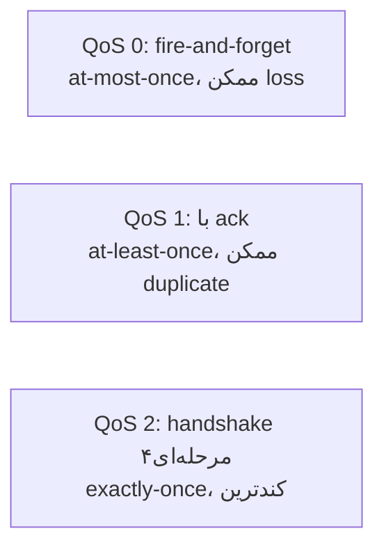

# MQTT — پروتکل سبک برای IoT

> MQTT برای IoT و دستگاه‌های با منابع محدود طراحی شده. QoS levels مفهوم کلیدی است. این فایل با دیاگرام گسترش یافته.

## فهرست
- [نقشه‌ی ذهنی](#نقشه‌ی-ذهنی)
- [📖 مفاهیم](#-مفاهیم)
- [🎯 سوالات مصاحبه](#-سوالات-مصاحبه)
- [⚠️ اشتباهات رایج](#️-اشتباهات-رایج)
- [🔗 ارتباط با سایر مفاهیم](#-ارتباط-با-سایر-مفاهیم)

---

## نقشه‌ی ذهنی



---

## معماری MQTT



---

## 📖 مفاهیم

### مفاهیم پایه

**توضیح:**

پروتکل publish/subscribe سبک روی TCP برای IoT، شبکه‌ی کم‌پهنا، اتصال ناپایدار. دستگاه‌ها به **Broker** (Mosquitto، EMQX، HiveMQ) متصل و به **topic** سلسله‌مراتبی (`home/bedroom/temperature`) pub/sub می‌کنند. سربار کم (برخلاف HTTP).

**نکات کلیدی:**

- سبک و کم‌سربار، مناسب IoT/mobile.
- topic سلسله‌مراتبی با wildcard (`+` یک سطح، `#` چند سطح).

---

### QoS Levels

**توضیح:**



QoS بالاتر = تضمین بیشتر اما overhead بیشتر.

**نکات کلیدی:**

- QoS را بر اساس اهمیت داده انتخاب کنید (QoS 2 گران).
- QoS publisher-broker و broker-subscriber می‌تواند متفاوت باشد.

---

### Retain & Last Will

**توضیح:**

- **Retained Messages:** آخرین پیام retain‌شده به subscriberهای جدید فوراً (state فعلی).
- **Last Will (LWT):** پیامی که broker هنگام قطع غیرمنتظره منتشر می‌کند (تشخیص offline).

**نکات کلیدی:**

- retained برای دادن state فعلی.
- LWT برای تشخیص قطع ناگهانی.

---

## 🎯 سوالات مصاحبه

### سوال ۱: QoS levels در MQTT را توضیح بده.

**سطح:** Senior
**تکرار:** متوسط

**جواب کامل:**

QoS 0 (at-most-once، بدون ack، ممکن loss، سریع). QoS 1 (at-least-once، با PUBACK، ممکن duplicate → idempotency). QoS 2 (exactly-once، handshake چهارمرحله‌ای، کندترین). در IoT با باتری/پهنای محدود، QoS بالا گران است.

**نکته مصاحبه:**

Senior QoS را به at-most/at-least/exactly-once map می‌کند.

---

### سوال ۲: چرا MQTT به‌جای HTTP برای IoT؟

**سطح:** Senior
**تکرار:** متوسط

**جواب کامل:**

(۱) سربار کم (header کوچک باینری). (۲) pub/sub با اتصال persistent (بدون polling). (۳) QoS برای شبکه‌ی ناپایدار. (۴) LWT. (۵) مقیاس به میلیون‌ها دستگاه. HTTP برای telemetry مداوم از دستگاه محدود ناکارآمد است.

**نکته مصاحبه:**

Senior به سربار و pub/sub persistent اشاره می‌کند.

---

## ⚠️ اشتباهات رایج

### اشتباه ۱: QoS 2 برای همه‌چیز

```text
❌ QoS 2 برای داده‌ی پرتکرار → overhead
✅ QoS 0/1 برای مکرر، QoS 2 فقط بحرانی
```

**توضیح:** QoS 2 handshake چهارمرحله‌ای دارد.

---

### اشتباه ۲: عدم استفاده از LWT

```text
❌ ندانستن قطع دستگاه
✅ LWT برای وضعیت offline
```

**توضیح:** بدون LWT، قطع ناگهانی تشخیص داده نمی‌شود.

---

## 🔗 ارتباط با سایر مفاهیم

- QoS با **Kafka/RabbitMQ delivery (8.1, 8.2)**.
- pub/sub با **Event-Driven (6.1)**.
- Spring Integration MQTT با **Enterprise Integration (13.2)**.
