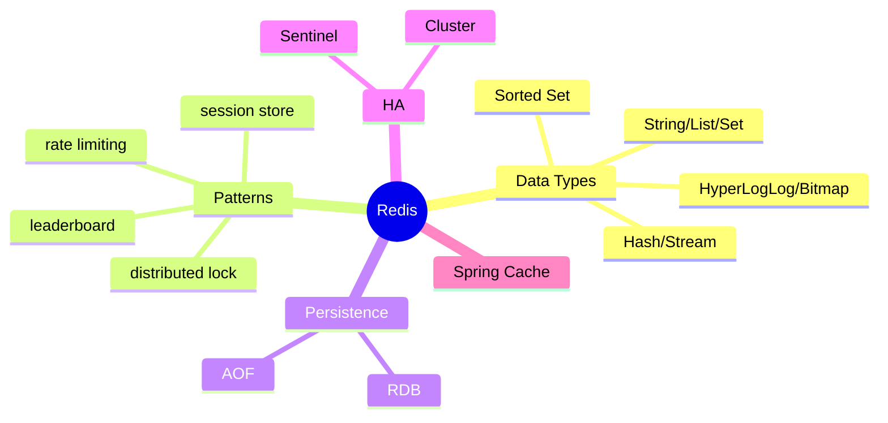
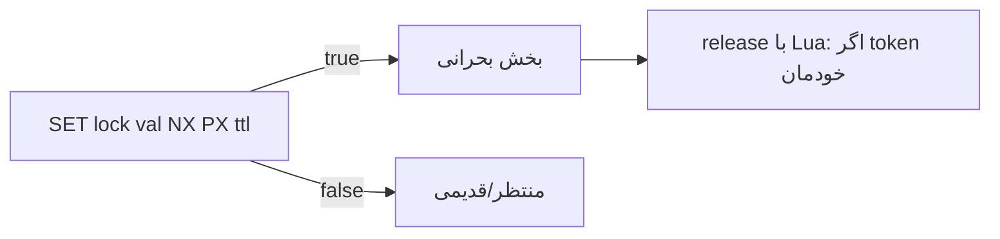
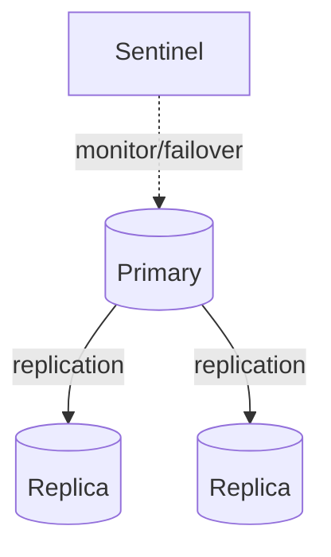

# Redis — Data Types، Patterns، Persistence، HA، Spring Cache

> Redis محبوب‌ترین in-memory store است. data structureها و الگوهای caching/lock در مصاحبه‌ها پرسیده می‌شوند. این فایل با دیاگرام و مثال‌های متعدد گسترش یافته.

## فهرست
- [نقشه‌ی ذهنی](#نقشه‌ی-ذهنی)
- [📖 مفاهیم](#-مفاهیم)
- [🎯 سوالات مصاحبه](#-سوالات-مصاحبه)
- [⚠️ اشتباهات رایج](#️-اشتباهات-رایج)
- [🔗 ارتباط با سایر مفاهیم](#-ارتباط-با-سایر-مفاهیم)

---

## نقشه‌ی ذهنی



---

## 📖 مفاهیم

### Data Types

**توضیح:**

in-memory data structure store. **String** (`INCR`, `EXPIRE`)، **List** (`LPUSH`, `BLPOP`)، **Set** (`SADD`, `SINTER`)، **Sorted Set/ZSet** (`ZADD`, `ZRANGE` — leaderboard، rate limiting)، **Hash**، **Stream** (مثل Kafka سبک)، **Pub/Sub**، **HyperLogLog** (تخمین یکتا)، **Bitmap**.

**مثال کد:**

```bash
INCR api:user:123:count
EXPIRE api:user:123:count 60

ZADD leaderboard 1500 "player1"
ZREVRANGE leaderboard 0 9 WITHSCORES  # top 10
```

**نکات کلیدی:**

- Redis single-threaded (دستورات data)؛ atomic بدون lock.
- Sorted Set برای leaderboard، rate limiting، delayed queue.
- همیشه برای cache TTL بگذارید.

---

### Patterns

**توضیح:**

Session Store، Rate Limiting (sliding window با ZSet)، **Distributed Lock** (`SET key value NX PX ttl`؛ Redlock)، Cache-Aside، Write-Through، Leaderboard، Job Queue (`BLPOP`).



**مثال کد:**

```java
String token = UUID.randomUUID().toString();
Boolean acquired = redis.opsForValue()
    .setIfAbsent("lock:order:1", token, Duration.ofSeconds(10)); // NX + PX
if (Boolean.TRUE.equals(acquired)) {
    try { /* بخش بحرانی */ }
    finally { /* release atomic با Lua، فقط اگر token خودمان */ }
}
```

**نکات کلیدی:**

- distributed lock باید TTL داشته باشد (وگرنه crash = deadlock).
- آزادسازی atomic و فقط توسط صاحب (Lua).

---

### Persistence

**توضیح:**

- **RDB:** snapshot دوره‌ای، کم‌سربار، احتمال loss.
- **AOF:** هر write log، کامل‌تر، کندتر.
- **Hybrid** (4+).

**نکات کلیدی:**

- RDB برای backup؛ AOF برای durability.
- Redis معمولاً cache (نه source of truth).

---

### High Availability

**توضیح:**

**Sentinel** (failover خودکار primary/replica)، **Redis Cluster** (sharding، ۱۶۳۸۴ slot)، **Valkey** (fork پس از license).



**نکات کلیدی:**

- Sentinel برای HA؛ Cluster برای sharding+HA.
- replication async → احتمال loss هنگام failover.

---

### Spring Cache

**توضیح:**

`@Cacheable`, `@CachePut`, `@CacheEvict` با Redis.

**مثال کد:**

```java
@Cacheable(value = "users", key = "#id")
public User findById(Long id) { return repository.findById(id).orElseThrow(); }

@CacheEvict(value = "users", key = "#user.id")
public void update(User user) { repository.save(user); }
```

**نکات کلیدی:**

- با AOP کار می‌کند → self-invocation اعمال نمی‌شود.
- TTL را در cache manager تنظیم کنید.

---

## 🎯 سوالات مصاحبه

### سوال ۱: distributed lock با Redis و تله‌ها؟

**سطح:** Senior / Lead
**تکرار:** زیاد

**جواب کامل:**

`SET key value NX PX ttl` — NX (atomic acquire)، PX (expiry)، value=token یکتا. تله‌ها: (۱) بدون TTL → crash = deadlock. (۲) آزادسازی غیراتمیک (DEL بدون چک token می‌تواند lock دیگری را آزاد کند) → Lua. (۳) TTL کوتاه‌تر از کار → دو نفر همزمان → watchdog (Redisson). (۴) Redlock در multi-master بحث‌برانگیز.

**کد توضیحی:**

```lua
if redis.call("get", KEYS[1]) == ARGV[1] then return redis.call("del", KEYS[1]) else return 0 end
```

**نکته مصاحبه:**

Lead: token، Lua، watchdog.

---

### سوال ۲: cache invalidation strategy و مشکلات؟

**سطح:** Senior / Lead
**تکرار:** زیاد

**جواب کامل:**

استراتژی‌ها: TTL-based، write-through/around، event-based (با Kafka/pub-sub). مشکلات: stale، race condition (نوشتن قدیمی روی جدید)، stampede. راه‌حل race: delete به‌جای update (lazy reload) + TTL safety net. در توزیع‌شده، invalidation همه‌ی nodeها چالش (pub/sub).

**نکته مصاحبه:**

Lead به race و «delete به‌جای update» اشاره می‌کند.

---

### سوال ۳: چرا Redis single-threaded و چطور سریع؟

**سطح:** Senior
**تکرار:** متوسط

**جواب کامل:**

دستورات data در یک thread. سرعت: (۱) in-memory. (۲) بدون lock/context switch/race — هر دستور atomic. (۳) event loop غیرمسدودکننده. (۴) data structure بهینه. مزیت: `INCR` ذاتاً atomic. محدودیت: دستور کند (`KEYS *`) کل سرور را بلاک می‌کند.

**نکته مصاحبه:**

Senior به atomicity رایگان و خطر `KEYS *` اشاره می‌کند.

---

### سوال ۴: RDB در برابر AOF؟

**سطح:** Senior
**تکرار:** متوسط

**جواب کامل:**

RDB snapshot دوره‌ای: startup سریع، کم‌سربار، اما loss بین snapshot. AOF هر write log: durability بهتر، اما فایل بزرگ‌تر و startup کندتر. hybrid (4+). cache → RDB؛ source of truth/durability → AOF.

**نکته مصاحبه:**

Senior به نقش Redis (cache/datastore) اشاره می‌کند.

---

## ⚠️ اشتباهات رایج

### اشتباه ۱: distributed lock بدون TTL

```java
// ❌
redis.opsForValue().setIfAbsent("lock", token);
```

```java
// ✅
redis.opsForValue().setIfAbsent("lock", token, Duration.ofSeconds(10));
```

**توضیح:** بدون TTL، crash = deadlock.

---

### اشتباه ۲: `KEYS *` در production

```bash
# ❌
KEYS user:*
```

```bash
# ✅
SCAN 0 MATCH user:* COUNT 100
```

**توضیح:** `KEYS` single-thread را بلاک می‌کند.

---

### اشتباه ۳: cache بدون TTL

```java
// ❌
redis.opsForValue().set(key, value);
```

```java
// ✅
redis.opsForValue().set(key, value, Duration.ofMinutes(10));
```

**توضیح:** بدون TTL، حافظه پر و stale می‌ماند.

---

### اشتباه ۴: update cache به‌جای delete

```text
❌ update → race condition
✅ delete → lazy reload
```

**توضیح:** delete از race جلوگیری می‌کند.

---

## 🔗 ارتباط با سایر مفاهیم

- caching strategy با **System Design (6.2)**.
- distributed lock با **PostgreSQL advisory lock (3.3)**.
- Spring Cache با **AOP/`@Cacheable` (2.1, 2.4)**.
- rate limiting با **API Gateway (2.6)**.
- JWT blacklist با **Security (7.2)**.
