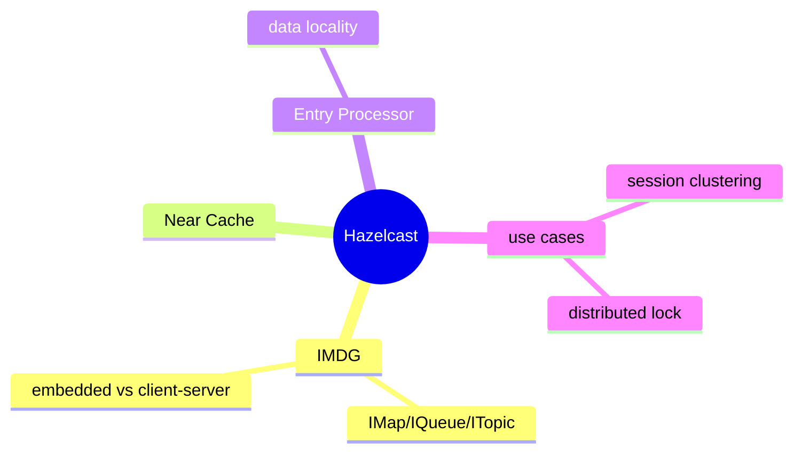
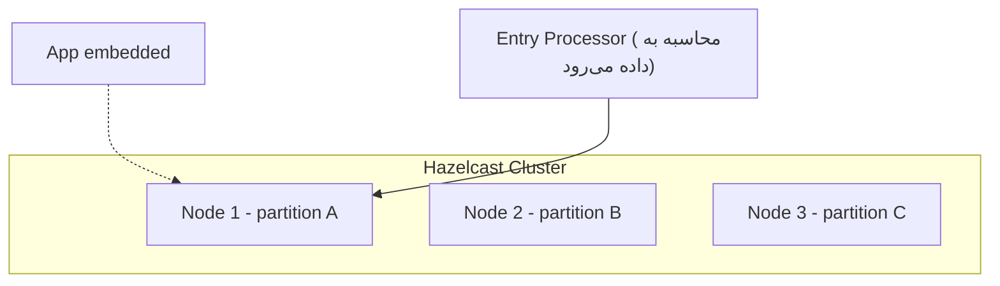

# Hazelcast — In-Memory Data Grid

> Hazelcast یک distributed in-memory data grid است که برای محاسبات توزیع‌شده و clustering استفاده می‌شود. این فایل با دیاگرام گسترش یافته.

## فهرست
- [نقشه‌ی ذهنی](#نقشه‌ی-ذهنی)
- [📖 مفاهیم](#-مفاهیم)
- [🎯 سوالات مصاحبه](#-سوالات-مصاحبه)
- [⚠️ اشتباهات رایج](#️-اشتباهات-رایج)
- [🔗 ارتباط با سایر مفاهیم](#-ارتباط-با-سایر-مفاهیم)

---

## نقشه‌ی ذهنی



---

## معماری



---

## 📖 مفاهیم

### مفاهیم پایه

**توضیح:**

in-memory data grid توزیع‌شده: داده را در حافظه‌ی چند نود partition و replicate می‌کند. می‌تواند **embedded** (همان JVM) یا **client-server** باشد. ساختارها: `IMap`, `IQueue`, `ITopic` (interface استاندارد Java اما توزیع‌شده). **Near Cache** کپی محلی پرکاربرد. **Entry Processors** محاسبه سمت سرور (data locality).

**مثال کد:**

```java
HazelcastInstance hz = Hazelcast.newHazelcastInstance();
IMap<String, User> users = hz.getMap("users"); // توزیع‌شده
users.put("123", user);

hz.getCPSubsystem().getLock("order-lock").lock(); // distributed lock

// Entry Processor: محاسبه سمت سرور (بدون انتقال داده)
users.executeOnKey("123", entry -> {
    User u = entry.getValue(); u.incrementLoginCount(); entry.setValue(u); return null;
});
```

**نکات کلیدی:**

- embedded بدون hop شبکه‌ی جدا.
- Entry Processor محاسبه را به داده می‌برد (data locality).
- Near Cache برای read پرتکرار.

---

## 🎯 سوالات مصاحبه

### سوال ۱: Hazelcast در برابر Redis؟

**سطح:** Senior / Lead
**تکرار:** متوسط

**جواب کامل:**

Redis in-memory store جداگانه (client-server)، data structure غنی، single-threaded، زبان‌مستقل، اکوسیستم بالغ. Hazelcast data grid مبتنی بر JVM که می‌تواند **embedded** اجرا شود (data locality، بدون hop جدا) و distributed computing (Entry Processor) دارد. اکوسیستم چندزبانه/cache عمومی → Redis؛ اپ Java با distributed computation/embedded → Hazelcast. Redis رایج‌تر.

**نکته مصاحبه:**

Lead به embedded و distributed computing اشاره می‌کند.

---

### سوال ۲: Entry Processor چه مزیتی دارد؟

**سطح:** Senior
**تکرار:** کم

**جواب کامل:**

محاسبه روی نودی که داده آن‌جاست (نه آوردن به client). مزایا: (۱) data locality (بدون انتقال). (۲) atomicity (با lock داخلی، بدون race در read-modify-write). (۳) کارایی bulk update. «بردن محاسبه به داده» (مشابه map-reduce).

**نکته مصاحبه:**

Senior به «بردن محاسبه به داده» و atomicity اشاره می‌کند.

---

## ⚠️ اشتباهات رایج

### اشتباه ۱: read-modify-write روی IMap بدون Entry Processor

```java
// ❌ race + انتقال داده
User u = map.get(key); u.increment(); map.put(key, u);
```

```java
// ✅
map.executeOnKey(key, entry -> { /* modify */ });
```

**توضیح:** get/put جداگانه race دارد و داده را جابه‌جا می‌کند.

---

### اشتباه ۲: نادیده گرفتن serialization

```text
❌ object بزرگ بدون serialization بهینه → overhead شبکه
✅ IdentifiedDataSerializable
```

**توضیح:** serialization روی performance grid اثر زیاد دارد.

---

## 🔗 ارتباط با سایر مفاهیم

- در برابر **Redis (9.1)**.
- distributed lock با **concurrency** و **System Design**.
- session clustering با **horizontal scaling (6.2)**.
- distributed computing با map-reduce.
